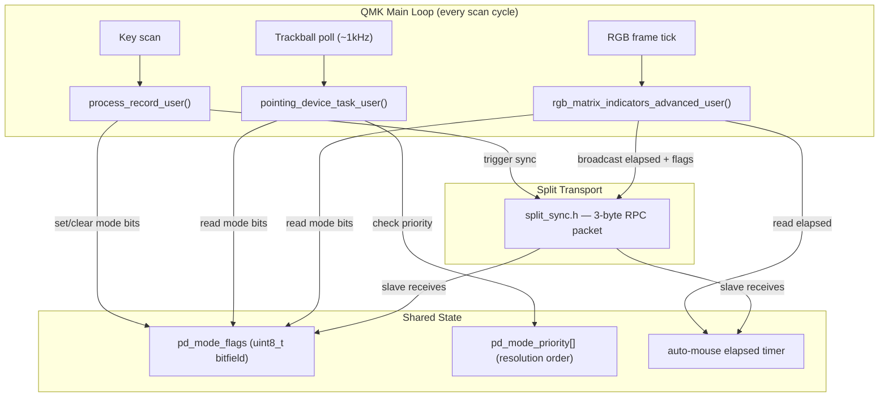
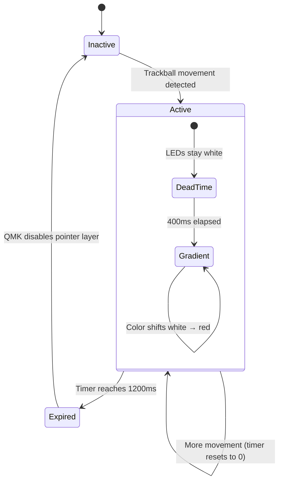
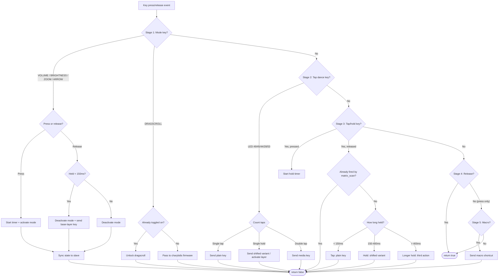
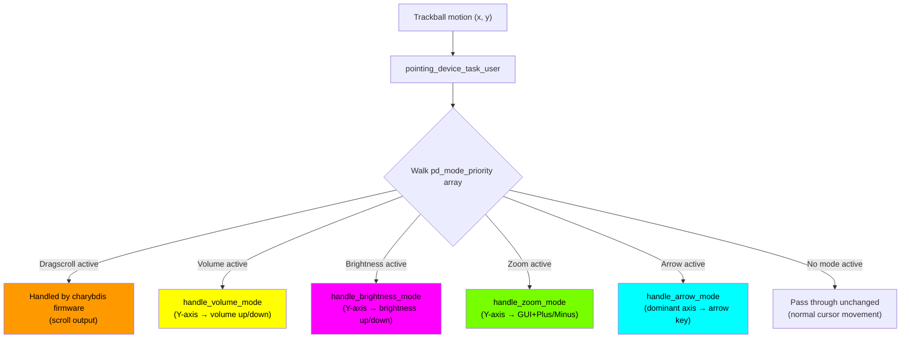
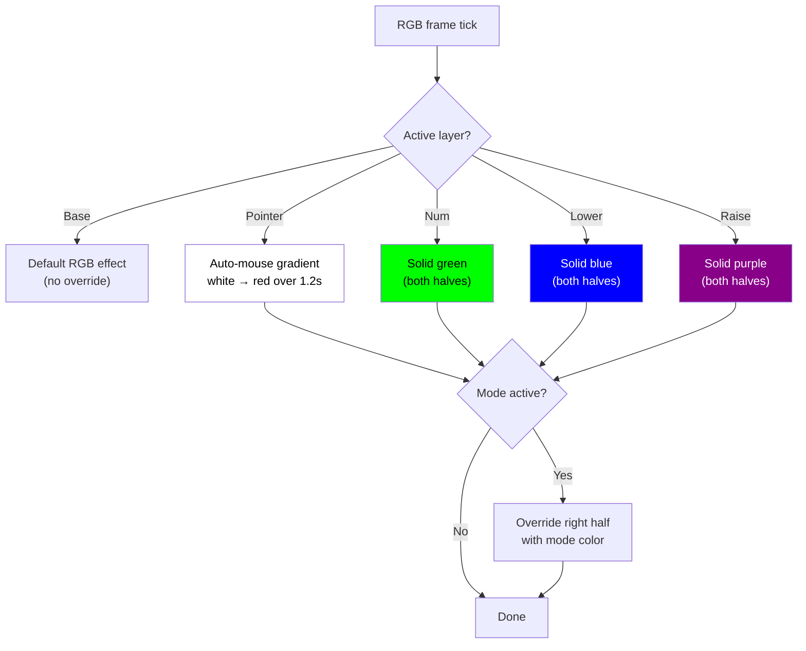
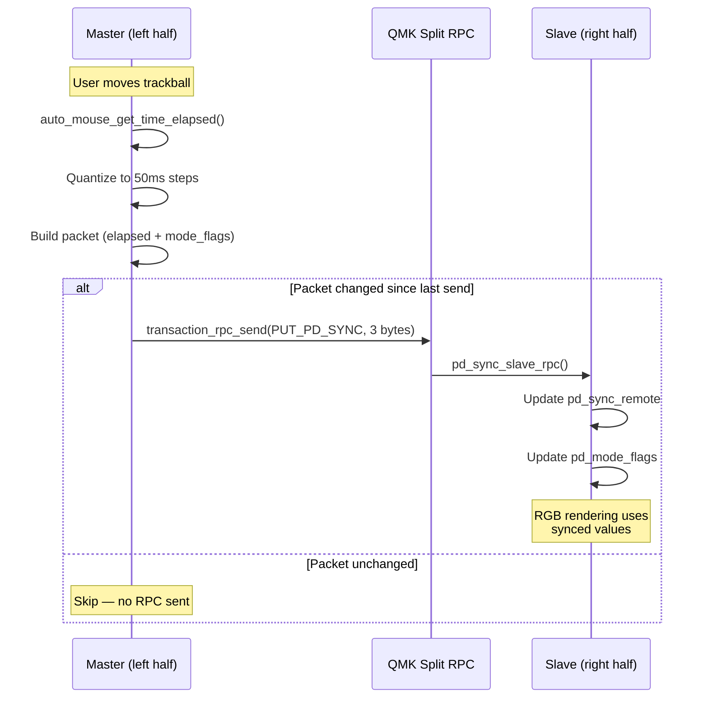
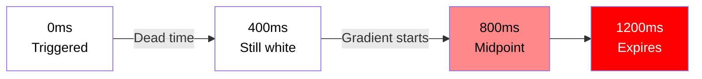

# Firmware Flow Diagrams

Visual overview of how QMK processes input and renders output on this keyboard. For implementation details, see [INTERNALS.md](INTERNALS.md).

## Architecture Overview

QMK runs a main loop that calls user-defined callbacks for key events, trackball motion, and LED rendering. This keymap hooks into those callbacks and ties them together with shared state.

> **Single translation unit:** All `.h` files are included into `keymap.c`, which is the only `.c` file compiled for this keymap. Static globals in headers are shared across all functions.

## Auto-Mouse Layer Lifecycle

QMK's auto-mouse system activates the pointer layer when the trackball moves and deactivates it after a timeout (1200ms). The keymap hooks into this to render the countdown gradient and sync state to the slave half.

| Event | What happens |
|-------|-------------|
| Trackball moves | QMK activates pointer layer, resets timer to 0 |
| Timer < 400ms | LEDs white (dead time — no flicker during active use) |
| Timer 400–1200ms | LEDs animate white → red (visual countdown) |
| Timer hits 1200ms | QMK deactivates pointer layer, back to base |
| Drag-scroll toggled on | Timer frozen — pointer layer stays active until toggled off |

## Key Press Processing

QMK calls `process_record_user()` for every key press and release. The function is organized in four stages, evaluated top to bottom. Returning `false` stops further processing.

## Trackball Motion Pipeline

QMK calls `pointing_device_task_user()` every scan cycle (~1000Hz) with the trackball's motion delta. If a pointing device mode is active, the motion is intercepted and converted to keypresses instead of cursor movement.

> **Priority:** If multiple modes are held simultaneously, only the highest-priority one runs. The priority order is defined once in `pd_mode_priority[]`: dragscroll > volume > brightness > zoom > arrow.

## RGB Rendering

QMK calls `rgb_matrix_indicators_advanced_user()` in LED chunks. Each layer has a base color; active pointing device modes overlay a color on the right half (where the trackball is).

## Split Sync (Master → Slave)

The master half (left) knows the auto-mouse elapsed time and which pointing device modes are active. The slave half (right) needs this to render correct LED colors. A 3-byte RPC packet is sent whenever the state changes.

## Auto-Mouse Countdown Gradient

When the trackball triggers the pointer layer, LEDs show a color gradient representing remaining time before the layer deactivates.

| Phase | Time | Color | Purpose |
|-------|------|-------|---------|
| Dead time | 0 – 400ms | White | No flicker during active trackball use |
| Gradient | 400 – 1200ms | White → Red | Visual countdown to layer deactivation |
| Expired | 1200ms | Layer deactivates | Auto-mouse returns to base layer |
