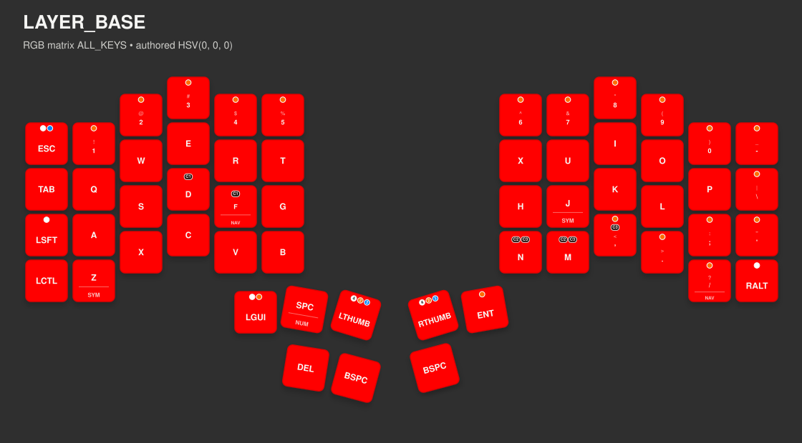
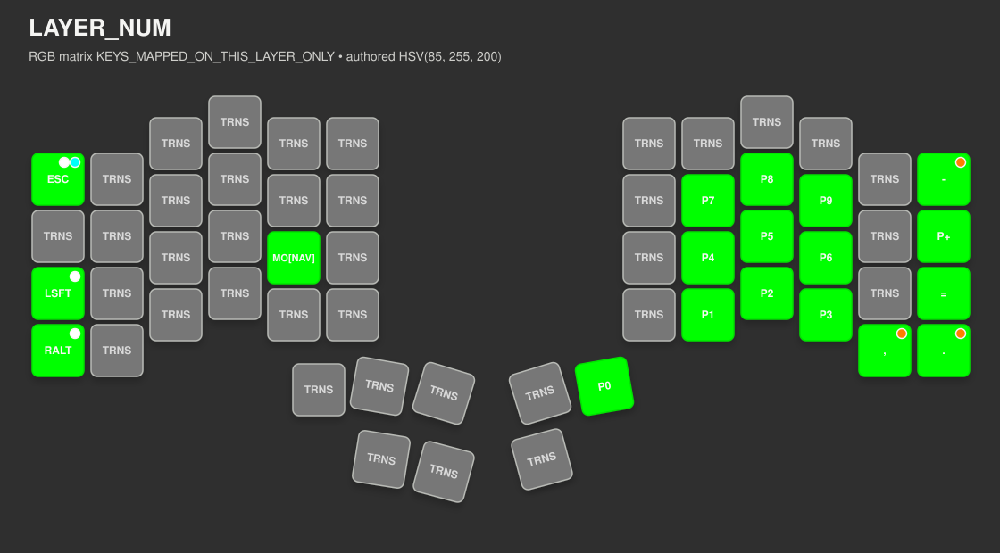
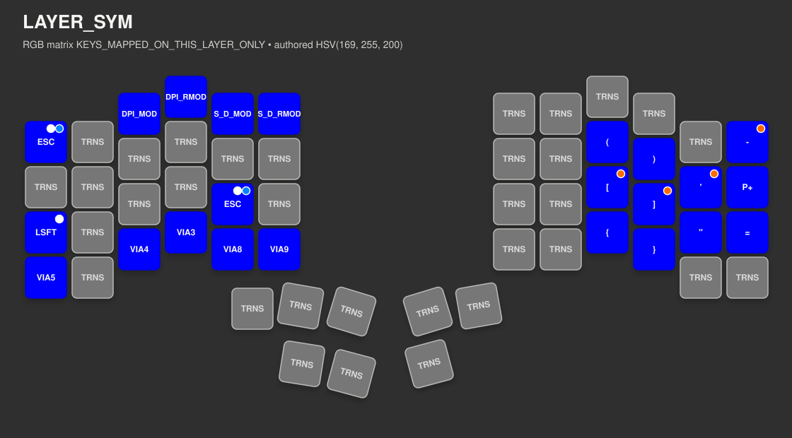
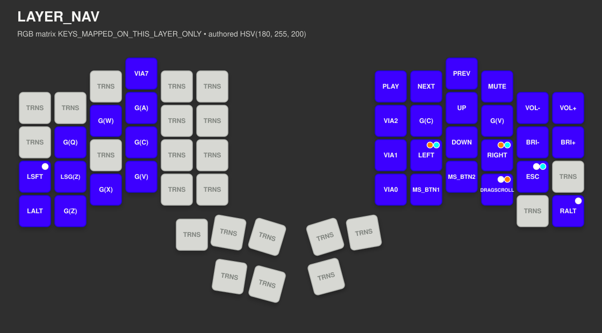
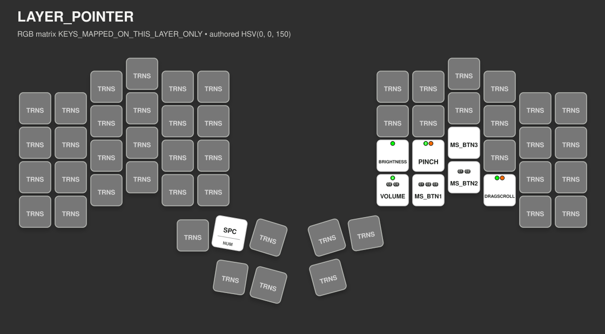

<!-- Generated file. Do not edit by hand. -->
# Profile Introspection
This report is generated from the authored profile files [keymap.c](../keyboards/bastardkb/charybdis/4x6/keymaps/noah/keymap.c), [keymap config.h](../keyboards/bastardkb/charybdis/4x6/keymaps/noah/config.h), [users/noah/config.h](../users/noah/config.h), and [rgb_config.c](../keyboards/bastardkb/charybdis/4x6/keymaps/noah/rgb_config.c). The renderer is board-specific to the Charybdis 4x6 and derives the current `LAYOUT()` slot order directly from [keymap.c](../keyboards/bastardkb/charybdis/4x6/keymaps/noah/keymap.c).
PD mode names and bindings in this report stay in sync with the shared definitions in [pd_mode_manifest.h](../users/noah/lib/pointing/defs/pd_mode_manifest.h).
## Quick Legend

| Where | Marker | Meaning |
| --- | --- | --- |
| Layer image | `C1`, `C2`, ... | Combo badge. Match the badge id to the layer-local combo table below the image. |
| Layer image | `tap` dot  with optional count | This key has authored tap actions. A plain dot means one authored tap action; a numbered dot means multiple tap tiers on that key define a tap action. Use the behavior table below for `single`, `double`, `triple`, and higher tap counts. |
| Layer image | `hold` dot  with optional count | This key has authored hold tiers. A plain dot means one hold tier; a numbered dot means multiple tap tiers on that key define a hold action. |
| Layer image | `long hold` dot  with optional count | This key has authored long-hold tiers. A plain dot means one long-hold tier; a numbered dot means multiple tap tiers on that key define a long-hold action. |
| Behavior table | `single`, `double`, `triple`, `quadruple`, `quintuple` | Tap tiers for the same physical key: 1 tap, 2 taps, 3 taps, 4 taps, 5 taps. |
| Behavior table | repeated rows for one key | The same physical key exposes different actions at different tap tiers. |
| Behavior table | `Tap` / `Hold` / `Long Hold` | Actions that fire for that tap tier on tap, hold, or deeper long hold. |

## Layer Images

These previews are generated as SVG image assets under [docs/media/profile-introspection/](media/profile-introspection). The renderer uses the authored `layer_colors[]` config from [rgb_config.c](../keyboards/bastardkb/charybdis/4x6/keymaps/noah/rgb_config.c) and the current `LAYOUT()` slot order from [keymap.c](../keyboards/bastardkb/charybdis/4x6/keymaps/noah/keymap.c):

| Available Layer RGB Mode | Meaning |
| --- | --- |
| `ALL_KEYS` | Tint every physical key with the authored layer color. |
| `KEYS_MAPPED_ON_THIS_LAYER_ONLY` | Tint only keys with a real mapping on that layer; transparent positions stay neutral so lower layers remain visible underneath. |

- `LAYER_BASE` falls back to the default RGB color from [config.h](../keyboards/bastardkb/charybdis/4x6/keymaps/noah/config.h) when its authored layer color is `HSV(0, 0, 0)`
- Keys with authored `key_behaviors[]` rows in [keymap.c](../keyboards/bastardkb/charybdis/4x6/keymaps/noah/keymap.c) show numbered activity dots derived from the authored key-behavior feedback colors in [rgb_config.c](../keyboards/bastardkb/charybdis/4x6/keymaps/noah/rgb_config.c): white for authored tap actions, orange for authored hold tiers, and cyan for authored long-hold tiers
- Keys that participate in combos on that layer show bottom-edge combo badges such as `C1` and `C2`; those ids match the combo table for the same layer
- Each layer section below also pulls in the authored key behaviors, pd modes that are directly placed or reachable through those behaviors, and combos that are actually present on that layer

Timing legend for the layer-local behavior tables:

- `tap_hold(...)`, `long_hold(...)`, and `multi_tap(...)` use the default timings from [config.h](../keyboards/bastardkb/charybdis/4x6/keymaps/noah/config.h)
- `tap_hold=...`, `long_hold=...`, and `multi_tap=...` are custom timings authored on that key
- `release before tap_hold(...); otherwise normal hold` means the tap fires on a quick release; if you keep holding, the key keeps its normal hold behavior
- Timing is shown per tap count, so each row lists only the timings that matter for that behavior

### `LAYER_BASE`

- RGB matrix render mode: `ALL_KEYS`
- Authored layer color: `HSV(0, 0, 0)`
- Preview color: 
- Combo badges on this layer: `C1`

#### Key Behaviors On This Layer

| Key On Layer | Behavior Keycode | Tap Count | Tap | Hold | Long Hold | Timing |
| --- | --- | --- | --- | --- | --- | --- |
| `ESC` | `ESC` (`KC_ESC`) | `single` | `-` | `-` | `TAP_AT_HOLD_THRESHOLD(LAG(KC_ESC))` | `tap_hold(150), long_hold(400), multi_tap(150)` |
| `ESC` | `ESC` (`KC_ESC`) | `double` | `TAP_SENDS(S(KC_GRV))` | `-` | `-` | `multi_tap(150)` |
| `1` | `1` (`KC_1`) | `single` | `-` | `PRESS_AND_HOLD_UNTIL_RELEASE(KC_EXLM)` | `-` | `tap_hold(150)` |
| `2` | `2` (`KC_2`) | `single` | `-` | `PRESS_AND_HOLD_UNTIL_RELEASE(KC_AT)` | `-` | `tap_hold(150)` |
| `3` | `3` (`KC_3`) | `single` | `-` | `PRESS_AND_HOLD_UNTIL_RELEASE(KC_HASH)` | `-` | `tap_hold(150)` |
| `4` | `4` (`KC_4`) | `single` | `-` | `PRESS_AND_HOLD_UNTIL_RELEASE(KC_DLR)` | `-` | `tap_hold(150)` |
| `5` | `5` (`KC_5`) | `single` | `-` | `PRESS_AND_HOLD_UNTIL_RELEASE(KC_PERC)` | `-` | `tap_hold(150)` |
| `6` | `6` (`KC_6`) | `single` | `-` | `PRESS_AND_HOLD_UNTIL_RELEASE(KC_CIRC)` | `-` | `tap_hold(150), multi_tap(150)` |
| `6` | `6` (`KC_6`) | `double` | `TAP_SENDS(KC_MPLY)` | `-` | `-` | `multi_tap(150)` |
| `7` | `7` (`KC_7`) | `single` | `-` | `PRESS_AND_HOLD_UNTIL_RELEASE(KC_AMPR)` | `-` | `tap_hold(150), multi_tap(150)` |
| `7` | `7` (`KC_7`) | `double` | `TAP_SENDS(KC_MNXT)` | `PRESS_AND_HOLD_UNTIL_RELEASE(KC_MNXT)` | `-` | `tap_hold(150), multi_tap(150)` |
| `8` | `8` (`KC_8`) | `single` | `-` | `PRESS_AND_HOLD_UNTIL_RELEASE(KC_ASTR)` | `-` | `tap_hold(150), multi_tap(150)` |
| `8` | `8` (`KC_8`) | `double` | `TAP_SENDS(KC_MPRV)` | `PRESS_AND_HOLD_UNTIL_RELEASE(KC_MPRV)` | `-` | `tap_hold(150), multi_tap(150)` |
| `9` | `9` (`KC_9`) | `single` | `-` | `PRESS_AND_HOLD_UNTIL_RELEASE(KC_LPRN)` | `-` | `tap_hold(150)` |
| `0` | `0` (`KC_0`) | `single` | `-` | `PRESS_AND_HOLD_UNTIL_RELEASE(KC_RPRN)` | `-` | `tap_hold(150)` |
| `-` | `-` (`KC_MINS`) | `single` | `-` | `PRESS_AND_HOLD_UNTIL_RELEASE(KC_UNDS)` | `-` | `tap_hold(150)` |
| `\` | `\` (`KC_BSLS`) | `single` | `-` | `PRESS_AND_HOLD_UNTIL_RELEASE(KC_PIPE)` | `-` | `tap_hold(150)` |
| `LSFT` | `LSFT` (`KC_LEFT_SHIFT`) | `single` | `TAP_SENDS(KC_CAPS)` | `-` | `-` | `release before tap_hold(150); otherwise normal hold` |
| `;` | `;` (`KC_SCLN`) | `single` | `-` | `PRESS_AND_HOLD_UNTIL_RELEASE(KC_COLN)` | `-` | `tap_hold(150)` |
| `'` | `'` (`KC_QUOT`) | `single` | `-` | `PRESS_AND_HOLD_UNTIL_RELEASE(KC_DQUO)` | `-` | `tap_hold(150)` |
| `,` | `,` (`KC_COMM`) | `single` | `-` | `PRESS_AND_HOLD_UNTIL_RELEASE(KC_LABK)` | `-` | `tap_hold(150)` |
| `.` | `.` (`KC_DOT`) | `single` | `-` | `PRESS_AND_HOLD_UNTIL_RELEASE(KC_RABK)` | `-` | `tap_hold(150)` |
| `LT[NAV]/SLSH` | `LT[NAV]/SLSH` (`LT(LAYER_NAV,KC_SLSH)`) | `double` | `-` | `TAP_AT_HOLD_THRESHOLD(LOCK_LAYER(LAYER_NAV))` | `-` | `tap_hold=100, multi_tap(150)` |
| `RALT` | `RALT` (`KC_RIGHT_ALT`) | `single` | `TAP_SENDS(ARROW_MODE_LOCK)` | `-` | `-` | `release before tap_hold(150); otherwise normal hold` |
| `LGUI` | `LGUI` (`KC_LEFT_GUI`) | `double` | `-` | `PRESS_AND_HOLD_UNTIL_RELEASE(KC_LEFT_ALT)` | `-` | `tap_hold(150), multi_tap(150)` |
| `LGUI` | `LGUI` (`KC_LEFT_GUI`) | `triple` | `TAP_SENDS(OSM(MOD_LSFT))` | `-` | `-` | `multi_tap(150)` |
| `LTHUMB` | `LTHUMB` (`LEFT_THUMB`) | `single` | `TAP_SENDS(LOCK_LAYER(LAYER_SYM))` | `PRESS_AND_HOLD_UNTIL_RELEASE(MO(LAYER_SYM))` | `-` | `tap_hold=150, multi_tap(150)` |
| `LTHUMB` | `LTHUMB` (`LEFT_THUMB`) | `double` | `TAP_SENDS(KC_MPLY)` | `TAP_ON_RELEASE_AFTER_HOLD(KC_ESCAPE)` | `TAP_AT_HOLD_THRESHOLD(LOCK_LAYER(LAYER_NUM))` | `tap_hold=150, long_hold(400), multi_tap(150)` |
| `LTHUMB` | `LTHUMB` (`LEFT_THUMB`) | `triple` | `TAP_SENDS(KC_MNXT)` | `-` | `PRESS_AND_HOLD_UNTIL_RELEASE(KC_MNXT)` | `tap_hold=150, long_hold(400), multi_tap(150)` |
| `LTHUMB` | `LTHUMB` (`LEFT_THUMB`) | `quadruple` | `TAP_SENDS(KC_MPRV)` | `-` | `PRESS_AND_HOLD_UNTIL_RELEASE(KC_MPRV)` | `tap_hold=150, long_hold(400), multi_tap(150)` |
| `RTHUMB` | `RTHUMB` (`RIGHT_THUMB`) | `single` | `TAP_SENDS(LOCK_LAYER(LAYER_NAV))` | `PRESS_AND_HOLD_UNTIL_RELEASE(MO(LAYER_NAV))` | `-` | `tap_hold=150, multi_tap(150)` |
| `RTHUMB` | `RTHUMB` (`RIGHT_THUMB`) | `double` | `TAP_SENDS(KC_MPLY)` | `TAP_ON_RELEASE_AFTER_HOLD(KC_ESCAPE)` | `TAP_AT_HOLD_THRESHOLD(LOCK_LAYER(LAYER_NUM))` | `tap_hold=150, long_hold(400), multi_tap(150)` |
| `RTHUMB` | `RTHUMB` (`RIGHT_THUMB`) | `triple` | `TAP_SENDS(KC_MNXT)` | `-` | `PRESS_AND_HOLD_UNTIL_RELEASE(KC_MNXT)` | `tap_hold=150, long_hold(400), multi_tap(150)` |
| `RTHUMB` | `RTHUMB` (`RIGHT_THUMB`) | `quadruple` | `TAP_SENDS(KC_MPRV)` | `-` | `PRESS_AND_HOLD_UNTIL_RELEASE(KC_MPRV)` | `tap_hold=150, long_hold(400), multi_tap(150)` |
| `ENT` | `ENT` (`KC_ENT`) | `single` | `-` | `PRESS_AND_HOLD_UNTIL_RELEASE(S(KC_ENT))` | `-` | `tap_hold(150)` |

#### PD Modes Reachable On This Layer

| Reachable Via | Mode Keycode | Pointing Mode | Paint Mode | Authored HSV | Preview Color |
| --- | --- | --- | --- | --- | --- |
| `RALT` via `single tap` -> `ARROW_MODE_LOCK` | `ARROW` (`ARROW_MODE`) | `PD_MODE_ARROW` | `PD_COLOR_MODE_RIGHT_HALF` | `HSV(127, 255, 200)` |  |

#### Combos Available On This Layer

| Combo | Inputs On This Layer | Output |
| --- | --- | --- |
| `C1` | `D` + `LT[NAV]/F` | `TAB` (`KC_TAB`) |

### `LAYER_NUM`

- RGB matrix render mode: `KEYS_MAPPED_ON_THIS_LAYER_ONLY`
- Authored layer color: `HSV(85, 255, 200)`
- Preview color: 

#### Key Behaviors On This Layer

| Key On Layer | Behavior Keycode | Tap Count | Tap | Hold | Long Hold | Timing |
| --- | --- | --- | --- | --- | --- | --- |
| `ESC` | `ESC` (`KC_ESC`) | `single` | `-` | `-` | `TAP_AT_HOLD_THRESHOLD(LAG(KC_ESC))` | `tap_hold(150), long_hold(400), multi_tap(150)` |
| `ESC` | `ESC` (`KC_ESC`) | `double` | `TAP_SENDS(S(KC_GRV))` | `-` | `-` | `multi_tap(150)` |
| `-` | `-` (`KC_MINS`) | `single` | `-` | `PRESS_AND_HOLD_UNTIL_RELEASE(KC_UNDS)` | `-` | `tap_hold(150)` |
| `LSFT` | `LSFT` (`KC_LEFT_SHIFT`) | `single` | `TAP_SENDS(KC_CAPS)` | `-` | `-` | `release before tap_hold(150); otherwise normal hold` |
| `RALT` | `RALT` (`KC_RIGHT_ALT`) | `single` | `TAP_SENDS(ARROW_MODE_LOCK)` | `-` | `-` | `release before tap_hold(150); otherwise normal hold` |
| `,` | `,` (`KC_COMM`) | `single` | `-` | `PRESS_AND_HOLD_UNTIL_RELEASE(KC_LABK)` | `-` | `tap_hold(150)` |
| `.` | `.` (`KC_DOT`) | `single` | `-` | `PRESS_AND_HOLD_UNTIL_RELEASE(KC_RABK)` | `-` | `tap_hold(150)` |

#### PD Modes Reachable On This Layer

| Reachable Via | Mode Keycode | Pointing Mode | Paint Mode | Authored HSV | Preview Color |
| --- | --- | --- | --- | --- | --- |
| `RALT` via `single tap` -> `ARROW_MODE_LOCK` | `ARROW` (`ARROW_MODE`) | `PD_MODE_ARROW` | `PD_COLOR_MODE_RIGHT_HALF` | `HSV(127, 255, 200)` |  |

#### Combos Available On This Layer

No authored combos resolve entirely from keys on this layer.

### `LAYER_SYM`

- RGB matrix render mode: `KEYS_MAPPED_ON_THIS_LAYER_ONLY`
- Authored layer color: `HSV(169, 255, 200)`
- Preview color: 

#### Key Behaviors On This Layer

| Key On Layer | Behavior Keycode | Tap Count | Tap | Hold | Long Hold | Timing |
| --- | --- | --- | --- | --- | --- | --- |
| `ESC x2` | `ESC` (`KC_ESC`) | `single` | `-` | `-` | `TAP_AT_HOLD_THRESHOLD(LAG(KC_ESC))` | `tap_hold(150), long_hold(400), multi_tap(150)` |
| `ESC x2` | `ESC` (`KC_ESC`) | `double` | `TAP_SENDS(S(KC_GRV))` | `-` | `-` | `multi_tap(150)` |
| `-` | `-` (`KC_MINS`) | `single` | `-` | `PRESS_AND_HOLD_UNTIL_RELEASE(KC_UNDS)` | `-` | `tap_hold(150)` |
| `'` | `'` (`KC_QUOT`) | `single` | `-` | `PRESS_AND_HOLD_UNTIL_RELEASE(KC_DQUO)` | `-` | `tap_hold(150)` |
| `LSFT` | `LSFT` (`KC_LEFT_SHIFT`) | `single` | `TAP_SENDS(KC_CAPS)` | `-` | `-` | `release before tap_hold(150); otherwise normal hold` |
| `[` | `[` (`KC_LBRC`) | `single` | `-` | `PRESS_AND_HOLD_UNTIL_RELEASE(KC_LCBR)` | `-` | `tap_hold(150)` |
| `]` | `]` (`KC_RBRC`) | `single` | `-` | `PRESS_AND_HOLD_UNTIL_RELEASE(KC_RCBR)` | `-` | `tap_hold(150)` |

#### PD Modes Reachable On This Layer

No pd modes are directly placed or reachable through key behaviors on this layer.

#### Combos Available On This Layer

No authored combos resolve entirely from keys on this layer.

### `LAYER_NAV`

- RGB matrix render mode: `KEYS_MAPPED_ON_THIS_LAYER_ONLY`
- Authored layer color: `HSV(180, 255, 200)`
- Preview color: 
- Combo badges on this layer: `C1`

#### Key Behaviors On This Layer

| Key On Layer | Behavior Keycode | Tap Count | Tap | Hold | Long Hold | Timing |
| --- | --- | --- | --- | --- | --- | --- |
| `LSFT` | `LSFT` (`KC_LEFT_SHIFT`) | `single` | `TAP_SENDS(KC_CAPS)` | `-` | `-` | `release before tap_hold(150); otherwise normal hold` |
| `LEFT` | `LEFT` (`KC_LEFT`) | `single` | `-` | `TAP_ON_RELEASE_AFTER_HOLD(A(KC_LEFT))` | `TAP_AT_HOLD_THRESHOLD(G(KC_LEFT))` | `tap_hold(150), long_hold(400)` |
| `RIGHT` | `RIGHT` (`KC_RIGHT`) | `single` | `-` | `TAP_ON_RELEASE_AFTER_HOLD(A(KC_RIGHT))` | `TAP_AT_HOLD_THRESHOLD(G(KC_RIGHT))` | `tap_hold(150), long_hold(400)` |
| `DRAGSCROLL` | `DRAGSCROLL` | `single` | `TAP_SENDS(KC_TRNS)` | `-` | `-` | `multi_tap(150)` |
| `DRAGSCROLL` | `DRAGSCROLL` | `double` | `-` | `TAP_AT_HOLD_THRESHOLD(DRAGSCROLL_LOCK)` | `-` | `tap_hold(150), multi_tap(150)` |

#### PD Modes Reachable On This Layer

| Reachable Via | Mode Keycode | Pointing Mode | Paint Mode | Authored HSV | Preview Color |
| --- | --- | --- | --- | --- | --- |
| `DRAGSCROLL` directly on layer; `DRAGSCROLL` via `double hold` -> `DRAGSCROLL_LOCK` | `DRAGSCROLL` | `PD_MODE_DRAGSCROLL` | `PD_COLOR_MODE_RIGHT_HALF` | `HSV(21, 255, 200)` |  |

#### Combos Available On This Layer

| Combo | Inputs On This Layer | Output |
| --- | --- | --- |
| `C1` | `MS_BTN1` + `MS_BTN2` | `CLICK_SPAM` |

### `LAYER_POINTER`

- RGB matrix render mode: `KEYS_MAPPED_ON_THIS_LAYER_ONLY`
- Authored layer color: `HSV(0, 0, 150)`
- Preview color: 
- Combo badges on this layer: `C1`

#### Key Behaviors On This Layer

| Key On Layer | Behavior Keycode | Tap Count | Tap | Hold | Long Hold | Timing |
| --- | --- | --- | --- | --- | --- | --- |
| `BRIGHTNESS` | `BRIGHTNESS` (`BRIGHTNESS_MODE`) | `single` | `TAP_SENDS(KC_TRNS)` | `-` | `-` | `release before tap_hold(150); otherwise normal hold` |
| `PINCH` | `PINCH` (`PINCH_MODE`) | `single` | `TAP_SENDS(KC_TRNS)` | `-` | `-` | `multi_tap(150)` |
| `PINCH` | `PINCH` (`PINCH_MODE`) | `double` | `TAP_SENDS(VIA_MACRO_6)` | `PRESS_AND_HOLD_UNTIL_RELEASE(ZOOM_MODE)` | `-` | `tap_hold(150), multi_tap(150)` |
| `VOLUME` | `VOLUME` (`VOLUME_MODE`) | `single` | `TAP_SENDS(KC_TRNS)` | `-` | `-` | `multi_tap(150)` |
| `VOLUME` | `VOLUME` (`VOLUME_MODE`) | `double` | `TAP_SENDS(KC_MUTE)` | `-` | `-` | `multi_tap(150)` |
| `DRAGSCROLL` | `DRAGSCROLL` | `single` | `TAP_SENDS(KC_TRNS)` | `-` | `-` | `multi_tap(150)` |
| `DRAGSCROLL` | `DRAGSCROLL` | `double` | `-` | `TAP_AT_HOLD_THRESHOLD(DRAGSCROLL_LOCK)` | `-` | `tap_hold(150), multi_tap(150)` |

#### PD Modes Reachable On This Layer

| Reachable Via | Mode Keycode | Pointing Mode | Paint Mode | Authored HSV | Preview Color |
| --- | --- | --- | --- | --- | --- |
| `DRAGSCROLL` directly on layer; `DRAGSCROLL` via `double hold` -> `DRAGSCROLL_LOCK` | `DRAGSCROLL` | `PD_MODE_DRAGSCROLL` | `PD_COLOR_MODE_RIGHT_HALF` | `HSV(21, 255, 200)` |  |
| `VOLUME` directly on layer | `VOLUME` (`VOLUME_MODE`) | `PD_MODE_VOLUME` | `PD_COLOR_MODE_RIGHT_HALF` | `HSV(43, 255, 200)` |  |
| `BRIGHTNESS` directly on layer | `BRIGHTNESS` (`BRIGHTNESS_MODE`) | `PD_MODE_BRIGHTNESS` | `PD_COLOR_MODE_RIGHT_HALF` | `HSV(213, 255, 200)` |  |
| `PINCH` via `double hold` -> `ZOOM` (`ZOOM_MODE`) | `ZOOM` (`ZOOM_MODE`) | `PD_MODE_ZOOM` | `PD_COLOR_MODE_RIGHT_HALF` | `HSV(70, 255, 200)` |  |
| `PINCH` directly on layer | `PINCH` (`PINCH_MODE`) | `PD_MODE_PINCH` | `PD_COLOR_MODE_RIGHT_HALF` | `HSV(55, 255, 200)` |  |

#### Combos Available On This Layer

| Combo | Inputs On This Layer | Output |
| --- | --- | --- |
| `C1` | `MS_BTN1` + `MS_BTN2` | `CLICK_SPAM` |

## PD Mode Colors

These overlays come from `pd_mode_colors[]` in [rgb_config.c](../keyboards/bastardkb/charybdis/4x6/keymaps/noah/rgb_config.c). Each row chooses its own paint mode and color for the matching pointing mode.
Trigger-local PD paint modes are gated by `RGB_PD_MODE_ACTIVE_HALF_ENABLE` in [users/noah/config.h](../users/noah/config.h); current state: `defined`.

| PD Paint Mode | Meaning |
| --- | --- |
| `PD_COLOR_MODE_RIGHT_HALF` | Paint the right half whenever the matching PD mode is active. |
| `PD_COLOR_MODE_LEFT_HALF` | Paint the left half whenever the matching PD mode is active. |
| `PD_COLOR_MODE_BOTH_HALVES` | Mirror the PD-mode overlay across both halves. |
| `PD_COLOR_MODE_TRIGGER_HALF` | Paint the half that triggered the currently effective PD mode. |
| `PD_COLOR_MODE_TRIGGER_KEYS` | Paint the key footprint that triggered the currently effective PD mode. |

| Pointing Mode | Paint Mode | Authored HSV | Preview Color |
| --- | --- | --- | --- |
| `PD_MODE_DRAGSCROLL` | `PD_COLOR_MODE_RIGHT_HALF` | `HSV(21, 255, 200)` |  |
| `PD_MODE_VOLUME` | `PD_COLOR_MODE_RIGHT_HALF` | `HSV(43, 255, 200)` |  |
| `PD_MODE_BRIGHTNESS` | `PD_COLOR_MODE_RIGHT_HALF` | `HSV(213, 255, 200)` |  |
| `PD_MODE_ARROW` | `PD_COLOR_MODE_RIGHT_HALF` | `HSV(127, 255, 200)` |  |
| `PD_MODE_PINCH` | `PD_COLOR_MODE_RIGHT_HALF` | `HSV(55, 255, 200)` |  |
| `PD_MODE_ZOOM` | `PD_COLOR_MODE_RIGHT_HALF` | `HSV(70, 255, 200)` |  |

## Auto-mouse Fade

This fade destination comes from `automouse_fade_end_config` in [rgb_config.c](../keyboards/bastardkb/charybdis/4x6/keymaps/noah/rgb_config.c). The mode chooses where the timeout fade lands after the auto-mouse layer starts dropping out.

Current authored auto-mouse fade mode: `FOLLOW_REAL_DESTINATION`.

| Available Mode | Meaning |
| --- | --- |
| `FOLLOW_REAL_DESTINATION` | Fade to the real rendered board state that remains after the auto-mouse layer drops out. |
| `END_COLOR_WHERE_BASE_EFFECT_WOULD_SHOW` | Keep the real destination where layers still paint, but use `end_color` where the base RGB effect would otherwise show through. |
| `END_COLOR_ON_ALL_KEYS` | Use `end_color` as the fade destination on every key while the automouse renderer is active. |

Authored `end_color`: `HSV(0, 255, 200)`.

Preview color: 

`end_color` is only visible in the two `END_COLOR_*` modes above; `FOLLOW_REAL_DESTINATION` ignores it and lands on the real rendered board state instead.

## Combo Feedback LEDs

This steady combo layer comes from `combo_feedback_colors` in [rgb_config.c](../keyboards/bastardkb/charybdis/4x6/keymaps/noah/rgb_config.c). It stays visible while a combo chord is active, sits underneath preview and pd-mode indicators when that combo owns those states, and otherwise repaints above preview and pd-mode overlays but below key-behavior feedback.

Current authored combo feedback paint mode: `COMBO_FEEDBACK_MODE_COMBO_HALF`.

| Available Mode | Meaning |
| --- | --- |
| `COMBO_FEEDBACK_MODE_BOTH_HALVES` | Mirror the steady combo color across both halves while any combo is active. |
| `COMBO_FEEDBACK_MODE_COMBO_HALF` | Paint the half or halves touched by the live combo footprint. |
| `COMBO_FEEDBACK_MODE_COMBO_KEYS` | Paint only the exact keys that formed the currently active combo footprint. |
| `COMBO_FEEDBACK_MODE_LEFT_HALF` | Always paint the left half for active combos. |
| `COMBO_FEEDBACK_MODE_RIGHT_HALF` | Always paint the right half for active combos. |

| State | Meaning | Authored HSV | Preview Color |
| --- | --- | --- | --- |
| `Active Combo` | Steady combo layer color while a combo chord stays active. Preview- or PD-owning combos can be routed underneath those state indicators, while unrelated combos remain above them. | `HSV(191, 255, 200)` |  |

## Key-Behavior Feedback LEDs

These colors come from `key_behavior_feedback_colors` in [rgb_config.c](../keyboards/bastardkb/charybdis/4x6/keymaps/noah/rgb_config.c) and render last on top of the current layer, combo feedback, preview, and any pd-mode overlay. Internally the runtime keeps truthful per-key semantics; broadened authored paint modes intentionally collapse that truth to a half or full-board presentation.

Current authored feedback paint mode: `KEY_FEEDBACK_MODE_KEY_HALF`.

| Available Mode | Meaning |
| --- | --- |
| `KEY_FEEDBACK_MODE_BOTH_HALVES` | Repaint both halves whenever a key-behavior feedback state is active. |
| `KEY_FEEDBACK_MODE_KEY_HALF` | Repaint only the half that owns the key or tap series currently driving the feedback state. |
| `KEY_FEEDBACK_MODE_KEY` | Repaint only the specific key currently driving the feedback state. |
| `KEY_FEEDBACK_MODE_LEFT_HALF` | Always repaint the left half using the highest-priority active key-behavior feedback state. |
| `KEY_FEEDBACK_MODE_RIGHT_HALF` | Always repaint the right half using the highest-priority active key-behavior feedback state. |

| State | Meaning | Authored HSV | Preview Color |
| --- | --- | --- | --- |
| `Multi Tap Pending` | Neutral white while the engine is still resolving the active tap index. | `HSV(0, 0, 150)` |  |
| `Hold Active` | Orange for authored hold-tier pending / active states and hold-tier commit pulses. | `HSV(18, 255, 200)` |  |
| `Long Hold Active` | Icy cyan for authored long-hold-tier active states and long-hold-tier commit pulses. | `HSV(148, 255, 200)` |  |

## Macro Inventory

### VIA Macros

| Slot | Payload | Usage |
| --- | --- | --- |
| `VIA_MACRO_0` | `{KC_LGUI,KC_SPC}` | `LAYER_NAV @ VIA0` |
| `VIA_MACRO_1` | `{KC_LALT,KC_SPC}` | `LAYER_NAV @ VIA1` |
| `VIA_MACRO_2` | `{KC_LALT,KC_LGUI,KC_SPC}` | `LAYER_NAV @ VIA2` |
| `VIA_MACRO_3` | `{KC_LCTL,KC_LALT,KC_LGUI,KC_C}` | `LAYER_SYM @ VIA3` |
| `VIA_MACRO_4` | `{KC_LCTL,KC_LALT,KC_LGUI,KC_X}` | `LAYER_SYM @ VIA4` |
| `VIA_MACRO_5` | `{KC_LCTL,KC_LGUI,KC_SPC}` | `LAYER_SYM @ VIA5` |
| `VIA_MACRO_6` | `{KC_LALT,KC_LGUI,KC_8}` | `PINCH_MODE double tap` |
| `VIA_MACRO_7` | `{KC_LCTL,KC_LALT,KC_LGUI,KC_V}` | `LAYER_NAV @ VIA7` |
| `VIA_MACRO_8` | `{KC_LSFT,KC_LGUI,KC_V}` | `LAYER_SYM @ VIA8` |
| `VIA_MACRO_9` | `{KC_LSFT,KC_LGUI,KC_P}` | `LAYER_SYM @ VIA9` |

### Hardcoded Macros

No filled hardcoded macro slots.

## Reference

### Authored Sources

| File | Authored Surface |
| --- | --- |
| [keymap.c](../keyboards/bastardkb/charybdis/4x6/keymaps/noah/keymap.c) | custom keycodes, macro tables, combos, key behaviors, and current `LAYOUT()` layer contents |
| [config.h](../keyboards/bastardkb/charybdis/4x6/keymaps/noah/config.h) | layer enum, timing, RGB defaults, and keymap-facing feature config |
| [rgb_config.c](../keyboards/bastardkb/charybdis/4x6/keymaps/noah/rgb_config.c) | layer colors, pd-mode colors, auto-mouse fade config, combo feedback color, key-behavior feedback colors |

### Shared Keycode Surfaces

- Layers: `LAYER_BASE`, `LAYER_NUM`, `LAYER_SYM`, `LAYER_NAV`, `LAYER_POINTER`
- Keymap-local custom keycodes: `RIGHT_THUMB`, `LEFT_THUMB`, `CLICK_SPAM`
- PD color overlays: `PD_MODE_DRAGSCROLL`, `PD_MODE_VOLUME`, `PD_MODE_BRIGHTNESS`, `PD_MODE_ARROW`, `PD_MODE_PINCH`, `PD_MODE_ZOOM`
- Auto-mouse fade destination mode: `FOLLOW_REAL_DESTINATION`
- Key-behavior feedback paint mode: `KEY_FEEDBACK_MODE_KEY_HALF`
- Combo feedback paint mode: `COMBO_FEEDBACK_MODE_COMBO_HALF`

### Layer RGB Config

| Layer | RGB Matrix Render Mode | Authored HSV | Preview Color |
| --- | --- | --- | --- |
| `LAYER_BASE` | `ALL_KEYS` | `HSV(0, 0, 0)` |  |
| `LAYER_NUM` | `KEYS_MAPPED_ON_THIS_LAYER_ONLY` | `HSV(85, 255, 200)` |  |
| `LAYER_SYM` | `KEYS_MAPPED_ON_THIS_LAYER_ONLY` | `HSV(169, 255, 200)` |  |
| `LAYER_NAV` | `KEYS_MAPPED_ON_THIS_LAYER_ONLY` | `HSV(180, 255, 200)` |  |
| `LAYER_POINTER` | `KEYS_MAPPED_ON_THIS_LAYER_ONLY` | `HSV(0, 0, 150)` |  |

## Summary

| Field | Value |
| --- | --- |
| `layer_count` | `5` |
| `layout_key_count` | `56` |
| `key_behavior_count` | `33` |
| `key_behavior_step_count` | `47` |
| `combo_count` | `2` |
| `via_macro_count` | `16` |
| `via_macro_non_empty_count` | `10` |
| `hardcoded_macro_count` | `16` |
| `hardcoded_macro_non_empty_count` | `0` |
| `keymap_custom_keycode_count` | `3` |
| `pd_mode_count` | `6` |
| `pd_mode_color_count` | `6` |
| `combo_feedback_configured` | `1` |

## Config Defines

These values come from the keymap config and the shared userspace config. When the same macro is defined in both, the merged evaluation used by this report follows QMK include order and lets the keymap config override the userspace config.

| Macro | Value | Source |
| --- | --- | --- |
| `SERIAL_USART_TIMEOUT` | `5` | [users/noah/config.h](../users/noah/config.h) |
| `SPLIT_LAYER_STATE_ENABLE` | `defined` | [users/noah/config.h](../users/noah/config.h) |
| `SPLIT_ACTIVITY_ENABLE` | `defined` | [users/noah/config.h](../users/noah/config.h) |
| `SPLIT_TRANSACTION_IDS_USER` | `PUT_SPLIT_RUNTIME_BASE_SYNC,PUT_SPLIT_COMBO_FEEDBACK_SYNC,PUT_SPLIT_KEY_FEEDBACK_SYNC,PUT_VIA_KEYMAP_SYNC` | [users/noah/config.h](../users/noah/config.h) |
| `RGB_PD_MODE_ACTIVE_HALF_ENABLE` | `defined` | [users/noah/config.h](../users/noah/config.h) |
| `RGB_MATRIX_LED_COUNT` | `58` | [users/noah/config.h](../users/noah/config.h) |
| `RGB_MATRIX_SPLIT` | `{29,29}` | [users/noah/config.h](../users/noah/config.h) |
| `POINTING_DEVICE_TASK_THROTTLE_MS` | `1` | [users/noah/config.h](../users/noah/config.h) |
| `PMW33XX_LIFTOFF_DISTANCE` | `0x03` | [users/noah/config.h](../users/noah/config.h) |
| `MOUSE_EXTENDED_REPORT` | `defined` | [users/noah/config.h](../users/noah/config.h) |
| `WHEEL_EXTENDED_REPORT` | `defined` | [users/noah/config.h](../users/noah/config.h) |
| `POINTING_DEVICE_HIRES_SCROLL_ENABLE` | `defined` | [users/noah/config.h](../users/noah/config.h) |
| `POINTING_DEVICE_HIRES_SCROLL_MULTIPLIER` | `120` | [users/noah/config.h](../users/noah/config.h) |
| `NOAH_POINTING_IDLE_NOISE_SUPPRESSION_ENABLE` | `defined` | [users/noah/config.h](../users/noah/config.h) |
| `NOAH_POINTING_IDLE_NOISE_SUPPRESSION_IDLE_MS` | `1000` | [users/noah/config.h](../users/noah/config.h) |
| `NOAH_POINTING_IDLE_NOISE_SUPPRESSION_ARM_IDLE_MS` | `300000` | [users/noah/config.h](../users/noah/config.h) |
| `NOAH_POINTING_IDLE_NOISE_SUPPRESSION_ABS_MAX` | `2` | [users/noah/config.h](../users/noah/config.h) |
| `CHARYBDIS_DRAGSCROLL_REVERSE_Y` | `defined` | [users/noah/config.h](../users/noah/config.h) |
| `CHARYBDIS_DRAGSCROLL_BUFFER_SIZE` | `0` | [users/noah/config.h](../users/noah/config.h) |
| `CHARYBDIS_SCROLL_STEP_DIVISOR` | `8` | [users/noah/config.h](../users/noah/config.h) |
| `CHARYBDIS_SCROLL_RATE_LIMIT_MS` | `8` | [users/noah/config.h](../users/noah/config.h) |
| `CHARYBDIS_SCROLL_SNAP_RATIO` | `3` | [users/noah/config.h](../users/noah/config.h) |
| `CHARYBDIS_SCROLL_BUFFER_EXPIRE_MS` | `80` | [users/noah/config.h](../users/noah/config.h) |
| `NOAH_DRAGSCROLL_THRESHOLD_H` | `2` | [users/noah/config.h](../users/noah/config.h) |
| `NOAH_DRAGSCROLL_THRESHOLD_V` | `3` | [users/noah/config.h](../users/noah/config.h) |
| `NOAH_DRAGSCROLL_DIVISOR_H` | `6` | [users/noah/config.h](../users/noah/config.h) |
| `NOAH_DRAGSCROLL_DIVISOR_V` | `8` | [users/noah/config.h](../users/noah/config.h) |
| `NOAH_DRAGSCROLL_LOCK_START_RATIO_NUM` | `7` | [users/noah/config.h](../users/noah/config.h) |
| `NOAH_DRAGSCROLL_LOCK_START_RATIO_DEN` | `4` | [users/noah/config.h](../users/noah/config.h) |
| `NOAH_DRAGSCROLL_LOCK_SUSTAIN_RATIO_NUM` | `5` | [users/noah/config.h](../users/noah/config.h) |
| `NOAH_DRAGSCROLL_LOCK_SUSTAIN_RATIO_DEN` | `4` | [users/noah/config.h](../users/noah/config.h) |
| `NOAH_DRAGSCROLL_LOCK_TIMEOUT_MS` | `55` | [users/noah/config.h](../users/noah/config.h) |
| `NOAH_DRAGSCROLL_CROSS_AXIS_DECAY_DIVISOR` | `4` | [users/noah/config.h](../users/noah/config.h) |
| `DYNAMIC_KEYMAP_LAYER_COUNT` | `LAYER_COUNT` | [users/noah/config.h](../users/noah/config.h) |
| `TAPPING_TERM` | `200` | [keymap config.h](../keyboards/bastardkb/charybdis/4x6/keymaps/noah/config.h) |
| `COMBO_TERM` | `50` | [keymap config.h](../keyboards/bastardkb/charybdis/4x6/keymaps/noah/config.h) |
| `KEY_BEHAVIOR_MAX_TAP_COUNT` | `5` | [keymap config.h](../keyboards/bastardkb/charybdis/4x6/keymaps/noah/config.h) |
| `CUSTOM_TAP_HOLD_TERM` | `150` | [keymap config.h](../keyboards/bastardkb/charybdis/4x6/keymaps/noah/config.h) |
| `CUSTOM_LONGER_HOLD_TERM` | `400` | [keymap config.h](../keyboards/bastardkb/charybdis/4x6/keymaps/noah/config.h) |
| `CUSTOM_MULTI_TAP_TERM` | `150` | [keymap config.h](../keyboards/bastardkb/charybdis/4x6/keymaps/noah/config.h) |
| `CHARYBDIS_DRAGSCROLL_DPI` | `100` | [keymap config.h](../keyboards/bastardkb/charybdis/4x6/keymaps/noah/config.h) |
| `PD_MODE_VOLUME_DPI` | `0` | [keymap config.h](../keyboards/bastardkb/charybdis/4x6/keymaps/noah/config.h) |
| `PD_MODE_BRIGHTNESS_DPI` | `0` | [keymap config.h](../keyboards/bastardkb/charybdis/4x6/keymaps/noah/config.h) |
| `PD_MODE_ZOOM_DPI` | `400` | [keymap config.h](../keyboards/bastardkb/charybdis/4x6/keymaps/noah/config.h) |
| `PD_MODE_ARROW_DPI` | `400` | [keymap config.h](../keyboards/bastardkb/charybdis/4x6/keymaps/noah/config.h) |
| `CHARYBDIS_MINIMUM_DEFAULT_DPI` | `800` | [keymap config.h](../keyboards/bastardkb/charybdis/4x6/keymaps/noah/config.h) |
| `CHARYBDIS_DEFAULT_DPI_CONFIG_STEP` | `200` | [keymap config.h](../keyboards/bastardkb/charybdis/4x6/keymaps/noah/config.h) |
| `CHARYBDIS_MINIMUM_SNIPING_DPI` | `200` | [keymap config.h](../keyboards/bastardkb/charybdis/4x6/keymaps/noah/config.h) |
| `CHARYBDIS_SNIPING_DPI_CONFIG_STEP` | `100` | [keymap config.h](../keyboards/bastardkb/charybdis/4x6/keymaps/noah/config.h) |
| `CHARYBDIS_AUTO_SNIPING_ENABLE` | `defined` | [keymap config.h](../keyboards/bastardkb/charybdis/4x6/keymaps/noah/config.h) |
| `CHARYBDIS_AUTO_SNIPING_LAYER` | `LAYER_NAV` | [keymap config.h](../keyboards/bastardkb/charybdis/4x6/keymaps/noah/config.h) |
| `POINTING_DEVICE_AUTO_MOUSE_ENABLE` | `defined` | [keymap config.h](../keyboards/bastardkb/charybdis/4x6/keymaps/noah/config.h) |
| `AUTO_MOUSE_DEFAULT_LAYER` | `LAYER_POINTER` | [keymap config.h](../keyboards/bastardkb/charybdis/4x6/keymaps/noah/config.h) |
| `AUTO_MOUSE_TIME` | `1200` | [keymap config.h](../keyboards/bastardkb/charybdis/4x6/keymaps/noah/config.h) |
| `RGB_MATRIX_DEFAULT_MODE` | `RGB_MATRIX_SOLID_COLOR` | [keymap config.h](../keyboards/bastardkb/charybdis/4x6/keymaps/noah/config.h) |
| `RGB_MATRIX_DEFAULT_HUE` | `0` | [keymap config.h](../keyboards/bastardkb/charybdis/4x6/keymaps/noah/config.h) |
| `RGB_MATRIX_DEFAULT_SAT` | `255` | [keymap config.h](../keyboards/bastardkb/charybdis/4x6/keymaps/noah/config.h) |
| `RGB_MATRIX_MAXIMUM_BRIGHTNESS` | `200` | [keymap config.h](../keyboards/bastardkb/charybdis/4x6/keymaps/noah/config.h) |
| `RGB_MATRIX_DEFAULT_VAL` | `RGB_MATRIX_MAXIMUM_BRIGHTNESS` | [keymap config.h](../keyboards/bastardkb/charybdis/4x6/keymaps/noah/config.h) |
| `RGB_MATRIX_LED_FLUSH_LIMIT` | `32` | [keymap config.h](../keyboards/bastardkb/charybdis/4x6/keymaps/noah/config.h) |
| `RGB_MATRIX_TIMEOUT` | `900000` | [keymap config.h](../keyboards/bastardkb/charybdis/4x6/keymaps/noah/config.h) |
| `RGB_KEY_BEHAVIOR_FEEDBACK_ENABLE` | `defined` | [keymap config.h](../keyboards/bastardkb/charybdis/4x6/keymaps/noah/config.h) |
| `RGB_KEY_BEHAVIOR_FEEDBACK_FLASH_HALF_PERIOD_MS` | `200` | [keymap config.h](../keyboards/bastardkb/charybdis/4x6/keymaps/noah/config.h) |
| `RGB_AUTOMOUSE_GRADIENT_ENABLE` | `defined` | [keymap config.h](../keyboards/bastardkb/charybdis/4x6/keymaps/noah/config.h) |
| `AUTOMOUSE_RGB_DEAD_TIME` | `(AUTO_MOUSE_TIME/3)` | [keymap config.h](../keyboards/bastardkb/charybdis/4x6/keymaps/noah/config.h) |

## Generated Assets

- Generated layer images live under [docs/media/profile-introspection/](media/profile-introspection) as `profile-layer-*.svg`
- Generated color swatches live under [docs/media/profile-introspection/](media/profile-introspection) as `profile-color-swatch-*.svg`
- Regenerate the report, layer images, and swatches with `python3 tools/profile_introspect.py --write`; script: [tools/profile_introspect.py](../tools/profile_introspect.py)
- Verify they are current with `python3 tools/profile_introspect.py --check`; script: [tools/profile_introspect.py](../tools/profile_introspect.py)
