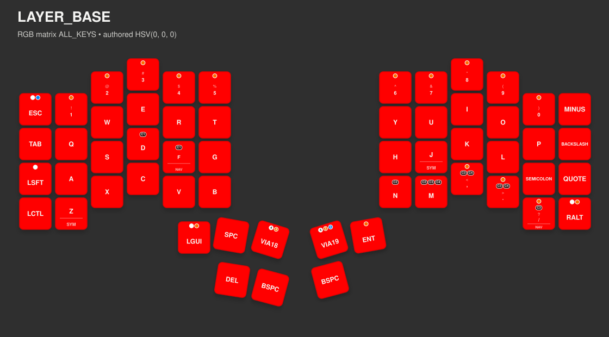
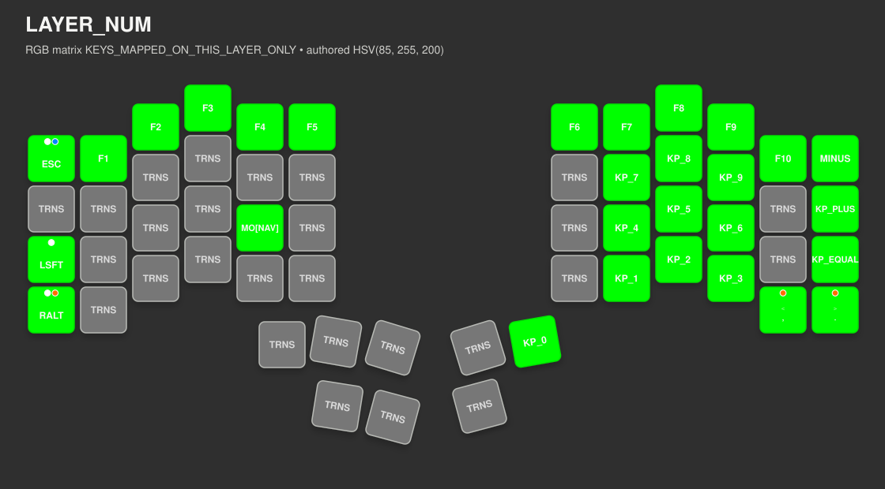
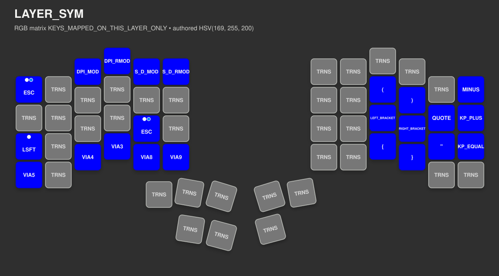
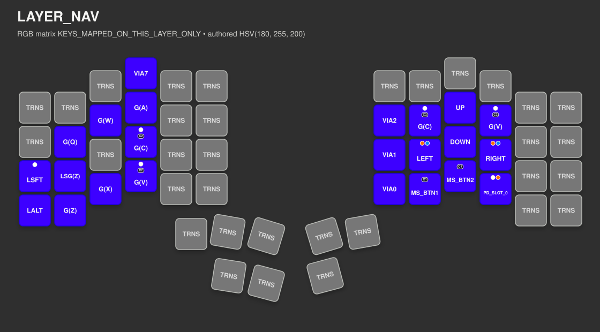
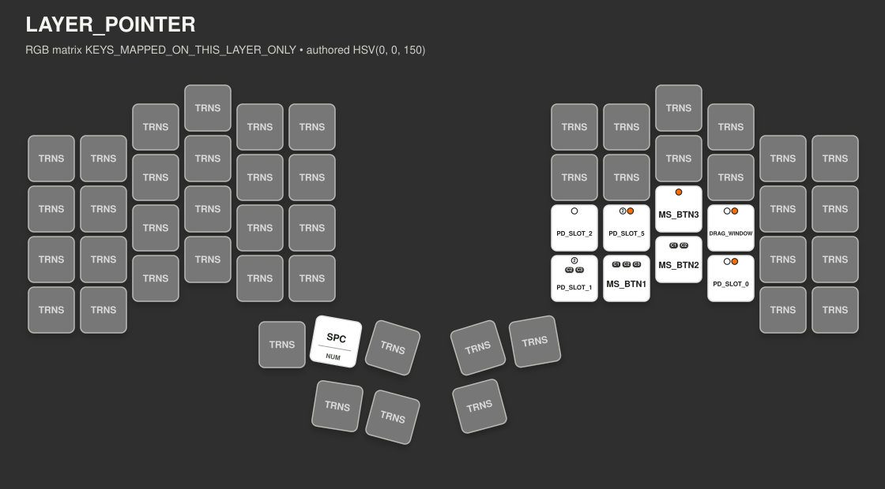
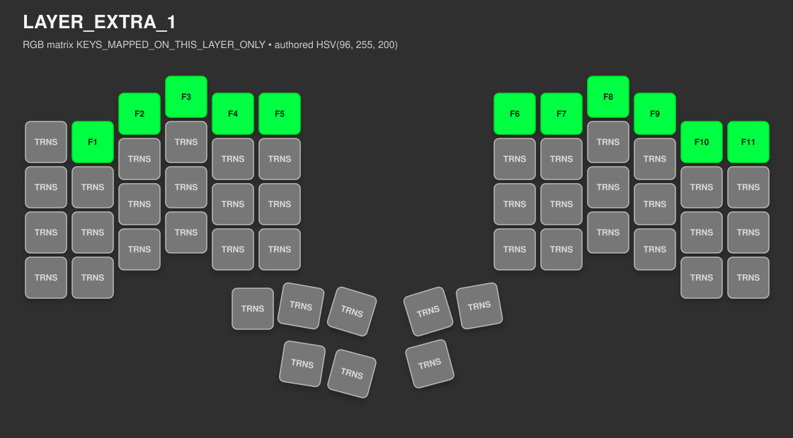
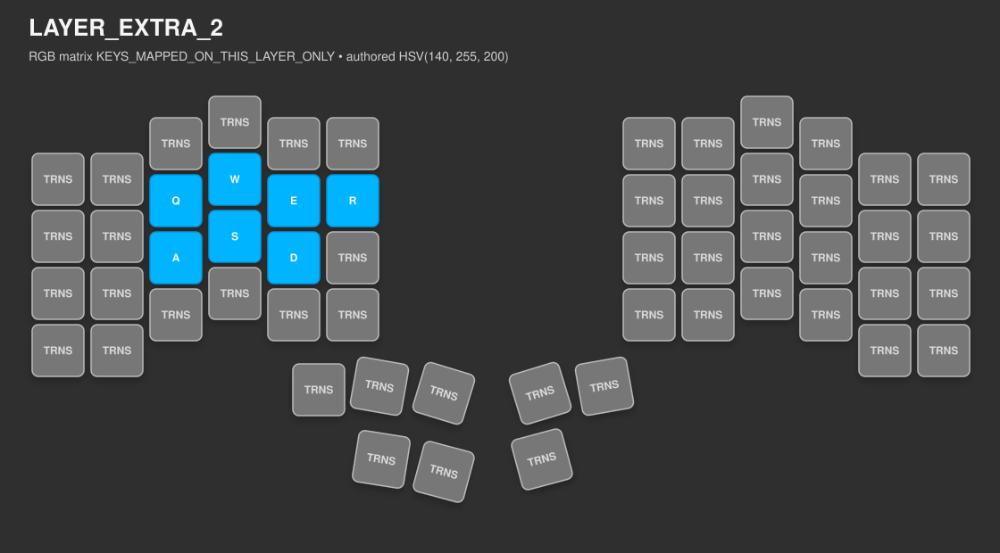
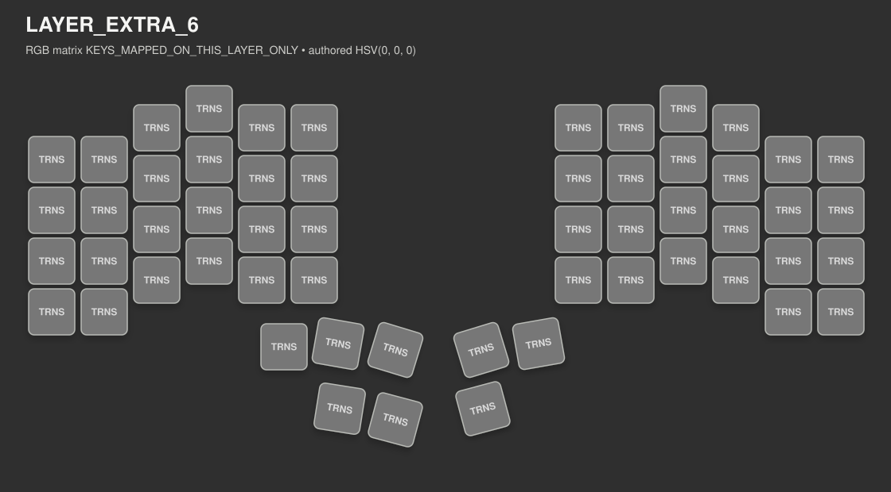
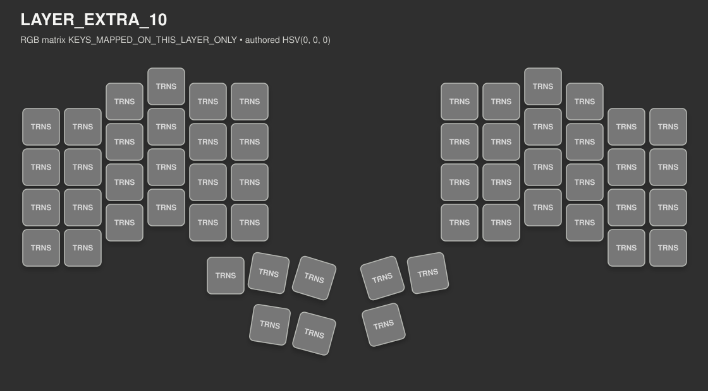

<!-- Generated file. Do not edit by hand. -->
# Profile Introspection
This report is generated from the authored profile files [keymap.c](../keyboards/bastardkb/charybdis/4x6/keymaps/noah/keymap.c), [keymap config.h](../keyboards/bastardkb/charybdis/4x6/keymaps/noah/config.h), [users/noah/config.h](../users/noah/config.h), and [rgb_config.c](../keyboards/bastardkb/charybdis/4x6/keymaps/noah/rgb_config.c). The renderer is board-specific to the Charybdis 4x6 and derives the current `LAYOUT()` slot order directly from [keymap.c](../keyboards/bastardkb/charybdis/4x6/keymaps/noah/keymap.c).
PD mode names and bindings in this report stay in sync with the shared definitions in [pd_mode_manifest.h](../users/noah/lib/pointing/defs/pd_mode_manifest.h).
## Quick Legend

| Where | Marker | Meaning |
| --- | --- | --- |
| Layer image | `C1`, `C2`, ... | Combo badge. Match the badge id to the layer-local combo table below the image. |
| Layer image | `tap` dot  with optional count | This key has authored tap actions. A plain dot means one authored tap action; a numbered dot means multiple tap tiers on that key define a tap action. Use the behavior table below for `single`, `double`, `triple`, and higher tap counts. |
| Layer image | `hold` dot  with optional count | This key has authored hold tiers. A plain dot means one hold tier; a numbered dot means multiple tap tiers on that key define a hold action. |
| Layer image | `long hold` dot  with optional count | This key has authored long-hold tiers. A plain dot means one long-hold tier; a numbered dot means multiple tap tiers on that key define a long-hold action. |
| Behavior table | `single`, `double`, `triple`, `quadruple`, `quintuple` | Tap tiers for the same physical key: 1 tap, 2 taps, 3 taps, 4 taps, 5 taps. |
| Behavior table | repeated rows for one key | The same physical key exposes different actions at different tap tiers. |
| Behavior table | `Tap` / `Hold` / `Long Hold` | Actions that fire for that tap tier on tap, hold, or deeper long hold. |

## Layer Images

These previews are generated as SVG image assets under [docs/media/profile-introspection/](media/profile-introspection). The renderer uses the authored `layer_colors[]` and layer LED-group config from [rgb_config.c](../keyboards/bastardkb/charybdis/4x6/keymaps/noah/rgb_config.c), plus the current `LAYOUT()` slot order from [keymap.c](../keyboards/bastardkb/charybdis/4x6/keymaps/noah/keymap.c):

| Available Layer RGB Mode | Meaning |
| --- | --- |
| `ALL_KEYS` | Tint every physical key with the authored layer color. |
| `KEYS_MAPPED_ON_THIS_LAYER_ONLY` | Tint only keys with a real mapping on that layer; transparent positions stay neutral so lower layers remain visible underneath. |

- `LAYER_BASE` falls back to the default RGB color from [config.h](../keyboards/bastardkb/charybdis/4x6/keymaps/noah/config.h) when its authored layer color is `HSV(0, 0, 0)`
- Keys with authored `key_behaviors[]` rows in [keymap.c](../keyboards/bastardkb/charybdis/4x6/keymaps/noah/keymap.c) show numbered activity dots derived from the authored key-behavior feedback colors in [rgb_config.c](../keyboards/bastardkb/charybdis/4x6/keymaps/noah/rgb_config.c): tap-commit color for authored tap actions, hold color for authored hold tiers, and long-hold color for authored long-hold tiers
- Keys that participate in combos on that layer show combo badges such as `C1` and `C2` in their own key-face row; those ids match the combo table for the same layer
- Active layer LED groups repaint their configured LED ids on top of the normal layer color in the same generated layer preview
- Each layer section below also pulls in the authored key behaviors, pd modes that are directly placed or reachable through those behaviors, and combos that are actually present on that layer

Timing legend for the layer-local behavior tables:

- `tap_hold(...)`, `long_hold(...)`, and `multi_tap(...)` use the default timings from [config.h](../keyboards/bastardkb/charybdis/4x6/keymaps/noah/config.h)
- `tap_hold=...`, `long_hold=...`, and `multi_tap=...` are custom timings authored on that key
- `release before tap_hold(...); otherwise normal hold` means the tap fires on a quick release; if you keep holding, the key keeps its normal hold behavior
- Timing is shown per tap count, so each row lists only the timings that matter for that behavior

### `LAYER_BASE`

- RGB matrix render mode: `ALL_KEYS`
- Authored layer color: `HSV(0, 0, 0)`
- Preview color: 
- Combo badges on this layer: `C1`, `C2`, `C3`, `C4`

#### Key Behaviors On This Layer

| Key On Layer | Behavior Keycode | Tap Count | Tap | Hold | Long Hold | Timing |
| --- | --- | --- | --- | --- | --- | --- |
| `ESC` | `ESC` (`KC_ESC`) | `single` | `-` | `-` | `TAP_AT_HOLD_THRESHOLD(LAG(KC_ESC))` | `tap_hold(150), long_hold(400), multi_tap(150)` |
| `ESC` | `ESC` (`KC_ESC`) | `double` | `TAP_SENDS(S(KC_GRV))` | `-` | `-` | `multi_tap(150)` |
| `1` | `1` (`KC_1`) | `single` | `-` | `PRESS_AND_HOLD_UNTIL_RELEASE(KC_EXLM)` | `-` | `tap_hold(150)` |
| `2` | `2` (`KC_2`) | `single` | `-` | `PRESS_AND_HOLD_UNTIL_RELEASE(KC_AT)` | `-` | `tap_hold(150)` |
| `3` | `3` (`KC_3`) | `single` | `-` | `PRESS_AND_HOLD_UNTIL_RELEASE(KC_HASH)` | `-` | `tap_hold(150)` |
| `4` | `4` (`KC_4`) | `single` | `-` | `PRESS_AND_HOLD_UNTIL_RELEASE(KC_DLR)` | `-` | `tap_hold(150)` |
| `5` | `5` (`KC_5`) | `single` | `-` | `PRESS_AND_HOLD_UNTIL_RELEASE(KC_PERC)` | `-` | `tap_hold(150)` |
| `6` | `6` (`KC_6`) | `single` | `-` | `PRESS_AND_HOLD_UNTIL_RELEASE(KC_CIRC)` | `-` | `tap_hold(150)` |
| `7` | `7` (`KC_7`) | `single` | `-` | `PRESS_AND_HOLD_UNTIL_RELEASE(KC_AMPR)` | `-` | `tap_hold(150)` |
| `8` | `8` (`KC_8`) | `single` | `-` | `PRESS_AND_HOLD_UNTIL_RELEASE(KC_ASTR)` | `-` | `tap_hold(150)` |
| `9` | `9` (`KC_9`) | `single` | `-` | `PRESS_AND_HOLD_UNTIL_RELEASE(KC_LPRN)` | `-` | `tap_hold(150)` |
| `0` | `0` (`KC_0`) | `single` | `-` | `PRESS_AND_HOLD_UNTIL_RELEASE(KC_RPRN)` | `-` | `tap_hold(150)` |
| `LSFT` | `LSFT` (`KC_LEFT_SHIFT`) | `single` | `TAP_SENDS(KC_CAPS)` | `-` | `-` | `release before tap_hold(150); otherwise normal hold` |
| `,` | `,` (`KC_COMM`) | `single` | `-` | `PRESS_AND_HOLD_UNTIL_RELEASE(KC_LABK)` | `-` | `tap_hold(150)` |
| `.` | `.` (`KC_DOT`) | `single` | `-` | `PRESS_AND_HOLD_UNTIL_RELEASE(KC_RABK)` | `-` | `tap_hold(150)` |
| `LT[NAV]/SLSH` | `LT[NAV]/SLSH` (`LT(LAYER_NAV,KC_SLSH)`) | `double` | `-` | `TAP_AT_HOLD_THRESHOLD(LOCK_LAYER(LAYER_NAV))` | `-` | `tap_hold=100, multi_tap(150)` |
| `RALT` | `RALT` (`KC_RIGHT_ALT`) | `single` | `TAP_SENDS(PD_SLOT_4_LOCK)` | `-` | `-` | `multi_tap(150)` |
| `RALT` | `RALT` (`KC_RIGHT_ALT`) | `double` | `-` | `PRESS_AND_HOLD_UNTIL_RELEASE(PD_SLOT_6)` | `-` | `tap_hold(150), multi_tap(150)` |
| `LGUI` | `LGUI` (`KC_LEFT_GUI`) | `double` | `-` | `PRESS_AND_HOLD_UNTIL_RELEASE(KC_LEFT_ALT)` | `-` | `tap_hold(150), multi_tap(150)` |
| `LGUI` | `LGUI` (`KC_LEFT_GUI`) | `triple` | `TAP_SENDS(OSM(MOD_LSFT))` | `-` | `-` | `multi_tap(150)` |
| `CUSTOM_KEY_1` | `CUSTOM_KEY_1` | `single` | `TAP_SENDS(LOCK_LAYER(LAYER_SYM))` | `PRESS_AND_HOLD_UNTIL_RELEASE(MO(LAYER_SYM))` | `-` | `tap_hold=150, multi_tap(150)` |
| `CUSTOM_KEY_1` | `CUSTOM_KEY_1` | `double` | `TAP_SENDS(LOCK_LAYER(LAYER_NUM))` | `PRESS_AND_HOLD_UNTIL_RELEASE(MO(LAYER_NUM))` | `-` | `tap_hold=150, multi_tap(150)` |
| `CUSTOM_KEY_1` | `CUSTOM_KEY_1` | `triple` | `TAP_SENDS(LOCK_LAYER(LAYER_EXTRA_1))` | `PRESS_AND_HOLD_UNTIL_RELEASE(MO(LAYER_EXTRA_1))` | `-` | `tap_hold=150, multi_tap(150)` |
| `CUSTOM_KEY_1` | `CUSTOM_KEY_1` | `quadruple` | `TAP_SENDS(LOCK_LAYER(LAYER_EXTRA_2))` | `PRESS_AND_HOLD_UNTIL_RELEASE(MO(LAYER_EXTRA_2))` | `-` | `tap_hold=150, multi_tap(150)` |
| `CUSTOM_KEY_0` | `CUSTOM_KEY_0` | `single` | `TAP_SENDS(LOCK_LAYER(LAYER_NAV))` | `PRESS_AND_HOLD_UNTIL_RELEASE(MO(LAYER_NAV))` | `-` | `tap_hold=150, multi_tap(150)` |
| `CUSTOM_KEY_0` | `CUSTOM_KEY_0` | `double` | `TAP_SENDS(KC_MPLY)` | `TAP_ON_RELEASE_AFTER_HOLD(KC_ESCAPE)` | `TAP_AT_HOLD_THRESHOLD(LOCK_LAYER(LAYER_NUM))` | `tap_hold=150, long_hold(400), multi_tap(150)` |
| `CUSTOM_KEY_0` | `CUSTOM_KEY_0` | `triple` | `TAP_SENDS(KC_MNXT)` | `-` | `PRESS_AND_HOLD_UNTIL_RELEASE(KC_MNXT)` | `tap_hold=150, long_hold(400), multi_tap(150)` |
| `CUSTOM_KEY_0` | `CUSTOM_KEY_0` | `quadruple` | `TAP_SENDS(KC_MPRV)` | `-` | `PRESS_AND_HOLD_UNTIL_RELEASE(KC_MPRV)` | `tap_hold=150, long_hold(400), multi_tap(150)` |
| `ENT` | `ENT` (`KC_ENT`) | `single` | `-` | `PRESS_AND_HOLD_UNTIL_RELEASE(S(KC_ENT))` | `-` | `tap_hold(150)` |

#### PD Modes Reachable On This Layer

| Reachable Via | Mode Keycode | Pointing Mode | Locality | Authored HSV | Preview Color |
| --- | --- | --- | --- | --- | --- |
| `RALT` via `single tap` -> `PD_SLOT_4_LOCK` | `PD_SLOT_4` | `PD_MODE_ARROW` | `RGB_RIGHT_HALF` | `HSV(127, 255, 200)` |  |
| `RALT` via `double hold` -> `PD_SLOT_6` | `PD_SLOT_6` | `PD_MODE_SLOT_6` | `RGB_KEY_HALF` | `HSV(19, 255, 200)` |  |

#### Combos Available On This Layer

| Combo | Inputs On This Layer | Output |
| --- | --- | --- |
| `C1` | `D` + `LT[NAV]/F` | `TAB` (`KC_TAB`) |
| `C2` | `N` + `M` | `LGUI` (`KC_LGUI`) |
| `C3` | `M` + `,` + `.` + `LT[NAV]/SLSH` | `G(N)` (`G(KC_N)`) |
| `C4` | `M` + `,` + `.` | `G(T)` (`G(KC_T)`) |

### `LAYER_NUM`

- RGB matrix render mode: `KEYS_MAPPED_ON_THIS_LAYER_ONLY`
- Authored layer color: `HSV(85, 255, 200)`
- Preview color: 

#### Key Behaviors On This Layer

| Key On Layer | Behavior Keycode | Tap Count | Tap | Hold | Long Hold | Timing |
| --- | --- | --- | --- | --- | --- | --- |
| `ESC` | `ESC` (`KC_ESC`) | `single` | `-` | `-` | `TAP_AT_HOLD_THRESHOLD(LAG(KC_ESC))` | `tap_hold(150), long_hold(400), multi_tap(150)` |
| `ESC` | `ESC` (`KC_ESC`) | `double` | `TAP_SENDS(S(KC_GRV))` | `-` | `-` | `multi_tap(150)` |
| `LSFT` | `LSFT` (`KC_LEFT_SHIFT`) | `single` | `TAP_SENDS(KC_CAPS)` | `-` | `-` | `release before tap_hold(150); otherwise normal hold` |
| `RALT` | `RALT` (`KC_RIGHT_ALT`) | `single` | `TAP_SENDS(PD_SLOT_4_LOCK)` | `-` | `-` | `multi_tap(150)` |
| `RALT` | `RALT` (`KC_RIGHT_ALT`) | `double` | `-` | `PRESS_AND_HOLD_UNTIL_RELEASE(PD_SLOT_6)` | `-` | `tap_hold(150), multi_tap(150)` |
| `,` | `,` (`KC_COMM`) | `single` | `-` | `PRESS_AND_HOLD_UNTIL_RELEASE(KC_LABK)` | `-` | `tap_hold(150)` |
| `.` | `.` (`KC_DOT`) | `single` | `-` | `PRESS_AND_HOLD_UNTIL_RELEASE(KC_RABK)` | `-` | `tap_hold(150)` |

#### PD Modes Reachable On This Layer

| Reachable Via | Mode Keycode | Pointing Mode | Locality | Authored HSV | Preview Color |
| --- | --- | --- | --- | --- | --- |
| `RALT` via `single tap` -> `PD_SLOT_4_LOCK` | `PD_SLOT_4` | `PD_MODE_ARROW` | `RGB_RIGHT_HALF` | `HSV(127, 255, 200)` |  |
| `RALT` via `double hold` -> `PD_SLOT_6` | `PD_SLOT_6` | `PD_MODE_SLOT_6` | `RGB_KEY_HALF` | `HSV(19, 255, 200)` |  |

#### Combos Available On This Layer

No authored combos resolve entirely from keys on this layer.

### `LAYER_SYM`

- RGB matrix render mode: `KEYS_MAPPED_ON_THIS_LAYER_ONLY`
- Authored layer color: `HSV(169, 255, 200)`
- Preview color: 

#### Key Behaviors On This Layer

| Key On Layer | Behavior Keycode | Tap Count | Tap | Hold | Long Hold | Timing |
| --- | --- | --- | --- | --- | --- | --- |
| `ESC x2` | `ESC` (`KC_ESC`) | `single` | `-` | `-` | `TAP_AT_HOLD_THRESHOLD(LAG(KC_ESC))` | `tap_hold(150), long_hold(400), multi_tap(150)` |
| `ESC x2` | `ESC` (`KC_ESC`) | `double` | `TAP_SENDS(S(KC_GRV))` | `-` | `-` | `multi_tap(150)` |
| `LSFT` | `LSFT` (`KC_LEFT_SHIFT`) | `single` | `TAP_SENDS(KC_CAPS)` | `-` | `-` | `release before tap_hold(150); otherwise normal hold` |

#### PD Modes Reachable On This Layer

No pd modes are directly placed or reachable through key behaviors on this layer.

#### Combos Available On This Layer

No authored combos resolve entirely from keys on this layer.

### `LAYER_NAV`

- RGB matrix render mode: `KEYS_MAPPED_ON_THIS_LAYER_ONLY`
- Authored layer color: `HSV(180, 255, 200)`
- Preview color: 
- Combo badges on this layer: `C1`, `C2`, `C3`

#### Key Behaviors On This Layer

| Key On Layer | Behavior Keycode | Tap Count | Tap | Hold | Long Hold | Timing |
| --- | --- | --- | --- | --- | --- | --- |
| `G(C) x2` | `G(C)` (`G(KC_C)`) | `double` | `TAP_SENDS(VIA_MACRO_10)` | `-` | `-` | `multi_tap(150)` |
| `G(V) x2` | `G(V)` (`G(KC_V)`) | `double` | `TAP_SENDS(VIA_MACRO_7)` | `-` | `-` | `multi_tap(150)` |
| `LSFT` | `LSFT` (`KC_LEFT_SHIFT`) | `single` | `TAP_SENDS(KC_CAPS)` | `-` | `-` | `release before tap_hold(150); otherwise normal hold` |
| `LEFT` | `LEFT` (`KC_LEFT`) | `single` | `-` | `TAP_ON_RELEASE_AFTER_HOLD(A(KC_LEFT))` | `TAP_AT_HOLD_THRESHOLD(G(KC_LEFT))` | `tap_hold(150), long_hold(400)` |
| `RIGHT` | `RIGHT` (`KC_RIGHT`) | `single` | `-` | `TAP_ON_RELEASE_AFTER_HOLD(A(KC_RIGHT))` | `TAP_AT_HOLD_THRESHOLD(G(KC_RIGHT))` | `tap_hold(150), long_hold(400)` |
| `PD_SLOT_0` | `PD_SLOT_0` | `single` | `TAP_SENDS(KC_TRNS)` | `-` | `-` | `multi_tap(150)` |
| `PD_SLOT_0` | `PD_SLOT_0` | `double` | `-` | `TAP_AT_HOLD_THRESHOLD(PD_SLOT_0_LOCK)` | `-` | `tap_hold(150), multi_tap(150)` |

#### PD Modes Reachable On This Layer

| Reachable Via | Mode Keycode | Pointing Mode | Locality | Authored HSV | Preview Color |
| --- | --- | --- | --- | --- | --- |
| `PD_SLOT_0` directly on layer; `PD_SLOT_0` via `double hold` -> `PD_SLOT_0_LOCK` | `PD_SLOT_0` | `PD_MODE_DRAGSCROLL` | `RGB_RIGHT_HALF` | `HSV(21, 255, 200)` |  |

#### Combos Available On This Layer

| Combo | Inputs On This Layer | Output |
| --- | --- | --- |
| `C1` | `G(C) x2` + `G(V) x2` | `G(A)` (`G(KC_A)`) |
| `C2` | `MS_BTN1` + `MS_BTN2` + `PD_SLOT_0` | `G(T)` (`G(KC_T)`) |
| `C3` | `MS_BTN1` + `MS_BTN2` | `MS_BTN6` |

### `LAYER_POINTER`

- RGB matrix render mode: `KEYS_MAPPED_ON_THIS_LAYER_ONLY`
- Authored layer color: `HSV(0, 0, 150)`
- Preview color: 
- Combo badges on this layer: `C1`, `C2`, `C3`, `C4`

#### Key Behaviors On This Layer

| Key On Layer | Behavior Keycode | Tap Count | Tap | Hold | Long Hold | Timing |
| --- | --- | --- | --- | --- | --- | --- |
| `PD_SLOT_2` | `PD_SLOT_2` | `single` | `TAP_SENDS(KC_TRNS)` | `-` | `-` | `release before tap_hold(150); otherwise normal hold` |
| `PD_SLOT_5` | `PD_SLOT_5` | `single` | `TAP_SENDS(KC_TRNS)` | `-` | `-` | `multi_tap(150)` |
| `PD_SLOT_5` | `PD_SLOT_5` | `double` | `TAP_SENDS(VIA_MACRO_6)` | `PRESS_AND_HOLD_UNTIL_RELEASE(PD_SLOT_3)` | `-` | `tap_hold(150), multi_tap(150)` |
| `MS_BTN3` | `MS_BTN3` | `double` | `-` | `PRESS_AND_HOLD_UNTIL_RELEASE(MS_BTN7)` | `-` | `tap_hold=100, multi_tap=100` |
| `CUSTOM_KEY_3` | `CUSTOM_KEY_3` | `single` | `TAP_SENDS(KC_TRNS)` | `PRESS_AND_HOLD_UNTIL_RELEASE(MS_BTN6)` | `-` | `tap_hold=100` |
| `PD_SLOT_1` | `PD_SLOT_1` | `single` | `TAP_SENDS(KC_TRNS)` | `-` | `-` | `multi_tap(150)` |
| `PD_SLOT_1` | `PD_SLOT_1` | `double` | `TAP_SENDS(KC_MUTE)` | `-` | `-` | `multi_tap(150)` |
| `PD_SLOT_0` | `PD_SLOT_0` | `single` | `TAP_SENDS(KC_TRNS)` | `-` | `-` | `multi_tap(150)` |
| `PD_SLOT_0` | `PD_SLOT_0` | `double` | `-` | `TAP_AT_HOLD_THRESHOLD(PD_SLOT_0_LOCK)` | `-` | `tap_hold(150), multi_tap(150)` |

#### PD Modes Reachable On This Layer

| Reachable Via | Mode Keycode | Pointing Mode | Locality | Authored HSV | Preview Color |
| --- | --- | --- | --- | --- | --- |
| `PD_SLOT_0` directly on layer; `PD_SLOT_0` via `double hold` -> `PD_SLOT_0_LOCK` | `PD_SLOT_0` | `PD_MODE_DRAGSCROLL` | `RGB_RIGHT_HALF` | `HSV(21, 255, 200)` |  |
| `PD_SLOT_1` directly on layer | `PD_SLOT_1` | `PD_MODE_VOLUME` | `RGB_RIGHT_HALF` | `HSV(43, 255, 200)` |  |
| `PD_SLOT_2` directly on layer | `PD_SLOT_2` | `PD_MODE_BRIGHTNESS` | `RGB_RIGHT_HALF` | `HSV(213, 255, 200)` |  |
| `PD_SLOT_5` via `double hold` -> `PD_SLOT_3` | `PD_SLOT_3` | `PD_MODE_ZOOM` | `RGB_RIGHT_HALF` | `HSV(70, 255, 200)` |  |
| `PD_SLOT_5` directly on layer | `PD_SLOT_5` | `PD_MODE_PINCH` | `RGB_RIGHT_HALF` | `HSV(55, 255, 200)` |  |

#### Combos Available On This Layer

| Combo | Inputs On This Layer | Output |
| --- | --- | --- |
| `C1` | `PD_SLOT_5` + `MS_BTN3` | `CUSTOM_KEY_2` |
| `C2` | `MS_BTN1` + `PD_SLOT_1` | `LGUI` (`KC_LGUI`) |
| `C3` | `MS_BTN1` + `MS_BTN2` + `PD_SLOT_0` | `G(T)` (`G(KC_T)`) |
| `C4` | `MS_BTN1` + `MS_BTN2` | `MS_BTN6` |

### `LAYER_EXTRA_1`

- RGB matrix render mode: `KEYS_MAPPED_ON_THIS_LAYER_ONLY`
- Authored layer color: `HSV(96, 255, 200)`
- Preview color: 

#### Key Behaviors On This Layer

No authored key-behavior rows are present on this layer.

#### PD Modes Reachable On This Layer

No pd modes are directly placed or reachable through key behaviors on this layer.

#### Combos Available On This Layer

No authored combos resolve entirely from keys on this layer.

### `LAYER_EXTRA_2`

- RGB matrix render mode: `KEYS_MAPPED_ON_THIS_LAYER_ONLY`
- Authored layer color: `HSV(140, 255, 200)`
- Preview color: 

#### Key Behaviors On This Layer

No authored key-behavior rows are present on this layer.

#### PD Modes Reachable On This Layer

No pd modes are directly placed or reachable through key behaviors on this layer.

#### Combos Available On This Layer

No authored combos resolve entirely from keys on this layer.

### `LAYER_EXTRA_3`

- RGB matrix render mode: `KEYS_MAPPED_ON_THIS_LAYER_ONLY`
- Authored layer color: `HSV(0, 0, 0)`
- Preview color: no override

#### Key Behaviors On This Layer

No authored key-behavior rows are present on this layer.

#### PD Modes Reachable On This Layer

No pd modes are directly placed or reachable through key behaviors on this layer.

#### Combos Available On This Layer

No authored combos resolve entirely from keys on this layer.

### `LAYER_EXTRA_4`

- RGB matrix render mode: `KEYS_MAPPED_ON_THIS_LAYER_ONLY`
- Authored layer color: `HSV(0, 0, 0)`
- Preview color: no override

#### Key Behaviors On This Layer

No authored key-behavior rows are present on this layer.

#### PD Modes Reachable On This Layer

No pd modes are directly placed or reachable through key behaviors on this layer.

#### Combos Available On This Layer

No authored combos resolve entirely from keys on this layer.

### `LAYER_EXTRA_5`

- RGB matrix render mode: `KEYS_MAPPED_ON_THIS_LAYER_ONLY`
- Authored layer color: `HSV(0, 0, 0)`
- Preview color: no override

#### Key Behaviors On This Layer

No authored key-behavior rows are present on this layer.

#### PD Modes Reachable On This Layer

No pd modes are directly placed or reachable through key behaviors on this layer.

#### Combos Available On This Layer

No authored combos resolve entirely from keys on this layer.

### `LAYER_EXTRA_6`

- RGB matrix render mode: `KEYS_MAPPED_ON_THIS_LAYER_ONLY`
- Authored layer color: `HSV(0, 0, 0)`
- Preview color: no override

#### Key Behaviors On This Layer

No authored key-behavior rows are present on this layer.

#### PD Modes Reachable On This Layer

No pd modes are directly placed or reachable through key behaviors on this layer.

#### Combos Available On This Layer

No authored combos resolve entirely from keys on this layer.

### `LAYER_EXTRA_7`

- RGB matrix render mode: `KEYS_MAPPED_ON_THIS_LAYER_ONLY`
- Authored layer color: `HSV(0, 0, 0)`
- Preview color: no override

#### Key Behaviors On This Layer

No authored key-behavior rows are present on this layer.

#### PD Modes Reachable On This Layer

No pd modes are directly placed or reachable through key behaviors on this layer.

#### Combos Available On This Layer

No authored combos resolve entirely from keys on this layer.

### `LAYER_EXTRA_8`

- RGB matrix render mode: `KEYS_MAPPED_ON_THIS_LAYER_ONLY`
- Authored layer color: `HSV(0, 0, 0)`
- Preview color: no override

#### Key Behaviors On This Layer

No authored key-behavior rows are present on this layer.

#### PD Modes Reachable On This Layer

No pd modes are directly placed or reachable through key behaviors on this layer.

#### Combos Available On This Layer

No authored combos resolve entirely from keys on this layer.

### `LAYER_EXTRA_9`

- RGB matrix render mode: `KEYS_MAPPED_ON_THIS_LAYER_ONLY`
- Authored layer color: `HSV(0, 0, 0)`
- Preview color: no override

#### Key Behaviors On This Layer

No authored key-behavior rows are present on this layer.

#### PD Modes Reachable On This Layer

No pd modes are directly placed or reachable through key behaviors on this layer.

#### Combos Available On This Layer

No authored combos resolve entirely from keys on this layer.

### `LAYER_EXTRA_10`

- RGB matrix render mode: `KEYS_MAPPED_ON_THIS_LAYER_ONLY`
- Authored layer color: `HSV(0, 0, 0)`
- Preview color: no override

#### Key Behaviors On This Layer

No authored key-behavior rows are present on this layer.

#### PD Modes Reachable On This Layer

No pd modes are directly placed or reachable through key behaviors on this layer.

#### Combos Available On This Layer

No authored combos resolve entirely from keys on this layer.

### `LAYER_EXTRA_11`

- RGB matrix render mode: `KEYS_MAPPED_ON_THIS_LAYER_ONLY`
- Authored layer color: `HSV(0, 0, 0)`
- Preview color: no override

#### Key Behaviors On This Layer

No authored key-behavior rows are present on this layer.

#### PD Modes Reachable On This Layer

No pd modes are directly placed or reachable through key behaviors on this layer.

#### Combos Available On This Layer

No authored combos resolve entirely from keys on this layer.

## PD Mode Colors

These overlays come from `pd_mode_colors[]` in [rgb_config.c](../keyboards/bastardkb/charybdis/4x6/keymaps/noah/rgb_config.c). Each row chooses its own locality and color for the matching pointing mode.
Key-local PD RGB localities are gated by `RGB_PD_MODE_ACTIVE_HALF_ENABLE` in [users/noah/config.h](../users/noah/config.h); current state: `defined`.

| PD Locality | Meaning |
| --- | --- |
| `RGB_BOTH_HALVES` | Mirror the PD-mode overlay across both halves. |
| `RGB_LEFT_HALF` | Paint the left half whenever the matching PD mode is active. |
| `RGB_RIGHT_HALF` | Paint the right half whenever the matching PD mode is active. |
| `RGB_KEY_HALF` | Paint the half or halves containing the key footprint that triggered the currently effective PD mode. |
| `RGB_KEYS_ONLY` | Paint only the key footprint that triggered the currently effective PD mode. |

| Pointing Mode | Locality | Authored HSV | Preview Color |
| --- | --- | --- | --- |
| `PD_MODE_SLOT_6` | `RGB_KEY_HALF` | `HSV(19, 255, 200)` |  |
| `PD_MODE_SLOT_7` | `RGB_RIGHT_HALF` | `HSV(200, 193, 108)` |  |
| `PD_MODE_DRAGSCROLL` | `RGB_RIGHT_HALF` | `HSV(21, 255, 200)` |  |
| `PD_MODE_VOLUME` | `RGB_RIGHT_HALF` | `HSV(43, 255, 200)` |  |
| `PD_MODE_BRIGHTNESS` | `RGB_RIGHT_HALF` | `HSV(213, 255, 200)` |  |
| `PD_MODE_ARROW` | `RGB_RIGHT_HALF` | `HSV(127, 255, 200)` |  |
| `PD_MODE_PINCH` | `RGB_RIGHT_HALF` | `HSV(55, 255, 200)` |  |
| `PD_MODE_ZOOM` | `RGB_RIGHT_HALF` | `HSV(70, 255, 200)` |  |
| `PD_MODE_SLOT_8` | `RGB_RIGHT_HALF` | `HSV(0, 0, 0)` |  |
| `PD_MODE_SLOT_9` | `RGB_RIGHT_HALF` | `HSV(0, 0, 0)` |  |
| `PD_MODE_SLOT_10` | `RGB_RIGHT_HALF` | `HSV(0, 0, 0)` |  |
| `PD_MODE_SLOT_11` | `RGB_RIGHT_HALF` | `HSV(0, 0, 0)` |  |
| `PD_MODE_SLOT_12` | `RGB_RIGHT_HALF` | `HSV(0, 0, 0)` |  |
| `PD_MODE_SLOT_13` | `RGB_RIGHT_HALF` | `HSV(0, 0, 0)` |  |
| `PD_MODE_SLOT_14` | `RGB_RIGHT_HALF` | `HSV(0, 0, 0)` |  |
| `PD_MODE_SLOT_15` | `RGB_RIGHT_HALF` | `HSV(0, 0, 0)` |  |
| `PD_MODE_SLOT_16` | `RGB_RIGHT_HALF` | `HSV(0, 0, 0)` |  |
| `PD_MODE_SLOT_17` | `RGB_RIGHT_HALF` | `HSV(0, 0, 0)` |  |
| `PD_MODE_SLOT_18` | `RGB_RIGHT_HALF` | `HSV(0, 0, 0)` |  |
| `PD_MODE_SLOT_19` | `RGB_RIGHT_HALF` | `HSV(0, 0, 0)` |  |
| `PD_MODE_SLOT_20` | `RGB_RIGHT_HALF` | `HSV(0, 0, 0)` |  |
| `PD_MODE_SLOT_21` | `RGB_RIGHT_HALF` | `HSV(0, 0, 0)` |  |
| `PD_MODE_SLOT_22` | `RGB_RIGHT_HALF` | `HSV(0, 0, 0)` |  |
| `PD_MODE_SLOT_23` | `RGB_RIGHT_HALF` | `HSV(0, 0, 0)` |  |
| `PD_MODE_SLOT_24` | `RGB_RIGHT_HALF` | `HSV(0, 0, 0)` |  |
| `PD_MODE_SLOT_25` | `RGB_RIGHT_HALF` | `HSV(0, 0, 0)` |  |
| `PD_MODE_SLOT_26` | `RGB_RIGHT_HALF` | `HSV(0, 0, 0)` |  |
| `PD_MODE_SLOT_27` | `RGB_RIGHT_HALF` | `HSV(0, 0, 0)` |  |
| `PD_MODE_SLOT_28` | `RGB_RIGHT_HALF` | `HSV(0, 0, 0)` |  |
| `PD_MODE_SLOT_29` | `RGB_RIGHT_HALF` | `HSV(0, 0, 0)` |  |
| `PD_MODE_SLOT_30` | `RGB_RIGHT_HALF` | `HSV(0, 0, 0)` |  |
| `PD_MODE_SLOT_31` | `RGB_RIGHT_HALF` | `HSV(0, 0, 0)` |  |

### PD Mode LED Groups

Authored PD-mode LED groups repaint after the active PD-mode locality render.

| Pointing Mode | LED Group | LEDs | Count | Authored HSV | Preview Color |
| --- | --- | --- | --- | --- | --- |
| `RGB_PD_MODE_GROUP_ALL` | `RGB_LED_GROUP_THUMBS` | `26,27,28,25,24,53,54,55` | `8` | `HSV(0, 0, 0)` | inherits each active pointing-mode color |

## Auto-mouse Fade

This fade destination comes from `automouse_fade_end_config` in [rgb_config.c](../keyboards/bastardkb/charybdis/4x6/keymaps/noah/rgb_config.c). The mode chooses where the timeout fade lands after the auto-mouse layer starts dropping out.

Current authored auto-mouse fade mode: `FOLLOW_REAL_DESTINATION`.

| Available Mode | Meaning |
| --- | --- |
| `FOLLOW_REAL_DESTINATION` | Fade to the real rendered board state that remains after the auto-mouse layer drops out. |
| `END_COLOR_WHERE_BASE_EFFECT_WOULD_SHOW` | Keep the real destination where layers still paint, but use `end_color` where the base RGB effect would otherwise show through. |
| `END_COLOR_ON_ALL_KEYS` | Use `end_color` as the fade destination on every key while the automouse renderer is active. |

Authored `end_color`: `HSV(167, 255, 199)`.

Preview color: 

`end_color` is only visible in the two `END_COLOR_*` modes above; `FOLLOW_REAL_DESTINATION` ignores it and lands on the real rendered board state instead.

## Combo Feedback LEDs

This steady combo layer comes from `combo_feedback_colors` in [rgb_config.c](../keyboards/bastardkb/charybdis/4x6/keymaps/noah/rgb_config.c). It stays visible while a combo chord is active, except once its output owns a momentary layer hold: then only layer lighting shows, with no confirmation flash. Pending behavior holds keep combo lighting until they resolve. Other combos keep their own lighting, including on shared keys. Outside that exception, it sits underneath preview and pd-mode indicators when that combo owns those states, and otherwise repaints above preview and pd-mode overlays but below key-behavior feedback.

Current authored combo feedback locality: `RGB_KEY_HALF`.

| Available Locality | Meaning |
| --- | --- |
| `RGB_BOTH_HALVES` | Mirror the steady combo color across both halves while any combo is active. |
| `RGB_LEFT_HALF` | Always paint the left half for active combos. |
| `RGB_RIGHT_HALF` | Always paint the right half for active combos. |
| `RGB_KEY_HALF` | Paint the half or halves touched by the live combo footprint. |
| `RGB_KEYS_ONLY` | Paint only the exact keys that formed the currently active combo footprint. |

| State | Meaning | Authored HSV | Preview Color |
| --- | --- | --- | --- |
| `Active Combo` | Steady combo layer color while a combo chord stays active. Preview- or PD-owning combos can be routed underneath those state indicators, while unrelated combos remain above them. | `HSV(191, 255, 200)` |  |

Authored combo feedback LED groups repaint after the combo locality render inside the current combo underlay or overlay substage.

| Group | LED Group | LEDs | Count | Authored HSV | Preview Color |
| --- | --- | --- | --- | --- | --- |
| `1` | `RGB_LED_GROUP_THUMBS` | `26,27,28,25,24,53,54,55` | `8` | `HSV(0, 0, 0)` |  |

## Key-Behavior Feedback LEDs

These colors come from `key_behavior_feedback_colors` in [rgb_config.c](../keyboards/bastardkb/charybdis/4x6/keymaps/noah/rgb_config.c) and render last on top of the current layer, combo feedback, preview, and any pd-mode overlay. Internally the runtime keeps truthful per-key semantics, per-key flash visibility, and a broad-surface owner map. `RGB_KEYS_ONLY` stays per-key; broader authored localities follow the newest active owner for that surface and use that owner's real flash phase, so offset held keys do not fill each other's off windows.

Tap feedback has one tap-phase state: every tap past the base one shows its branch color from `RGB_TAP_BRANCH_COLORS(...)` and holds it until that branch is entered. Tap/hold/long-hold action feedback takes over from there when that action has its own visible state.

Current authored feedback locality: `RGB_KEY_HALF`.

| Available Locality | Meaning |
| --- | --- |
| `RGB_BOTH_HALVES` | Repaint both halves from the newest active key-behavior feedback owner. |
| `RGB_LEFT_HALF` | Always repaint the left half from the newest active key-behavior feedback owner. |
| `RGB_RIGHT_HALF` | Always repaint the right half from the newest active key-behavior feedback owner. |
| `RGB_KEY_HALF` | Repaint the half owned by the newest active key or tap series on each half. |
| `RGB_KEYS_ONLY` | Repaint only the specific key currently driving the feedback state. |

Current authored tap-commit feedback mode: `KEY_FEEDBACK_TAP_COMMIT_NON_BASE_TAPS`.

| Available Tap-Commit Mode | Meaning |
| --- | --- |
| `KEY_FEEDBACK_TAP_COMMIT_OFF` | Do not pulse when authored tap-count branches commit. |
| `KEY_FEEDBACK_TAP_COMMIT_NON_BASE_TAPS` | Pulse only for double-tap and higher authored tap-count branches; the base single-tap branch and inherited normal-tap branches stay quiet. |

| State | Meaning | Authored HSV | Preview Color |
| --- | --- | --- | --- |
| `Tap Count 2` | Color of this tap branch while it is selected and not yet entered, from the tap that reaches it until its action fires. The table starts at double-tap because branch 0 paints nothing and leaves the surface underneath showing; deeper branches clamp to the last configured branch color. | `HSV(169, 255, 200)` |  |
| `Tap Count 3` | Color of this tap branch while it is selected and not yet entered, from the tap that reaches it until its action fires. The table starts at double-tap because branch 0 paints nothing and leaves the surface underneath showing; deeper branches clamp to the last configured branch color. | `HSV(222, 255, 200)` |  |
| `Tap Count 4` | Color of this tap branch while it is selected and not yet entered, from the tap that reaches it until its action fires. The table starts at double-tap because branch 0 paints nothing and leaves the surface underneath showing; deeper branches clamp to the last configured branch color. | `HSV(85, 255, 200)` |  |
| `Tap Count 5` | Color of this tap branch while it is selected and not yet entered, from the tap that reaches it until its action fires. The table starts at double-tap because branch 0 paints nothing and leaves the surface underneath showing; deeper branches clamp to the last configured branch color. | `HSV(25, 255, 200)` |  |
| `Tap Committed` | Used for committed authored non-base tap branches that do not already have state feedback. Base single-tap commits stay quiet under the pulse mode below. | `HSV(0, 0, 150)` |  |
| `Hold Active` | Used for authored hold-tier pending / active states and commit pulses. | `HSV(18, 255, 200)` |  |
| `Long Hold Active` | Used for authored long-hold-tier active states and commit pulses. | `HSV(148, 255, 200)` |  |

Authored key-feedback LED groups repaint after the feedback locality render inside this stage.

| Semantic Group | LED Group | LEDs | Count | Authored HSV | Preview Color |
| --- | --- | --- | --- | --- | --- |
| `KEY_FEEDBACK_GROUP_ALL` | `RGB_LED_GROUP_THUMBS` | `26,27,28,25,24,53,54,55` | `8` | `HSV(0, 0, 0)` | inherits active feedback color |

## Macro Inventory

### VIA Macros

| Slot | Name | Payload | Usage |
| --- | --- | --- | --- |
| `VIA_MACRO_0` | Spotlight | `{KC_LGUI,KC_SPC}` | `LAYER_NAV @ VIA0` |
| `VIA_MACRO_1` | AI Chat | `{KC_LALT,KC_SPC}` | `LAYER_NAV @ VIA1` |
| `VIA_MACRO_2` | Warp Terminal | `{KC_LALT,KC_LGUI,KC_SPC}` | `LAYER_NAV @ VIA2` |
| `VIA_MACRO_3` | OCR Copy | `{KC_LCTL,KC_LALT,KC_LGUI,KC_C}` | `LAYER_SYM @ VIA3` |
| `VIA_MACRO_4` | Drag Screenshot | `{KC_LCTL,KC_LALT,KC_LGUI,KC_X}` | `LAYER_SYM @ VIA4` |
| `VIA_MACRO_5` | Emoji | `{KC_LCTL,KC_LGUI,KC_SPC}` | `LAYER_SYM @ VIA5` |
| `VIA_MACRO_6` | Zoom Screen | `{KC_LALT,KC_LGUI,KC_8}` | `PD_SLOT_5 double tap` |
| `VIA_MACRO_7` | Clipboard History | `{KC_LCTL,KC_LALT,KC_LGUI,KC_V}` | `LAYER_NAV @ VIA7`, `G(KC_V) double tap` |
| `VIA_MACRO_8` | VS Code Preview MD | `{KC_LSFT,KC_LGUI,KC_V}` | `LAYER_SYM @ VIA8` |
| `VIA_MACRO_9` | VS Code Run Task | `{KC_LSFT,KC_LGUI,KC_P}` | `LAYER_SYM @ VIA9` |
| `VIA_MACRO_10` | Select All + Copy | `{KC_LGUI,KC_A}{50}{KC_LGUI,KC_C}` | `G(KC_C) double tap` |

## Reference

### Authored Sources

| File | Authored Surface |
| --- | --- |
| [keymap.c](../keyboards/bastardkb/charybdis/4x6/keymaps/noah/keymap.c) | custom keycodes, macro tables, combos, key behaviors, and current `LAYOUT()` layer contents |
| [keymap config.h](../keyboards/bastardkb/charybdis/4x6/keymaps/noah/config.h) | layer enum, timing, RGB defaults, and keymap-facing feature config |
| [users/noah/config.h](../users/noah/config.h) | shared userspace config consumed by this profile report, including split, RGB Matrix, pointing, dragscroll, and VIA layer-count defaults |
| [rgb_config.c](../keyboards/bastardkb/charybdis/4x6/keymaps/noah/rgb_config.c) | reusable LED groups, layer colors, layer LED groups, pd-mode colors and LED groups, auto-mouse fade config, combo feedback color and LED groups, key-behavior feedback colors and LED groups |
| [pd_mode_manifest.h](../users/noah/lib/pointing/defs/pd_mode_manifest.h) | stable pointing-slot identities and generated mode/lock keycodes |

### Shared Keycode Surfaces

- Layers: `LAYER_BASE`, `LAYER_NUM`, `LAYER_SYM`, `LAYER_NAV`, `LAYER_POINTER`, `LAYER_EXTRA_1`, `LAYER_EXTRA_2`, `LAYER_EXTRA_3`, `LAYER_EXTRA_4`, `LAYER_EXTRA_5`, `LAYER_EXTRA_6`, `LAYER_EXTRA_7`, `LAYER_EXTRA_8`, `LAYER_EXTRA_9`, `LAYER_EXTRA_10`, `LAYER_EXTRA_11`
- Named custom keys: `CUSTOM_KEY_0` (Right Thumb), `CUSTOM_KEY_1` (Left Thumb), `CUSTOM_KEY_2` (Click Spam), `CUSTOM_KEY_3` (Drag Window)
- PD color overlays: `PD_MODE_SLOT_6`, `PD_MODE_SLOT_7`, `PD_MODE_DRAGSCROLL`, `PD_MODE_VOLUME`, `PD_MODE_BRIGHTNESS`, `PD_MODE_ARROW`, `PD_MODE_PINCH`, `PD_MODE_ZOOM`, `PD_MODE_SLOT_8`, `PD_MODE_SLOT_9`, `PD_MODE_SLOT_10`, `PD_MODE_SLOT_11`, `PD_MODE_SLOT_12`, `PD_MODE_SLOT_13`, `PD_MODE_SLOT_14`, `PD_MODE_SLOT_15`, `PD_MODE_SLOT_16`, `PD_MODE_SLOT_17`, `PD_MODE_SLOT_18`, `PD_MODE_SLOT_19`, `PD_MODE_SLOT_20`, `PD_MODE_SLOT_21`, `PD_MODE_SLOT_22`, `PD_MODE_SLOT_23`, `PD_MODE_SLOT_24`, `PD_MODE_SLOT_25`, `PD_MODE_SLOT_26`, `PD_MODE_SLOT_27`, `PD_MODE_SLOT_28`, `PD_MODE_SLOT_29`, `PD_MODE_SLOT_30`, `PD_MODE_SLOT_31`
- Auto-mouse fade destination mode: `FOLLOW_REAL_DESTINATION`
- Key-behavior feedback locality: `RGB_KEY_HALF`
- Key-behavior tap-commit feedback: `KEY_FEEDBACK_TAP_COMMIT_NON_BASE_TAPS`
- Combo feedback locality: `RGB_KEY_HALF`

### Layer RGB Config

| Layer | RGB Matrix Render Mode | Authored HSV | Preview Color |
| --- | --- | --- | --- |
| `LAYER_BASE` | `ALL_KEYS` | `HSV(0, 0, 0)` |  |
| `LAYER_NUM` | `KEYS_MAPPED_ON_THIS_LAYER_ONLY` | `HSV(85, 255, 200)` |  |
| `LAYER_SYM` | `KEYS_MAPPED_ON_THIS_LAYER_ONLY` | `HSV(169, 255, 200)` |  |
| `LAYER_NAV` | `KEYS_MAPPED_ON_THIS_LAYER_ONLY` | `HSV(180, 255, 200)` |  |
| `LAYER_POINTER` | `KEYS_MAPPED_ON_THIS_LAYER_ONLY` | `HSV(0, 0, 150)` |  |
| `LAYER_EXTRA_1` | `KEYS_MAPPED_ON_THIS_LAYER_ONLY` | `HSV(96, 255, 200)` |  |
| `LAYER_EXTRA_2` | `KEYS_MAPPED_ON_THIS_LAYER_ONLY` | `HSV(140, 255, 200)` |  |
| `LAYER_EXTRA_3` | `KEYS_MAPPED_ON_THIS_LAYER_ONLY` | `HSV(0, 0, 0)` | no override |
| `LAYER_EXTRA_4` | `KEYS_MAPPED_ON_THIS_LAYER_ONLY` | `HSV(0, 0, 0)` | no override |
| `LAYER_EXTRA_5` | `KEYS_MAPPED_ON_THIS_LAYER_ONLY` | `HSV(0, 0, 0)` | no override |
| `LAYER_EXTRA_6` | `KEYS_MAPPED_ON_THIS_LAYER_ONLY` | `HSV(0, 0, 0)` | no override |
| `LAYER_EXTRA_7` | `KEYS_MAPPED_ON_THIS_LAYER_ONLY` | `HSV(0, 0, 0)` | no override |
| `LAYER_EXTRA_8` | `KEYS_MAPPED_ON_THIS_LAYER_ONLY` | `HSV(0, 0, 0)` | no override |
| `LAYER_EXTRA_9` | `KEYS_MAPPED_ON_THIS_LAYER_ONLY` | `HSV(0, 0, 0)` | no override |
| `LAYER_EXTRA_10` | `KEYS_MAPPED_ON_THIS_LAYER_ONLY` | `HSV(0, 0, 0)` | no override |
| `LAYER_EXTRA_11` | `KEYS_MAPPED_ON_THIS_LAYER_ONLY` | `HSV(0, 0, 0)` | no override |

### Layer LED Groups

No active authored layer LED group rows are configured.

### Reusable LED Groups

Reusable groups define physical LED sets once near the LED map in `rgb_config.c`; stage LED group rows reference those names when they want the same LEDs.

| Group | LEDs | Count | Used By |
| --- | --- | --- | --- |
| `RGB_LED_GROUP_LEFT_THUMB` | `26,27,28,25,24` | `5` | `unused` |
| `RGB_LED_GROUP_RIGHT_THUMB` | `53,54,55` | `3` | `unused` |
| `RGB_LED_GROUP_THUMBS` | `26,27,28,25,24,53,54,55` | `8` | `all pointing modes`, `combo feedback`, `all feedback groups` |
| `RGB_LED_GROUP_TRACKBALL` | `56` | `1` | `unused` |

## Summary

| Field | Value |
| --- | --- |
| `layer_count` | `16` |
| `layout_key_count` | `56` |
| `key_behavior_count` | `37` |
| `key_behavior_step_count` | `49` |
| `combo_count` | `10` |
| `via_macro_count` | `128` |
| `via_macro_non_empty_count` | `11` |
| `named_custom_key_count` | `4` |
| `pd_mode_count` | `32` |
| `pd_mode_color_count` | `32` |
| `reusable_led_group_count` | `4` |
| `layer_led_group_count` | `0` |
| `pd_mode_led_group_count` | `1` |
| `combo_feedback_led_group_count` | `1` |
| `key_behavior_feedback_led_group_count` | `1` |
| `combo_feedback_configured` | `1` |

## Config Defines

These values come from the keymap config and the shared userspace config. When the same macro is defined in both, the merged evaluation used by this report follows QMK include order and lets the keymap config override the userspace config.

| Macro | Value | Source |
| --- | --- | --- |
| `SERIAL_USART_TIMEOUT` | `5` | [users/noah/config.h](../users/noah/config.h) |
| `RPC_M2S_BUFFER_SIZE` | `128` | [users/noah/config.h](../users/noah/config.h) |
| `SPLIT_RUNTIME_SYNC_RETRY_INITIAL_MS` | `50u` | [users/noah/config.h](../users/noah/config.h) |
| `SPLIT_RUNTIME_SYNC_RETRY_MAX_MS` | `1000u` | [users/noah/config.h](../users/noah/config.h) |
| `SPLIT_LAYER_STATE_ENABLE` | `defined` | [users/noah/config.h](../users/noah/config.h) |
| `SPLIT_ACTIVITY_ENABLE` | `defined` | [users/noah/config.h](../users/noah/config.h) |
| `SPLIT_TRANSACTION_IDS_USER` | `PUT_SPLIT_RUNTIME_BASE_SYNC,PUT_SPLIT_COMBO_FEEDBACK_SYNC,PUT_SPLIT_KEY_FEEDBACK_SEMANTIC_SYNC,PUT_SPLIT_KEY_FEEDBACK_BRANCH_SYNC,PUT_VIA_KEYMAP_SYNC,PUT_VIA_KEYMAP_MIRROR,PUT_PROFILE_SPLIT_SYNC` | [users/noah/config.h](../users/noah/config.h) |
| `RGB_PD_MODE_ACTIVE_HALF_ENABLE` | `defined` | [users/noah/config.h](../users/noah/config.h) |
| `MATRIX_IO_DELAY` | `10` | [users/noah/config.h](../users/noah/config.h) |
| `RGB_MATRIX_LED_COUNT` | `58` | [users/noah/config.h](../users/noah/config.h) |
| `RGB_LEFT_LED_COUNT` | `29` | [users/noah/config.h](../users/noah/config.h) |
| `RGB_MATRIX_SPLIT` | `{RGB_LEFT_LED_COUNT,RGB_MATRIX_LED_COUNT-RGB_LEFT_LED_COUNT}` | [users/noah/config.h](../users/noah/config.h) |
| `POINTING_DEVICE_TASK_THROTTLE_MS` | `0` | [users/noah/config.h](../users/noah/config.h) |
| `PMW33XX_LIFTOFF_DISTANCE` | `0x03` | [users/noah/config.h](../users/noah/config.h) |
| `MOUSE_EXTENDED_REPORT` | `defined` | [users/noah/config.h](../users/noah/config.h) |
| `WHEEL_EXTENDED_REPORT` | `defined` | [users/noah/config.h](../users/noah/config.h) |
| `NOAH_PD_MODE_MAX_TAPS_PER_TICK` | `4` | [users/noah/config.h](../users/noah/config.h) |
| `NOAH_PD_MODE_MAX_BACKLOG_TAPS` | `32` | [users/noah/config.h](../users/noah/config.h) |
| `POINTING_DEVICE_HIRES_SCROLL_ENABLE` | `defined` | [users/noah/config.h](../users/noah/config.h) |
| `POINTING_DEVICE_HIRES_SCROLL_MULTIPLIER` | `120` | [users/noah/config.h](../users/noah/config.h) |
| `NOAH_POINTING_IDLE_NOISE_SUPPRESSION_ENABLE` | `defined` | [users/noah/config.h](../users/noah/config.h) |
| `NOAH_POINTING_IDLE_NOISE_SUPPRESSION_IDLE_MS` | `1000` | [users/noah/config.h](../users/noah/config.h) |
| `NOAH_POINTING_IDLE_NOISE_SUPPRESSION_ARM_IDLE_MS` | `300000` | [users/noah/config.h](../users/noah/config.h) |
| `NOAH_POINTING_IDLE_NOISE_SUPPRESSION_ABS_MAX` | `2` | [users/noah/config.h](../users/noah/config.h) |
| `NOAH_DRAGSCROLL_REVERSE_Y` | `defined` | [users/noah/config.h](../users/noah/config.h) |
| `NOAH_DRAGSCROLL_THRESHOLD_H` | `2` | [users/noah/config.h](../users/noah/config.h) |
| `NOAH_DRAGSCROLL_THRESHOLD_V` | `3` | [users/noah/config.h](../users/noah/config.h) |
| `NOAH_DRAGSCROLL_DIVISOR_H` | `6` | [users/noah/config.h](../users/noah/config.h) |
| `NOAH_DRAGSCROLL_DIVISOR_V` | `8` | [users/noah/config.h](../users/noah/config.h) |
| `NOAH_DRAGSCROLL_RATE_LIMIT_MS` | `8` | [users/noah/config.h](../users/noah/config.h) |
| `NOAH_DRAGSCROLL_BUFFER_EXPIRE_MS` | `80` | [users/noah/config.h](../users/noah/config.h) |
| `NOAH_DRAGSCROLL_LOCK_START_RATIO_NUM` | `7` | [users/noah/config.h](../users/noah/config.h) |
| `NOAH_DRAGSCROLL_LOCK_START_RATIO_DEN` | `4` | [users/noah/config.h](../users/noah/config.h) |
| `NOAH_DRAGSCROLL_LOCK_SUSTAIN_RATIO_NUM` | `5` | [users/noah/config.h](../users/noah/config.h) |
| `NOAH_DRAGSCROLL_LOCK_SUSTAIN_RATIO_DEN` | `4` | [users/noah/config.h](../users/noah/config.h) |
| `NOAH_DRAGSCROLL_LOCK_TIMEOUT_MS` | `55` | [users/noah/config.h](../users/noah/config.h) |
| `NOAH_DRAGSCROLL_CROSS_AXIS_DECAY_DIVISOR` | `4` | [users/noah/config.h](../users/noah/config.h) |
| `VIA_FIRMWARE_VERSION` | `0x00010000u` | [users/noah/config.h](../users/noah/config.h) |
| `DYNAMIC_KEYMAP_LAYER_COUNT` | `LAYER_COUNT` | [users/noah/config.h](../users/noah/config.h) |
| `DYNAMIC_KEYMAP_MACRO_COUNT` | `128` | [users/noah/config.h](../users/noah/config.h) |
| `WEAR_LEVELING_BACKING_SIZE` | `286720` | [users/noah/config.h](../users/noah/config.h) |
| `DYNAMIC_KEYMAP_EEPROM_MAX_ADDR` | `0x8FFFu` | [users/noah/config.h](../users/noah/config.h) |
| `NOAH_PROFILE_STORAGE_SLOT_A_START_ADDR` | `0x9000u` | [users/noah/config.h](../users/noah/config.h) |
| `NOAH_PROFILE_STORAGE_SLOT_A_END_ADDR` | `0x15FFFu` | [users/noah/config.h](../users/noah/config.h) |
| `NOAH_PROFILE_STORAGE_SLOT_B_START_ADDR` | `0x16000u` | [users/noah/config.h](../users/noah/config.h) |
| `NOAH_PROFILE_STORAGE_SLOT_B_END_ADDR` | `0x22FFFu` | [users/noah/config.h](../users/noah/config.h) |
| `KEYRECORD_USER_DATA` | `defined` | [users/noah/config.h](../users/noah/config.h) |
| `NOAH_LAYER_BANK_COUNT` | `16` | [keymap config.h](../keyboards/bastardkb/charybdis/4x6/keymaps/noah/config.h) |
| `TAPPING_TERM` | `200` | [keymap config.h](../keyboards/bastardkb/charybdis/4x6/keymaps/noah/config.h) |
| `COMBO_TERM` | `50` | [keymap config.h](../keyboards/bastardkb/charybdis/4x6/keymaps/noah/config.h) |
| `KEY_BEHAVIOR_MAX_TAP_COUNT` | `5` | [keymap config.h](../keyboards/bastardkb/charybdis/4x6/keymaps/noah/config.h) |
| `CUSTOM_TAP_HOLD_TERM` | `150` | [keymap config.h](../keyboards/bastardkb/charybdis/4x6/keymaps/noah/config.h) |
| `CUSTOM_LONGER_HOLD_TERM` | `400` | [keymap config.h](../keyboards/bastardkb/charybdis/4x6/keymaps/noah/config.h) |
| `CUSTOM_MULTI_TAP_TERM` | `150` | [keymap config.h](../keyboards/bastardkb/charybdis/4x6/keymaps/noah/config.h) |
| `CHARYBDIS_DRAGSCROLL_DPI` | `100` | [keymap config.h](../keyboards/bastardkb/charybdis/4x6/keymaps/noah/config.h) |
| `PD_MODE_VOLUME_DPI` | `0` | [keymap config.h](../keyboards/bastardkb/charybdis/4x6/keymaps/noah/config.h) |
| `PD_MODE_BRIGHTNESS_DPI` | `0` | [keymap config.h](../keyboards/bastardkb/charybdis/4x6/keymaps/noah/config.h) |
| `PD_MODE_ZOOM_DPI` | `400` | [keymap config.h](../keyboards/bastardkb/charybdis/4x6/keymaps/noah/config.h) |
| `PD_MODE_ARROW_DPI` | `400` | [keymap config.h](../keyboards/bastardkb/charybdis/4x6/keymaps/noah/config.h) |
| `CHARYBDIS_MINIMUM_DEFAULT_DPI` | `400` | [keymap config.h](../keyboards/bastardkb/charybdis/4x6/keymaps/noah/config.h) |
| `CHARYBDIS_DEFAULT_DPI_CONFIG_STEP` | `200` | [keymap config.h](../keyboards/bastardkb/charybdis/4x6/keymaps/noah/config.h) |
| `CHARYBDIS_MINIMUM_SNIPING_DPI` | `100` | [keymap config.h](../keyboards/bastardkb/charybdis/4x6/keymaps/noah/config.h) |
| `CHARYBDIS_SNIPING_DPI_CONFIG_STEP` | `100` | [keymap config.h](../keyboards/bastardkb/charybdis/4x6/keymaps/noah/config.h) |
| `CHARYBDIS_AUTO_SNIPING_ENABLE` | `defined` | [keymap config.h](../keyboards/bastardkb/charybdis/4x6/keymaps/noah/config.h) |
| `CHARYBDIS_AUTO_SNIPING_LAYER` | `LAYER_NAV` | [keymap config.h](../keyboards/bastardkb/charybdis/4x6/keymaps/noah/config.h) |
| `POINTING_DEVICE_AUTO_MOUSE_ENABLE` | `defined` | [keymap config.h](../keyboards/bastardkb/charybdis/4x6/keymaps/noah/config.h) |
| `AUTO_MOUSE_DEFAULT_LAYER` | `LAYER_POINTER` | [keymap config.h](../keyboards/bastardkb/charybdis/4x6/keymaps/noah/config.h) |
| `AUTO_MOUSE_TIME` | `1200` | [keymap config.h](../keyboards/bastardkb/charybdis/4x6/keymaps/noah/config.h) |
| `RGB_MATRIX_DEFAULT_MODE` | `RGB_MATRIX_SOLID_COLOR` | [keymap config.h](../keyboards/bastardkb/charybdis/4x6/keymaps/noah/config.h) |
| `RGB_MATRIX_DEFAULT_HUE` | `0` | [keymap config.h](../keyboards/bastardkb/charybdis/4x6/keymaps/noah/config.h) |
| `RGB_MATRIX_DEFAULT_SAT` | `255` | [keymap config.h](../keyboards/bastardkb/charybdis/4x6/keymaps/noah/config.h) |
| `RGB_MATRIX_MAXIMUM_BRIGHTNESS` | `200` | [keymap config.h](../keyboards/bastardkb/charybdis/4x6/keymaps/noah/config.h) |
| `RGB_MATRIX_DEFAULT_VAL` | `RGB_MATRIX_MAXIMUM_BRIGHTNESS` | [keymap config.h](../keyboards/bastardkb/charybdis/4x6/keymaps/noah/config.h) |
| `RGB_MATRIX_LED_FLUSH_LIMIT` | `32` | [keymap config.h](../keyboards/bastardkb/charybdis/4x6/keymaps/noah/config.h) |
| `RGB_MATRIX_TIMEOUT` | `0` | [keymap config.h](../keyboards/bastardkb/charybdis/4x6/keymaps/noah/config.h) |
| `RGB_PD_MODE_FEEDBACK_ENABLE` | `defined` | [keymap config.h](../keyboards/bastardkb/charybdis/4x6/keymaps/noah/config.h) |
| `RGB_COMBO_FEEDBACK_ENABLE` | `defined` | [keymap config.h](../keyboards/bastardkb/charybdis/4x6/keymaps/noah/config.h) |
| `RGB_KEY_BEHAVIOR_FEEDBACK_ENABLE` | `defined` | [keymap config.h](../keyboards/bastardkb/charybdis/4x6/keymaps/noah/config.h) |
| `RGB_KEY_BEHAVIOR_FEEDBACK_FLASH_HALF_PERIOD_MS` | `200` | [keymap config.h](../keyboards/bastardkb/charybdis/4x6/keymaps/noah/config.h) |
| `RGB_AUTOMOUSE_GRADIENT_ENABLE` | `defined` | [keymap config.h](../keyboards/bastardkb/charybdis/4x6/keymaps/noah/config.h) |
| `AUTOMOUSE_RGB_DEAD_TIME` | `(AUTO_MOUSE_TIME/3)` | [keymap config.h](../keyboards/bastardkb/charybdis/4x6/keymaps/noah/config.h) |
| `AUTO_MOUSE_DELAY` | `noah_setting(25,200)` | [keymap config.h](../keyboards/bastardkb/charybdis/4x6/keymaps/noah/config.h) |
| `AUTO_MOUSE_THRESHOLD` | `noah_setting(26,10)` | [keymap config.h](../keyboards/bastardkb/charybdis/4x6/keymaps/noah/config.h) |

## Generated Assets

- Generated layer images live under [docs/media/profile-introspection/](media/profile-introspection) as `profile-layer-*.svg`
- Generated color swatches live under [docs/media/profile-introspection/](media/profile-introspection) as `profile-color-swatch-*.svg`
- Regenerate the report, layer images, and swatches with `python3 tools/profile_introspect.py --write`; script: [tools/profile_introspect.py](../tools/profile_introspect.py)
- Verify they are current with `python3 tools/profile_introspect.py --check`; script: [tools/profile_introspect.py](../tools/profile_introspect.py)
