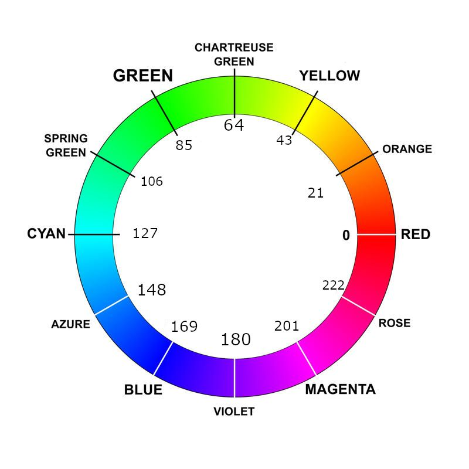

# RGB Configuration

This keymap keeps most RGB authoring in
`keyboards/bastardkb/charybdis/4x6/keymaps/noah/rgb_config.h`.

That file is for visual configuration:

- layer colors
- pointing-device mode colors
- per-layer LED highlights
- per-mode LED highlights
- the auto-mouse timeout gradient

If you want to change how the board looks, start there.

If you want to change how RGB is rendered, look at:

- `users/noah/lib/rgb/rgb_runtime.c`
- `users/noah/lib/rgb/rgb_automouse.c`
- `users/noah/lib/rgb/rgb_helpers.h`

## HSV Quick Reference

The color values in `rgb_config.h` are authored as `hsv_t` structs. Use this
quick reference when picking hue values:



## What `rgb_config.h` Controls

### `layer_colors[]`

`layer_colors[]` is indexed by the layer enum from `noah_keymap.h`.

Each row is an `hsv_t`:

```c
[LAYER_NUM] = {85, 255, RGB_MATRIX_MAXIMUM_BRIGHTNESS}
```

Use this when you want a whole-layer color wash.

`{0, 0, 0}` means "do not paint a solid layer color here." That is useful for:

- `LAYER_BASE`, which should fall through to the normal RGB Matrix effect
- the auto-mouse target layer, which uses the animated auto-mouse gradient

### `pd_mode_colors[]`

`pd_mode_colors[]` defines the right-half overlay color for each active
pointing-device mode.

Each row is keyed by a `PD_MODE_*` flag rather than by array index. That means
the color mapping follows the mode flag itself, not the order of `pd_modes[]`.

Use this table when you want `ARROW_MODE`, `VOLUME_MODE`, `PINCH_MODE`, and the
other pd modes to have distinct overlay colors.

### `layer_led_groups[]`

`layer_led_groups[]` lets a layer highlight specific LEDs instead of, or in
addition to, a full-board color.

Each row contains:

- the layer id
- an HSV color
- a pointer to an LED index array
- the LED count

This is useful for things like:

- highlighting thumb keys
- marking navigation modifiers
- accenting a small part of a layer without repainting the full board

The LED map comment in `rgb_config.h` is the reference for the standard matrix
indices on this board.

### `pd_mode_led_groups[]`

`pd_mode_led_groups[]` is the same idea as `layer_led_groups[]`, but keyed by
pointing-device mode instead of layer.

Use this when one mode should highlight a very specific LED or cluster, such as
the trackball LED or one side of the board.

### `automouse_color_start` and `automouse_color_end`

These two HSV values define the auto-mouse timeout gradient.

In the current runtime:

- the configured auto-mouse layer does not use a fixed solid layer color
- it starts at `automouse_color_start`
- it transitions toward `automouse_color_end` as the auto-mouse timeout runs out

The gradient does not animate during the entire timeout. The first
`AUTOMOUSE_RGB_DEAD_TIME` milliseconds are dead time, and only the remaining
span animates. In this keymap the default dead time is one third of
`AUTO_MOUSE_TIME`, but it is configurable in the keymap `config.h`. That
reduces flicker while the trackball is still actively being used.

## Render Order

`rgb_runtime.c` applies RGB in a deliberate order:

1. the topmost active non-base layer with a nonzero solid color
2. the auto-mouse gradient on the configured auto-mouse layer, if no solid
   layer color was painted
3. per-layer LED groups
4. the first active pointing-device mode color on the right half
5. per-mode LED groups

That order matters.

Examples:

- a per-layer LED group can sit on top of a solid layer color
- a pd-mode overlay can repaint the right half after the layer pass
- a pd-mode LED group can then repaint selected LEDs on top of the mode overlay

## The Helper Types

`users/noah/lib/rgb/rgb_helpers.h` defines the small config structs used by
`rgb_config.h`:

- `pd_mode_color_t`
- `layer_led_group_t`
- `pd_mode_led_group_t`

The same header also provides split-safe helper functions such as:

- `rgb_set_led()`
- `rgb_set_led_group()`
- `rgb_set_left_half()`
- `rgb_set_right_half()`
- `rgb_set_both_halves()`

Those helpers are for runtime rendering code. They are not where you usually
edit colors.

The main point of those helpers is that `rgb_matrix_indicators_advanced_user()`
runs in LED chunks. The helpers let the runtime use global LED indices without
having to manually clamp every write to `led_min` and `led_max`.

## Common Changes

### Change a layer color

Edit the relevant row in `layer_colors[]`.

### Change a pd-mode overlay color

Edit the matching row in `pd_mode_colors[]`.

### Add a small highlight to one layer

1. Define a `uint8_t` LED index array.
2. Add a row to `layer_led_groups[]`.

### Add a small highlight to one pd mode

1. Define a `uint8_t` LED index array.
2. Add a row to `pd_mode_led_groups[]`.

### Change the auto-mouse gradient

Edit `automouse_color_start` and `automouse_color_end`.

If you want to change the timing model instead of just the colors, look at:

- `AUTO_MOUSE_TIME` and `AUTOMOUSE_RGB_DEAD_TIME` in keymap `config.h`

`AUTOMOUSE_RGB_DEAD_TIME` must stay below `AUTO_MOUSE_TIME`. The build now
checks that at compile time.

## What This File Does Not Do

`rgb_config.h` does not decide:

- which layer becomes the auto-mouse layer
- how long auto-mouse stays active
- when a pointing-device mode becomes active or locked
- how split sync transports auto-mouse state

Those behaviors live in the keymap `config.h` and the runtime files under
`users/noah/lib/`.
