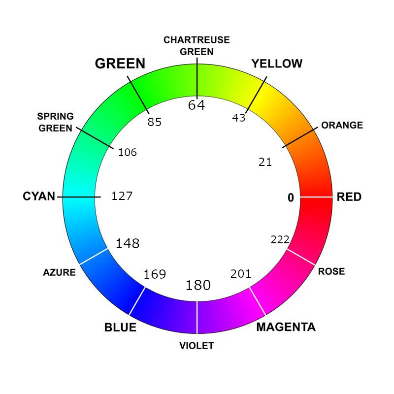

# RGB Configuration

This userspace keeps most RGB authoring in
[`keyboards/bastardkb/charybdis/4x6/keymaps/noah/rgb_config.c`](../keyboards/bastardkb/charybdis/4x6/keymaps/noah/rgb_config.c).

That file is the main RGB configuration surface:

- layer colors
- pointing-device mode colors
- per-layer LED highlights
- per-mode LED highlights
- key-behavior feedback colors
- the auto-mouse timeout gradient

If you want to change how the current profile looks, start there.

If you want to change how RGB is rendered, look at:

- [`users/noah/lib/rgb/core/rgb_runtime.c`](../users/noah/lib/rgb/core/rgb_runtime.c)
- [`users/noah/lib/rgb/stages/rgb_layer_stage.c`](../users/noah/lib/rgb/stages/rgb_layer_stage.c)
- [`users/noah/lib/rgb/automouse/rgb_automouse_stage.c`](../users/noah/lib/rgb/automouse/rgb_automouse_stage.c)
- [`users/noah/lib/rgb/stages/rgb_preview_stage.c`](../users/noah/lib/rgb/stages/rgb_preview_stage.c)
- [`users/noah/lib/rgb/stages/rgb_pd_mode_stage.c`](../users/noah/lib/rgb/stages/rgb_pd_mode_stage.c)
- [`users/noah/lib/rgb/stages/rgb_key_feedback_stage.c`](../users/noah/lib/rgb/stages/rgb_key_feedback_stage.c)
- [`users/noah/lib/rgb/automouse/rgb_automouse.c`](../users/noah/lib/rgb/automouse/rgb_automouse.c)
- [`users/noah/lib/rgb/core/rgb_helpers.h`](../users/noah/lib/rgb/core/rgb_helpers.h)

`users/noah/lib/rgb/` is organized by edit surface:

- `core/` for runtime orchestration, shared authored-config helpers, and validation
- `automouse/` for the auto-mouse state and its gradient renderer
- `stages/` for the remaining ordered render stages

If you want to change the small helper surface used by `rgb_config.c`,
look at:

- [`users/noah/lib/rgb/core/rgb_config_helpers.h`](../users/noah/lib/rgb/core/rgb_config_helpers.h)

If you want to change what authored RGB data is considered valid, also look at:

- [`users/noah/lib/rgb/core/rgb_validation.c`](../users/noah/lib/rgb/core/rgb_validation.c)

If you want to change what the key-behavior overlay means instead of how it is
painted, also look at:

- [`users/noah/lib/key/runtime/key_runtime_feedback.c`](../users/noah/lib/key/runtime/key_runtime_feedback.c)
- [`users/noah/lib/key/runtime/key_runtime_scan.c`](../users/noah/lib/key/runtime/key_runtime_scan.c)

## HSV Quick Reference

The color values in [`rgb_config.c`](../keyboards/bastardkb/charybdis/4x6/keymaps/noah/rgb_config.c) are authored with the `HSV(h, s, v)` helper. Use this
quick reference when picking hue values:



## What `rgb_config.c` Controls

### `layer_colors[]`

`layer_colors[]` is indexed by the layer enum values from the active keymap
[`config.h`](../keyboards/bastardkb/charybdis/4x6/keymaps/noah/config.h).

Each row is a `layer_color_config_t` with a color and per-layer render mode:

```c
[LAYER_NUM] = {
    .color = HSV(85, 255, RGB_MATRIX_MAXIMUM_BRIGHTNESS),
    .mode = KEYS_MAPPED_ON_THIS_LAYER_ONLY,
},
```

The available modes are:

- `ALL_KEYS`: paint the whole layer as a solid color wash
- `KEYS_MAPPED_ON_THIS_LAYER_ONLY`: paint only LEDs whose key position has a
  non-`KC_TRNS`, non-`KC_NO` keycode on that layer

Mapped-only layers compose cleanly with overlap: lower active colored layers
stay visible wherever the higher layer is transparent. The runtime resolves
that against the effective keymap, so VIA dynamic keymap edits are reflected
after the runtime refreshes its cached LED coverage.

`HSV(0, 0, 0)` means "do not paint a solid layer color here." That is
useful for:

- `LAYER_BASE`, which should fall through to the normal RGB Matrix effect
- any layer you intentionally want to stay colorless in the layer stack

### `pd_mode_colors[]`

`pd_mode_colors[]` defines the right-half overlay color for each active
pointing-device mode.

In `rgb_config.c`, declare `pd_mode_colors[]` and `pd_mode_color_count`
directly.

Each row is keyed by a `PD_MODE_*` flag rather than by array index. That means
the color mapping follows the pointing mode itself, not the order of
`pd_modes[]`.

Use rows like:

```c
{ .pointing_mode = PD_MODE_ARROW, .color = HSV(127, 255, RGB_MATRIX_MAXIMUM_BRIGHTNESS) },
```

Use this table when you want `ARROW_MODE`, `VOLUME_MODE`, `PINCH_MODE`, and the
other pd modes to have distinct overlay colors.

### `layer_led_groups`

`layer_led_groups` lets a layer highlight specific LEDs instead of, or in
addition to, a full-board color.

In `rgb_config.c`, use one of these helper forms:

- leave the section commented out when no per-layer LED groups are enabled
- declare `layer_led_groups_data` and then export it with
  `EXPORT_LAYER_LED_GROUPS(layer_led_groups_data)` when you want one or more
  authored rows

Each row contains:

- the layer id
- an HSV color
- a pointer to an LED index array
- the LED count

Use rows like:

```c
{ .layer = LAYER_NAV, .color = HSV(0, 255, RGB_MATRIX_MAXIMUM_BRIGHTNESS), .leds = nav_highlight_leds, .count = ARRAY_SIZE(nav_highlight_leds) },
```

This is useful for things like:

- highlighting thumb keys
- marking navigation modifiers
- accenting a small part of a layer without repainting the full board

The LED map comment in [`rgb_config.c`](../keyboards/bastardkb/charybdis/4x6/keymaps/noah/rgb_config.c) is the reference for the standard matrix
indices on this board.

### `pd_mode_led_groups`

`pd_mode_led_groups` is the same idea as `layer_led_groups`, but keyed by
pointing-device mode instead of layer.

Use this when one mode should highlight a very specific LED or cluster, such as
the trackball LED or one side of the board.

As above, use:

- leave the section commented out when no per-mode LED groups are enabled
- declare `pd_mode_led_groups_data` and then export it with
  `EXPORT_PD_MODE_LED_GROUPS(pd_mode_led_groups_data)` when you want one or
  more authored rows

Use rows like:

```c
{ .pointing_mode = PD_MODE_VOLUME, .color = HSV(85, 255, RGB_MATRIX_MAXIMUM_BRIGHTNESS), .leds = trackball_led, .count = ARRAY_SIZE(trackball_led) },
```

### `automouse_fade_end_config`

`automouse_fade_end_config` defines only the auto-mouse fade destination.

In the shared RGB runtime:

- the configured auto-mouse layer now uses the full authored layer-rendered
  start state, including any active layer LED groups, as the timeout fade
  start state
- the default destination is the real layer-rendered state that remains after
  the auto-mouse layer drops out
- `FOLLOW_REAL_DESTINATION` lands on that real rendered destination
- `END_COLOR_WHERE_BASE_EFFECT_WOULD_SHOW` keeps the real destination where
  layers paint, but uses `end_color` where the base RGB effect would otherwise
  show through
- `END_COLOR_ON_ALL_KEYS` uses `end_color` as the destination on every key
  while the automouse renderer is active

The timeout fade does not animate during the entire timeout. The first
`AUTOMOUSE_RGB_DEAD_TIME` milliseconds are dead time, and only the remaining
span animates. `AUTOMOUSE_RGB_DEAD_TIME` is configurable in the active keymap
[`config.h`](../keyboards/bastardkb/charybdis/4x6/keymaps/noah/config.h), so a
profile can trade off smoother animation against less flicker while the
trackball is still actively being used.

The configured destination is not a persistent board state. Once the automouse
renderer stops, the next frame falls back to ordinary layer rendering and then
later overlays such as pd-mode color or key feedback still paint on top.

### `key_behavior_feedback_colors`

In `rgb_config.c`, declare `key_behavior_feedback_colors` directly:

```c
const key_behavior_feedback_color_config_t key_behavior_feedback_colors = {
    .multi_tap_pending_color = HSV(0, 0, 150),
    .hold_active_color       = HSV(18, 255, RGB_MATRIX_MAXIMUM_BRIGHTNESS),
    .long_hold_active_color  = HSV(148, 255, RGB_MATRIX_MAXIMUM_BRIGHTNESS),
};
```

Those rows populate the shared
`key_behavior_feedback_colors` config object:

- `multi_tap_pending_color`
- `hold_active_color`
- `long_hold_active_color`

In the shared runtime, those colors are used for these categories:

- multi-tap pending: the engine is waiting to see whether more taps arrive
- hold pending: a hold path exists, but the final action is not resolved yet
- hold trigger: a hold-tier action has just fired
- long-hold trigger: a longer-hold tier action has just fired
- held non-layer action active: a `PRESS_AND_HOLD_UNTIL_RELEASE(...)` action is
  still registered and should stay visibly active

The tier decides the color:

- `.hold` surfaces use `hold_active_color`
- `.long_hold` surfaces use `long_hold_active_color`

Pending momentary-layer previews are a separate overlay path. They reuse the
previewed layer's authored layer color and any matching layer LED groups
instead of these three feedback colors.

The helper decides the RGB behavior shape:

- `TAP_AT_HOLD_THRESHOLD(...)`: pulse once when that tier commits
- `TAP_ON_RELEASE_AFTER_HOLD(...)`: stay steadily lit while that tier is
  pending release
- `PRESS_AND_HOLD_UNTIL_RELEASE(...)` and `REPEAT_WHILE_HELD(...)`: flash while
  that tier remains active

Held layer-switch actions are intentionally a special case: they get the short
trigger pulse when the threshold is crossed, but they do not keep a persistent
hold overlay after that. Once the layer is on, the layer color itself is the
main feedback.

The overlay is enabled by `RGB_KEY_BEHAVIOR_FEEDBACK_ENABLE` in the active keymap
[`config.h`](../keyboards/bastardkb/charybdis/4x6/keymaps/noah/config.h). Its flash cadence is controlled by
`RGB_KEY_BEHAVIOR_FEEDBACK_FLASH_HALF_PERIOD_MS`.

The master half computes the semantic feedback flags. On split boards, the
slave receives those packed flags through
[`split_runtime_sync`](../users/noah/lib/state/runtime/split_runtime_sync.c), including
the flash-phase bit used to keep both halves in sync.

## Render Order

[`rgb_runtime.c`](../users/noah/lib/rgb/core/rgb_runtime.c) applies RGB in a deliberate order:

1. active non-base layers compose from low to high:
   full-board layer colors wash the whole board, and mapped-only layers paint
   only the LEDs owned by that layer's non-transparent keys
2. if the auto-mouse layer is active, that layer stage is blended toward its
   destination state instead of being painted as a fixed separate gradient
3. per-layer preview overlay for a pending momentary-layer hold, if
   `RGB_KEY_BEHAVIOR_FEEDBACK_ENABLE` is on and that previewed layer has a
   nonzero solid color
4. the first active pointing-device mode color on the right half
5. per-mode LED groups
6. the key-behavior feedback overlay on both halves

That order matters.

Examples:

- a per-layer LED group can sit on top of a solid layer color
- a pd-mode overlay can repaint the right half after the layer and group pass
- a pd-mode LED group can then repaint selected LEDs on top of the mode overlay
- the key-behavior overlay can temporarily repaint both halves last

## The Helper Types

[`users/noah/lib/rgb/core/rgb_helpers.h`](../users/noah/lib/rgb/core/rgb_helpers.h) defines the small config structs used by
[`rgb_config.c`](../keyboards/bastardkb/charybdis/4x6/keymaps/noah/rgb_config.c):

- `pd_mode_color_t`
- `layer_color_config_t`
- `automouse_fade_end_config_t`
- `layer_led_group_t`
- `pd_mode_led_group_t`

[`users/noah/lib/rgb/core/rgb_config_helpers.h`](../users/noah/lib/rgb/core/rgb_config_helpers.h)
defines the shared `HSV(...)`, `EXPORT_LAYER_LED_GROUPS(...)`, and
`EXPORT_PD_MODE_LED_GROUPS(...)` helpers used by the authored config tables.

`rgb_helpers.h` also provides split-safe helper functions such as:

- `rgb_set_led()`
- `rgb_set_led_group()`
- `rgb_set_left_half()`
- `rgb_set_right_half()`
- `rgb_set_both_halves()`

Those helpers are for runtime rendering code. They are not where you usually
edit colors.

The main point of those helpers is that `rgb_matrix_indicators_advanced_user()`
runs in LED chunks. The helpers let the runtime use global LED indices without
having to manually clamp every write to `led_min` and `led_max`.

## Common Changes

### Change a layer color

Edit the relevant row in `layer_colors[]`.

### Change a pd-mode overlay color

Edit the matching row in `pd_mode_colors[]`.

### Add a small highlight to one layer

1. Define a `uint8_t` LED index array.
2. Uncomment the `layer_led_groups_data` block plus
   `EXPORT_LAYER_LED_GROUPS(layer_led_groups_data)`, then add the rows you
   want.

### Add a small highlight to one pd mode

1. Define a `uint8_t` LED index array.
2. Uncomment the `pd_mode_led_groups_data` block plus
   `EXPORT_PD_MODE_LED_GROUPS(pd_mode_led_groups_data)`, then add the rows you
   want.

### Change the auto-mouse timeout fade

Edit the `LAYER_POINTER` row in `layer_colors[]` to change the main start
color. If the auto-mouse layer or overlapping layers use LED groups, those are
also part of the visible start render. Edit `automouse_fade_end_config` if you
want the timeout destination to follow the real post-timeout layer state, use
`end_color` where the base effect would show, or use `end_color` on every key.

If you want to change the timing model instead of just the colors, look at:

- `AUTO_MOUSE_TIME` and `AUTOMOUSE_RGB_DEAD_TIME` in the active keymap [`config.h`](../keyboards/bastardkb/charybdis/4x6/keymaps/noah/config.h)

`AUTOMOUSE_RGB_DEAD_TIME` must stay below `AUTO_MOUSE_TIME`. The build now
checks that at compile time.

### Change the key-behavior feedback colors

Edit the three designated initializer rows in
[`rgb_config.c`](../keyboards/bastardkb/charybdis/4x6/keymaps/noah/rgb_config.c).

### Disable the key-behavior overlay

Comment out `RGB_KEY_BEHAVIOR_FEEDBACK_ENABLE` in the active keymap [`config.h`](../keyboards/bastardkb/charybdis/4x6/keymaps/noah/config.h).
That also disables the preview-layer overlay used for pending momentary-layer
holds.

### Disable the auto-mouse gradient

Comment out `RGB_AUTOMOUSE_GRADIENT_ENABLE` in the active keymap [`config.h`](../keyboards/bastardkb/charybdis/4x6/keymaps/noah/config.h).

## What This File Does Not Do

[`rgb_config.c`](../keyboards/bastardkb/charybdis/4x6/keymaps/noah/rgb_config.c) does not decide:

- which layer becomes the auto-mouse layer
- how long auto-mouse stays active
- which key-behavior states count as pending, active, or pulsed feedback
- when a pointing-device mode becomes active or locked
- how split sync transports auto-mouse or key-feedback state

Those behaviors live in the active keymap
[`config.h`](../keyboards/bastardkb/charybdis/4x6/keymaps/noah/config.h) and
the runtime files under `users/noah/lib/`.
