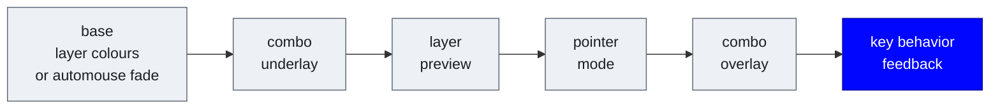
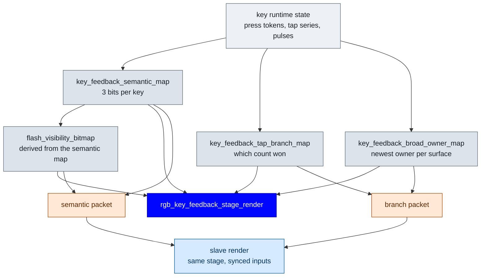
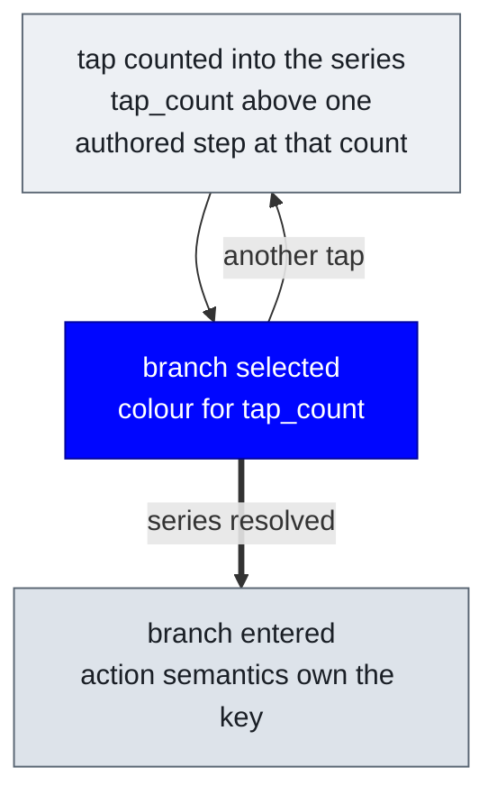
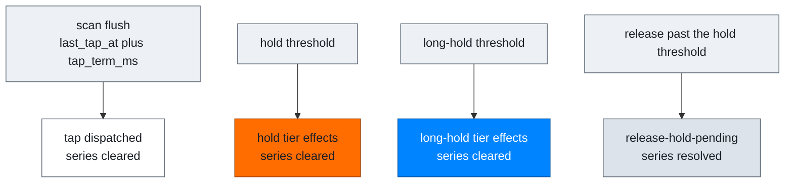
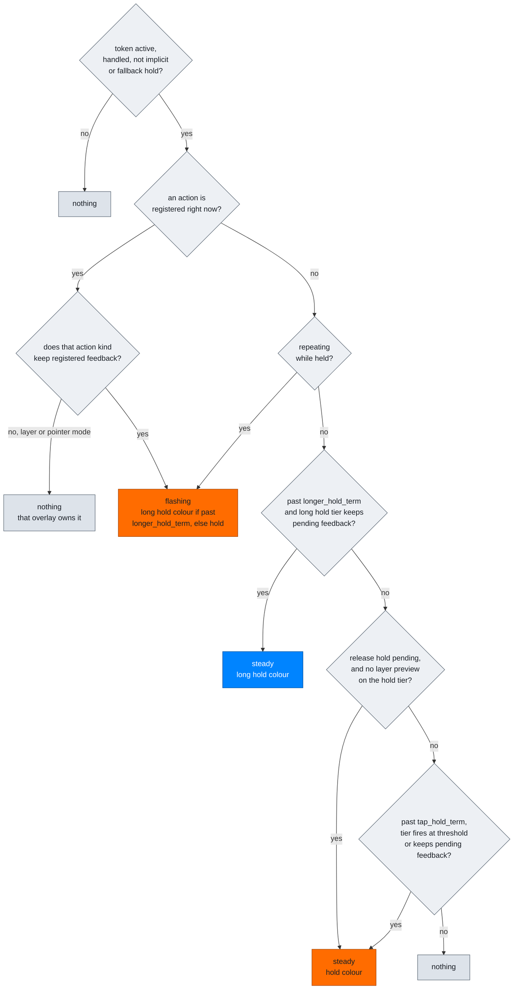

# RGB Implementation

What the code actually does, as distinct from what it is meant to do.
[rgbflow.md](./rgbflow.md) is the intended language; this is the machinery behind
it, including the places the two do not line up. For authoring colors, locality
and LED groups see [RGB_CONFIG.md](./RGB_CONFIG.md).

## Where the key-behavior stage sits

Stages composite in a fixed order in
[`rgb_runtime.c`](../users/noah/lib/rgb/core/rgb_runtime.c). Each may overpaint
the ones before it. Key-behavior feedback runs **last**, so it wins over every
other stage wherever it paints.

`locality` decides how much it paints. The authored profile uses `RGB_KEY_HALF`,
so one key's feedback state repaints that entire half, over the layer colors and
pointer-mode overlay underneath.

## How truth reaches the LEDs

Per-key truth is computed only on the master. The slave renders from synced
copies and never evaluates the feedback rules itself, which is why the two halves
cannot disagree about the rules, only about freshness.

A single `mark_key_feedback_dirty()` marks both packets, so the owner map cannot
lag the semantic map. It fires when a transition plan is non-empty, or when a
plan was empty but `next_feedback_sequence` moved, checked on the press, release
and scan entry points. `should_build_packet` also rebuilds unconditionally while
the last sent packet was active, so an active-to-inactive edge is never missed.

## The tap phase runs on no clock

Both tap-phase questions collapse into one predicate,
`key_feedback_tap_series_shows_tap_branch`: the series is active, its count is past
the base one, the row authors a step at that count, and the series has not resolved.

There is no derived settle moment, so there is nothing to anchor and nothing to
disagree with the engine about. `tap_branch_map` carries `series->tap_count`, which
the reducer sets from `token->interaction.selection.tap_count` — the resolved
branch index, not the raw press count, so the colour names the branch that would
actually win. `tap_branch_has_authored_step` keeps it to branches the row really
authors, since the colour table would otherwise clamp a colour onto a count with
no step behind it.

## The action phase resolves where it is decided

There is no window between deciding a branch and doing it. Each resolution point
acts immediately:

A release before the hold threshold does not resolve anything on a multi-tap row:
it preserves the chain so the multi-tap window can run out, which is what gives
every authored depth — the deepest included — the same visible window before its
action lands. `terminal_tap_only_feedback_window` in the release planner is the
condition that extends that to terminal branches.

## Tier semantics are decided in order

`key_feedback_semantic_for_token` walks these checks top to bottom and returns on
the first match. This is the whole of the hold and long-hold vocabulary.

`keeps_registered_feedback` comes from the action kind table. It is true for
`LITERAL`, `MACRO`, `QMK_BEHAVIOR` and `KEYMAP_CUSTOM`, and false for every layer
and pointer-mode kind. That single flag is why a held modifier flashes and a held
momentary layer does not.

Pulses are a separate one-shot channel lasting one
`FEEDBACK_FLASH_HALF_PERIOD_MS`, with a queue slot so a second pulse arriving
during the first re-arms rather than being dropped. `TAP_COMMITTED` renders green,
`HOLD` renders as steady hold colour, `LONG_HOLD` as steady long-hold colour.

## Precedence

When one key has more than one live semantic, the highest wins.

| Priority | Semantic |
| --- | --- |
| 60 | tap committed |
| 50 | long hold active, steady or flashing |
| 40 | hold active or hold pending |
| 10 | tap branch pending |

The branch sits at the bottom deliberately: it names which branch is selected,
which every action state may replace with what that branch is about to do. A branch
that authors nothing nameable keeps the key because nothing outranks it.

## Deliberate silences

This stage declining to paint leaves the stage beneath it showing, so these are
silences of the override, not of the LED.

- branch 0, always: the non-tapping surface
- a tap count with no authored step, which would otherwise take a clamped colour
- layer and pointer-mode actions, whose own overlays are the persistent feedback
- any hold tier carrying a layer preview, which routes to the preview stage
- base-tap commits, limited by `tap_commit_mode`
- implicit-hold and fallback-hold tokens, which are holds the engine synthesised
  rather than behaviour anyone authored

## Where this does not match rgbflow.md

0. **Colours are read against a lit board, and one of them barely is.**
   `hold_active_color` `HSV(18)` `#FF6C00` sits 25 degrees from the base layer's
   resting red `HSV(0)` `#FF0000` at equal saturation and brightness. The base layer
   carries most of the board's hold feedback, so the most common hold colour is the
   one least separable from what it paints over.

1. **The palette has homonyms.** Three feedback colours are byte-for-byte identical
   to a layer colour: branch 2 `#0006FF` is `LAYER_SYM`, branch 4 `#00FF00` is
   `LAYER_NUM`, and the tap colour `#FFFFFF` is `LAYER_POINTER`. Because the layers
   paint mapped keys only and this stage repaints the whole half, the signal is
   degraded rather than lost — the pressed key holds still while its neighbours
   move. The branch colours are also on screen for longer than they used to be,
   so these collisions are more visible than before rather than less.

2. **Scale is out of proportion to scope.** `RGB_KEY_HALF` repaints half the board
   for a single key's state, and this stage renders last, so it overrides the
   layer and pointer-mode colours underneath while it is active.

### Closed by the single-state tap phase

- The count colour is no longer overloaded: one predicate, one meaning.
- Display and action can no longer describe different moments, because the display
  reads the action state instead of a parallel clock.
- The action-delay window is gone entirely, so there is no longer a term whose only
  job was to make the colour visible.
- The second tap-phase colour is gone, so the phase can no longer show two
  different things about one moment. The collisions it had did not close: they moved
  with the palette, and `tap_committed` is now itself exactly `LAYER_POINTER`
  `#FFFFFF`. That is a palette choice, not a consequence of the collapse.
