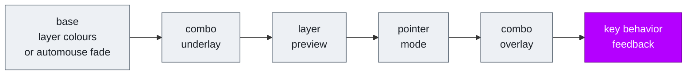
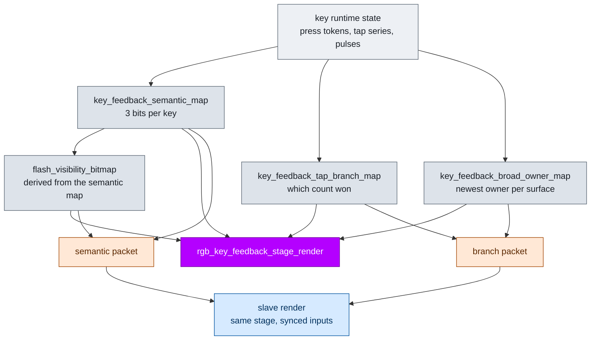
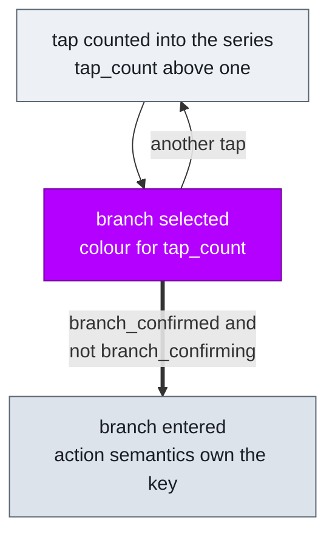
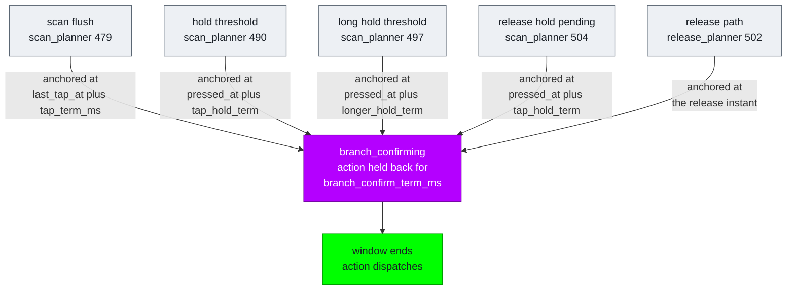
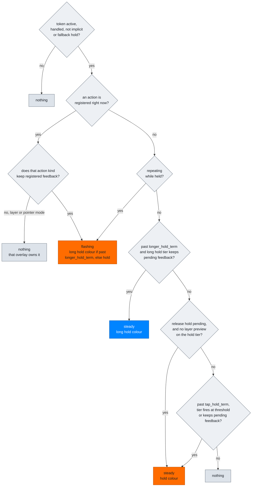

# RGB Implementation

What the code actually does, as distinct from what it is meant to do.
[rgbflow.md](./rgbflow.md) is the intended language; this is the machinery behind
it, including the places the two do not line up. For authoring colors, locality
and LED groups see [RGB_CONFIG.md](./RGB_CONFIG.md).

## Where the key-behavior stage sits

Stages composite in a fixed order in
[`rgb_runtime.c`](../users/noah/lib/rgb/core/rgb_runtime.c). Each may overpaint
the ones before it. Key-behavior feedback runs **last**, so it wins over every
other stage wherever it paints.

`locality` decides how much it paints. The authored profile uses `RGB_KEY_HALF`,
so one key's feedback state repaints that entire half, over the layer colors and
pointer-mode overlay underneath.

## How truth reaches the LEDs

Per-key truth is computed only on the master. The slave renders from synced
copies and never evaluates the feedback rules itself, which is why the two halves
cannot disagree about the rules, only about freshness.

A single `mark_key_feedback_dirty()` marks both packets, so the owner map cannot
lag the semantic map. It fires when a transition plan is non-empty, or when a
plan was empty but `next_feedback_sequence` moved, checked on the press, release
and scan entry points. `should_build_packet` also rebuilds unconditionally while
the last sent packet was active, so an active-to-inactive edge is never missed.

## The tap phase runs on no clock

Both tap-phase questions collapse into one predicate,
`key_feedback_tap_series_shows_tap_branch`: the series is active, the tap count is
past the base one, and the branch is not entered yet. "Entered" is
`branch_confirmed && !branch_confirming`, the instant the action path takes the
series over.

There is no derived settle moment, so there is nothing to anchor and nothing to
disagree with the engine about. `tap_branch_map` carries
`series->tap_count`, which the reducer sets from
`token->interaction.selection.tap_count` — the resolved branch index, not the raw
press count, so the colour names the branch that would actually win.

The predicate stays true through the branch-confirm window on purpose: that window
holds the action back so the branch is visible before it fires, so the branch
colour is what belongs on the key while it runs.

## The action phase runs on five paths

`branch_confirming` is set from five call sites, each anchoring its window on a
different clock. This is what the display used to inherit, and what the count
clock above now replaces for display purposes.

Which site runs depends on whether the selected branch authors a hold tier and on
whether the key was released. There is no predicate anywhere that answers "has
the count settled" for the action side; that concept exists only in the display
clock above.

## Tier semantics are decided in order

`key_feedback_semantic_for_token` walks these checks top to bottom and returns on
the first match. This is the whole of the hold and long-hold vocabulary.

`keeps_registered_feedback` comes from the action kind table. It is true for
`LITERAL`, `MACRO`, `QMK_BEHAVIOR` and `KEYMAP_CUSTOM`, and false for every layer
and pointer-mode kind. That single flag is why a held modifier flashes and a held
momentary layer does not.

Pulses are a separate one-shot channel lasting one
`FEEDBACK_FLASH_HALF_PERIOD_MS`, with a queue slot so a second pulse arriving
during the first re-arms rather than being dropped. `TAP_COMMITTED` renders green,
`HOLD` renders as steady hold colour, `LONG_HOLD` as steady long-hold colour.

## Precedence

When one key has more than one live semantic, the highest wins.

| Priority | Semantic |
| --- | --- |
| 70 | tap branch pending |
| 60 | tap committed |
| 50 | long hold active, steady or flashing |
| 40 | hold active or hold pending |

## Deliberate silences

- the base single tap through its whole window
- any tier a row does not author
- layer and pointer-mode actions, whose own overlays are the persistent feedback
- any hold tier carrying a layer preview, which routes to the preview stage
- implicit-hold and fallback-hold tokens

## Where this does not match rgbflow.md

1. **The palette has homonyms.** The three-tap colour is the same `#3C00FF` as
   `LAYER_NAV`; the four-tap `#00A2FF` is a near miss for `long_hold_active`
   `#0084FF`. Both are reachable on keys that use both meanings, and the branch
   colours are now on screen for longer than they used to be, so these collisions
   are more visible than before rather than less.

2. **Scale is out of proportion to scope.** `RGB_KEY_HALF` repaints half the board
   for a single key's state, and this stage renders last, so it overrides the
   layer and pointer-mode colours underneath while it is active.

### Closed by the single-state tap phase

- The count colour is no longer overloaded: one predicate, one meaning, and the
  branch-confirm window is covered by the same fact rather than a second trigger.
- Display and action can no longer describe different moments, because the display
  reads the action state instead of a parallel clock.
- The `tap_pending` white that collided with `LAYER_POINTER` `#FFFFFF` is gone,
  and `tap_committed` green still collides with `LAYER_NUM` `#00FF00`.
