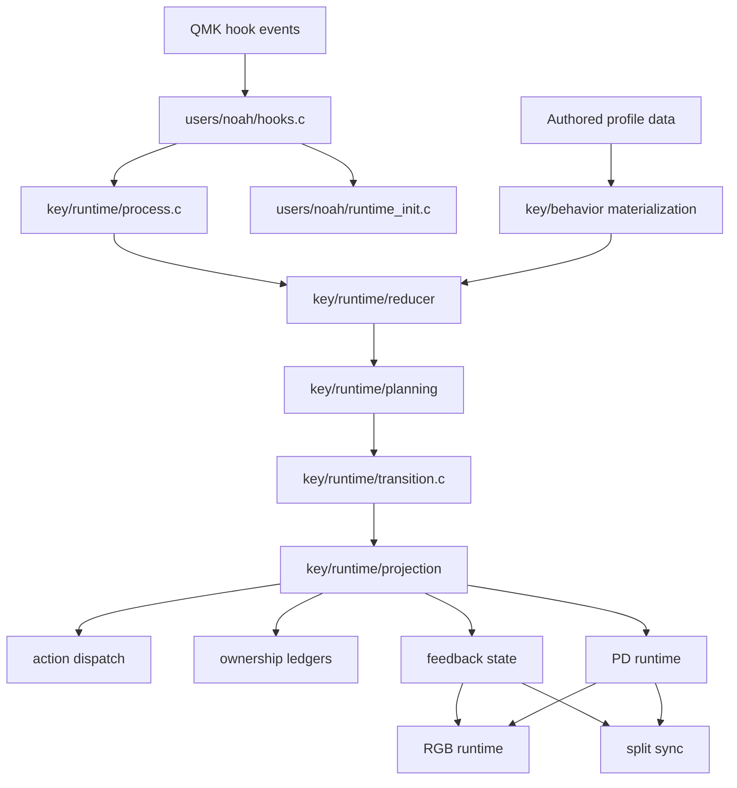

# Userspace Architecture

This is the maintainer and agent entry point for the userspace architecture. It
is for changes that touch runtime ownership, source layout, QMK integration,
split sync, RGB rendering, profile tooling, or the tests that enforce those
contracts.

The root `README.md` stays focused on user-facing setup and profile behavior.
The generated `docs/KEYMAP-OVERVIEW.md` shows the current authored profile.
This directory explains how the runtime is shaped and where changes belong.

## How To Use This Pack

- Start with this file when you need the ownership model.
- Use [source-map.md](./source-map.md) when you need to find the right package
  or understand what a tool writes.
- Use [change-guide.md](./change-guide.md) when you know the behavior you want
  to change and need the edit point plus checks.
- Use [runtime-flow.md](./runtime-flow.md) when a bug crosses press/release,
  scan, RGB, pointing-device, split, or macro boundaries.

The source trace covers:

- firmware entry and build wiring in `users/noah/source_manifest.mk`,
  `users/noah/runtime_init.c`, and `users/noah/hooks.c`
- runtime packages under `users/noah/lib/`
- authored profile files under `keyboards/bastardkb/charybdis/4x6/keymaps/noah/`
- repo-local profile tooling under `tools/`
- generated documentation/media surfaces under `docs/`
- host test runners under `tests/host/`

## Mental Model

This repo is a Charybdis-specific userspace runtime, not only a keymap. Authored
profile data describes what the board should do. Runtime packages turn QMK
events into deterministic behavior, then project explicit effects back into QMK
state, ownership ledgers, split sync, RGB, macros, and pointing-device modes.

The main rule is:

> Runtime truth is owned by one explicit owner. Everything else reads it,
> projects it, or adapts QMK/fork behavior into it.

## Ownership Map

| Runtime fact | Owner | Readers or projections |
| --- | --- | --- |
| Authored layers, combos, macros, `key_behaviors[]`, RGB tables | keymap-owned files under `keyboards/.../keymaps/noah/` | behavior lookup, validation, RGB runtime, profile introspection |
| Action classification and dispatch semantics | `users/noah/lib/action/` | key behavior materialization, key runtime, macro dispatch, direct action taps |
| QMK and fork compatibility assumptions | `users/noah/lib/compat/` | runtime entry flow, combo origin normalization, VIA split sync, QMK contract checks |
| Authored key-behavior lookup and materialization | `users/noah/lib/key/behavior/` | key-runtime press planning and validation |
| Active key-runtime state | `users/noah/lib/key/runtime/reducer/` | key-runtime planning, debug, feedback, projection |
| Release, scan, tap-series, and effect planning | `users/noah/lib/key/runtime/planning/` | top-level key-runtime wrappers and transition plans |
| QMK-facing effect application | `users/noah/lib/key/runtime/projection/` | action dispatch, held/repeat registries, layer ownership, PD mode state, feedback |
| Pending release dispatch queue | `users/noah/lib/key/runtime/queue/` | release/scan adapters and runtime debug |
| Held action and repeat applied registries | `users/noah/lib/key/ownership/` | key-runtime projection and housekeeping |
| Macro payload parsing, hardcoded macros, VIA macro defaults | `users/noah/lib/macro/` | action lifecycle, process flow, VIA default seeding |
| PD mode definitions, state, policy, and handlers | `users/noah/lib/pointing/` | key runtime, pointing hook, RGB, split sync |
| RGB rendering and validation | `users/noah/lib/rgb/` | RGB hook, authored RGB config, split/runtime feedback snapshots |
| Shared storage, diagnostics, modifier policy, layer/mod ownership | `users/noah/lib/state/` | all runtime owners through narrow surfaces |
| Split runtime packets | `users/noah/lib/split/` | master/slave RGB, PD, preview, combo, key-feedback mirroring |

## Flow Overview

## Where To Change Common Behavior

| Goal | Primary edit point | Detailed guide |
| --- | --- | --- |
| Change authored key behavior | `keymap.c` `key_behaviors[]` | [change-guide.md](./change-guide.md), [Interaction Model](../INTERACTION_MODEL.md) |
| Change release or multi-tap semantics | `key/runtime/planning/` and reducer tests | [runtime-flow.md](./runtime-flow.md), [Key Runtime](../KEY_RUNTIME.md) |
| Change modifier handling | `state/modifiers/` or `state/ownership/keyboard_mod_ownership.*` | [change-guide.md](./change-guide.md) |
| Add or change a PD mode | `pointing/defs/`, `pointing/modes/`, `pointing/runtime/` | [Adding A Pointing-Device Mode](../ADDING_PD_MODE.md) |
| Change RGB rendering | `rgb_config.c` for authored colors, `users/noah/lib/rgb/` for render logic | [RGB Configuration](../RGB_CONFIG.md) |
| Change split mirroring | `users/noah/lib/split/runtime_sync.*` | [runtime-flow.md](./runtime-flow.md) |
| Change hardcoded or VIA macro behavior | `keymap.c` macro tables or `users/noah/lib/macro/` | [change-guide.md](./change-guide.md) |
| Change hook wiring | `users/noah/hooks.c`, `users/noah/runtime_init.c` | [Hook Overrides](../HOOK_OVERRIDES.md) |

## Documents In This Pack

- [runtime-flow.md](./runtime-flow.md) traces user-visible runtime flows and
  marks authoritative state, planned effects, projected state, and compatibility
  adapters.
- [source-map.md](./source-map.md) maps source packages and profile tooling to
  responsibilities, mutation ownership, side effects, tests, and existing docs.
- [change-guide.md](./change-guide.md) tells future maintainers and agents where
  to make common changes and which checks to run.

## Architecture Rules

- Do not create a second owner for an existing runtime fact.
- Feed physical events into the reducer before projecting side effects.
- Add new release, scan, tap-series, or effect decisions to planners, not to
  adapters.
- Treat compatibility modules as adapters. They normalize QMK behavior; they do
  not own runtime truth.
- Keep keymap-authored data in the keymap tree and shared runtime policy under
  `users/noah/`.
- Keep internal shared storage under `state/shared/`; new callers should prefer
  debug, ownership, modifier, split, or runtime APIs.
- When behavior changes, update the closest domain doc and the tests named in
  [change-guide.md](./change-guide.md).
