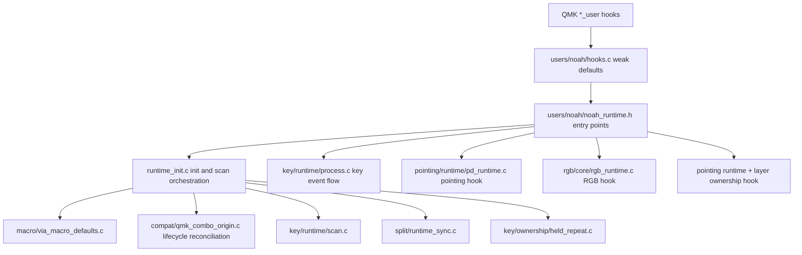
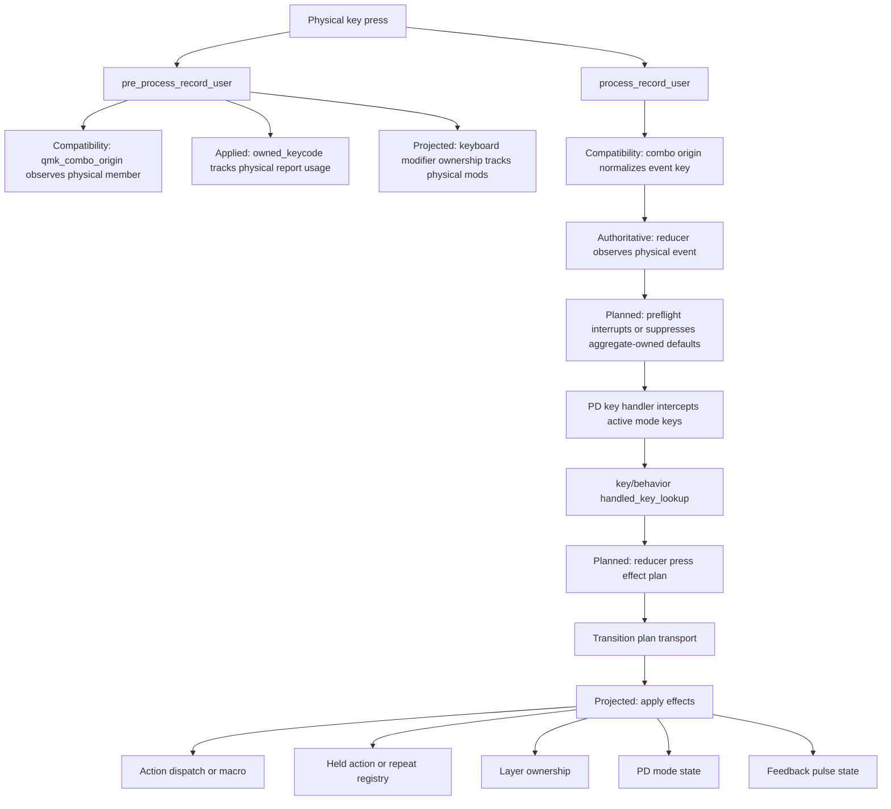
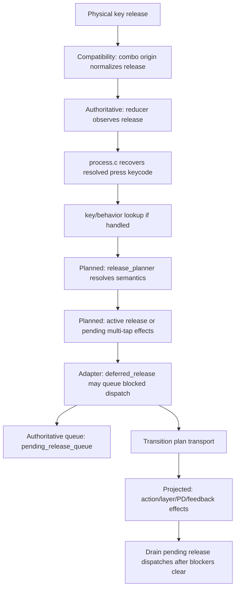
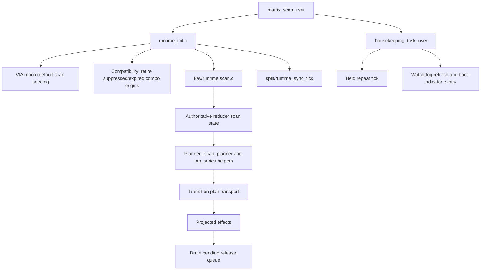
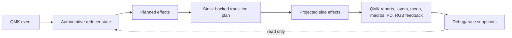
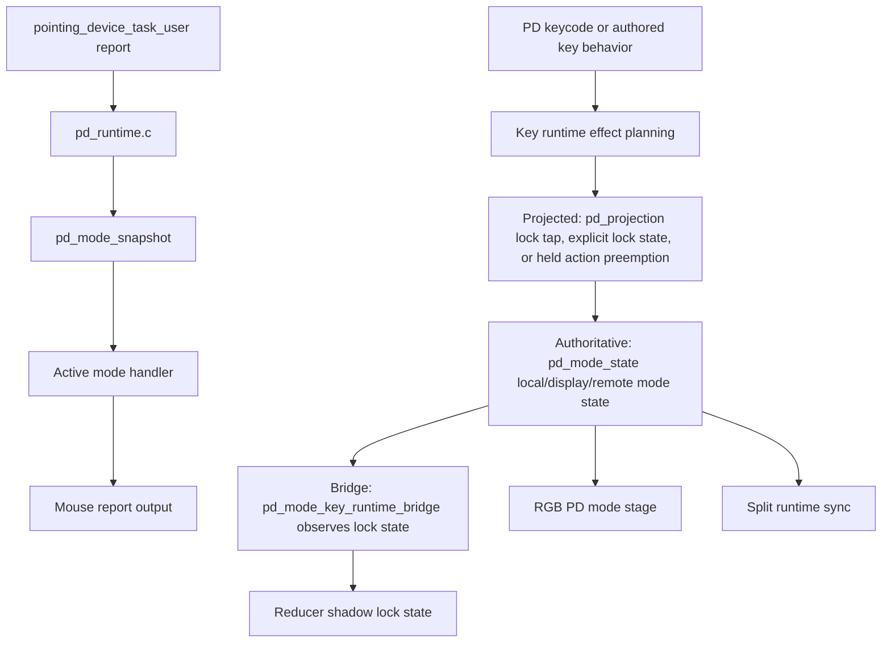
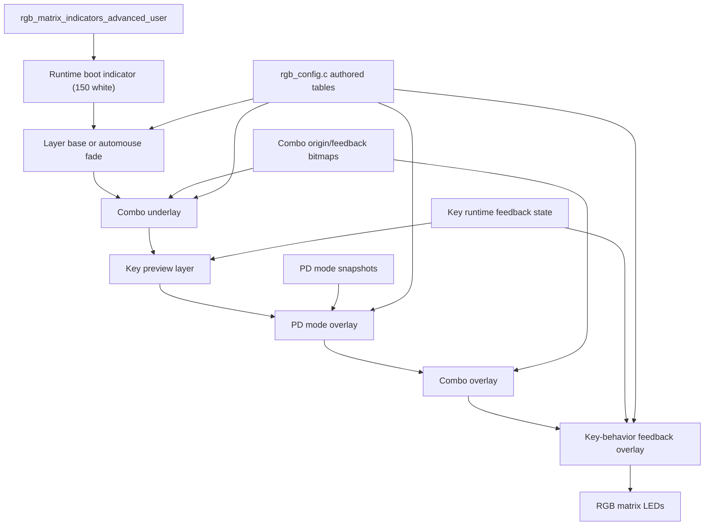
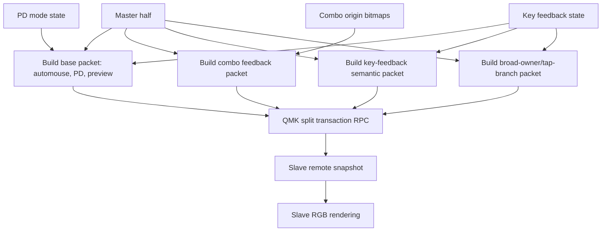
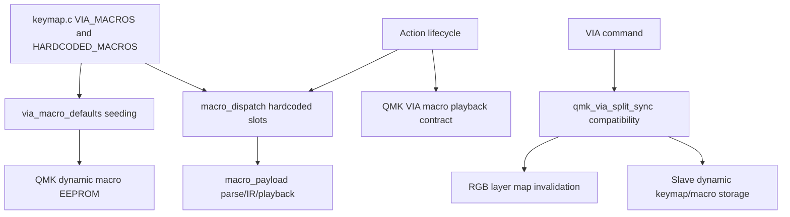
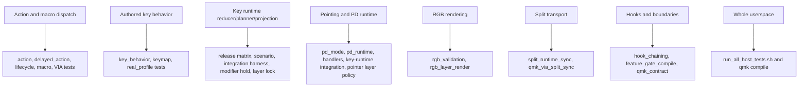

# Runtime Flow

This document traces the runtime paths that start from user behavior or QMK
hooks and end in side effects. Labels in the diagrams use these meanings:

- Authoritative: owns runtime truth.
- Planned: decides behavior and emits explicit effects.
- Projected: applies planned effects to QMK-facing state or registries.
- Compatibility: adapts upstream QMK/fork behavior without owning runtime truth.

## QMK Hook Lifecycle

Keymap-local hook overrides may replace the QMK hook, but they must call the
matching `noah_*` helper when they still want shared userspace behavior.

## Key Press Flow

The reducer owns active press identity by physical `keypos_t`. Layer changes or
transparent resolution do not move that identity. If a runtime-handled pd-mode
key matches the currently locked mode, press planning emits an explicit
unlock request before registering the held action, so the key becomes a
momentary owner for the rest of the physical hold.

## Key Release Flow

Quick release, fallback suppression, buffered base tap, active release, and
pending multi-tap release decisions belong to `key/runtime/planning/`. The
release planner also suppresses fallback or lock retoggle when a same-mode
pd lock was already consumed on press. The deferred release adapter may queue
or drain effects but must not re-decide release semantics.

## Matrix Scan Flow

Combo-origin reconciliation runs before key-runtime scan projection. It removes
QMK-disabled candidates immediately and expires inactive candidates only after
the first crossed-deadline scan has been followed by a `combo_task()` cycle.
Scan also owns hold threshold promotion, long-hold promotion, pending multi-tap
expiry, pending release draining, split heartbeats, and held repeat ticking.

## Reducer, Planner, Projection Boundary

The reducer stores truth. Planners decide. Projection writes outward. Debug and
trace read state but do not mutate reducer facts.

## Pointing-Device Flow

PD mode state is PD-runtime-owned. Key runtime can request PD effects and observe
PD lock state through the bridge, but it does not own local/display/remote PD
mode storage.

## RGB Render Pipeline

RGB rendering is projected UI. It must not create key-runtime, combo, or PD
truth; it consumes snapshots and authored color tables.

## Split Sync Flow

Split sync is transport. It mirrors already-owned state to the other half and
does not make ownership decisions.

## Macro And VIA Flow

Hardcoded macros are source-owned. VIA macros are QMK dynamic macro slots with
source-authored defaults and split mirroring.

Macro text is QMK ASCII, not arbitrary bytes: text positions accept
`0x01..0x7F`, while zero terminates a VIA slot. Bytes above `0x7F` remain valid
only where a complete QMK prefix command defines them as keycode operands. Both
authored and VIA decoders use the same predicate, and playback validates the
entire IR before its first text, wait, or key-ownership side effect. Invalid VIA
slots stay negatively cached until a VIA mutation invalidates the macro cache.

## Test Coverage Map

