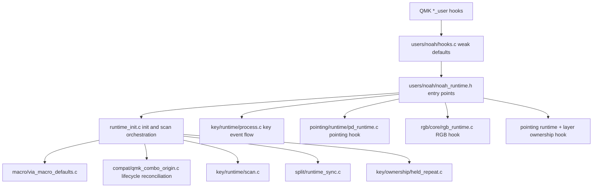
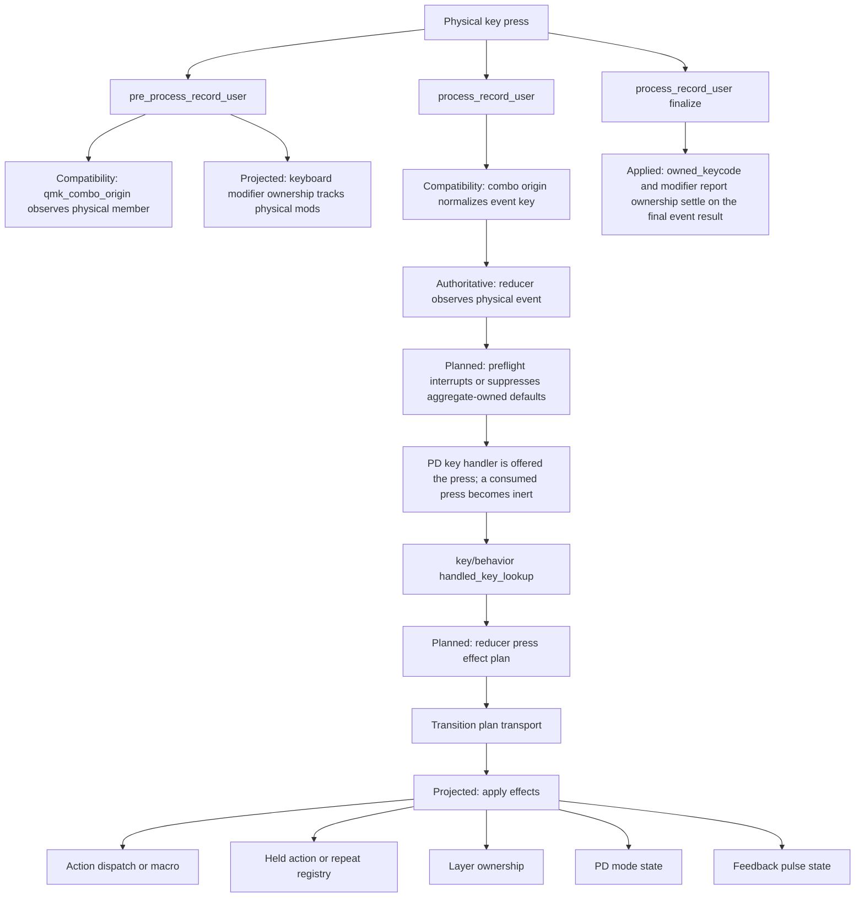
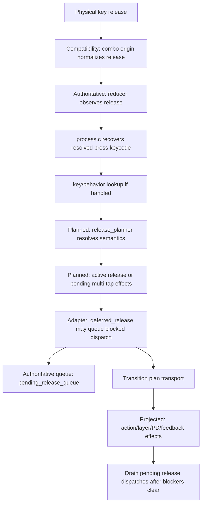
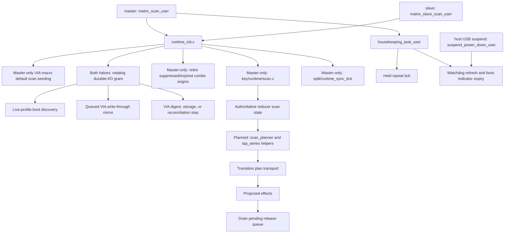
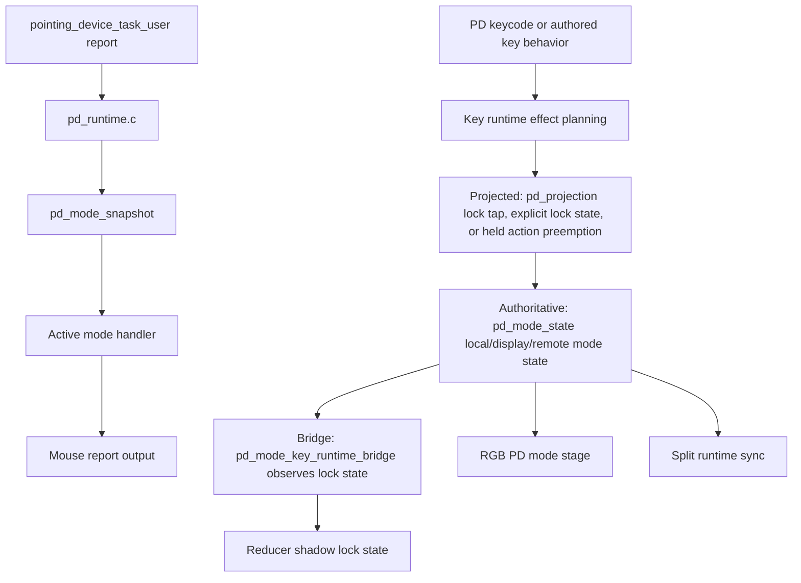
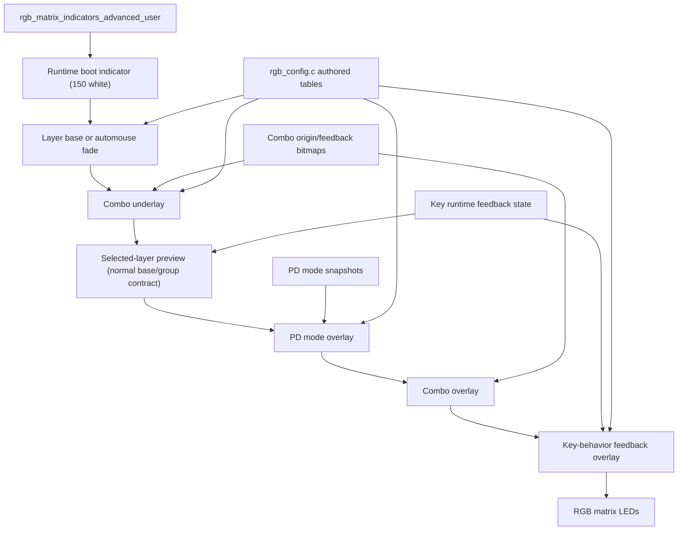
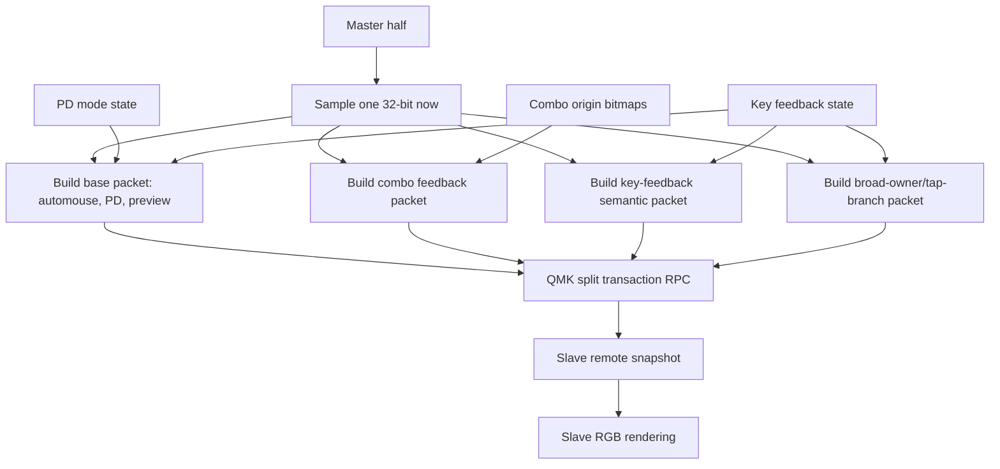
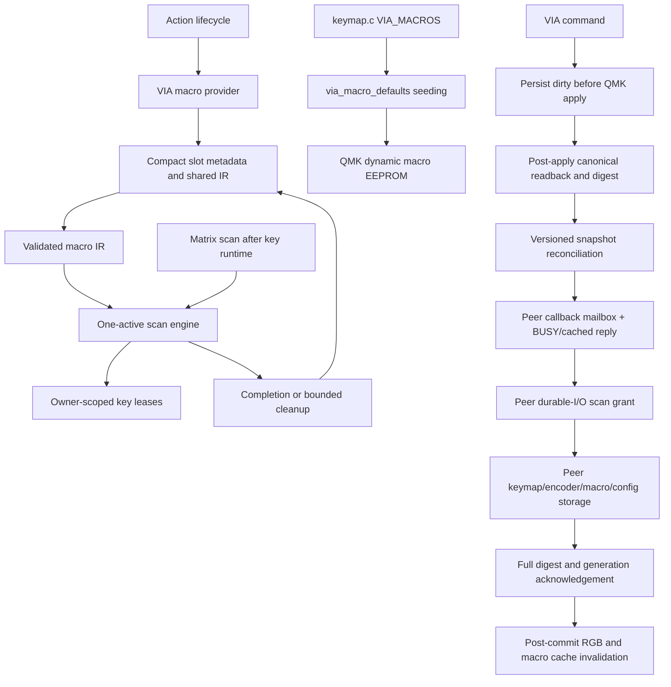
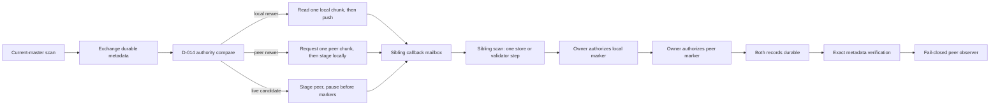
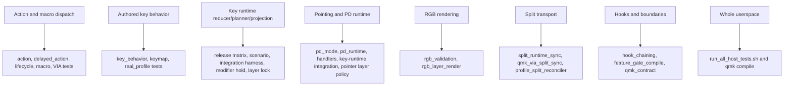

# Runtime Flow

This document traces the runtime paths that start from user behavior or QMK
hooks and end in side effects. Labels in the diagrams use these meanings:

- Authoritative: owns runtime truth.
- Planned: decides behavior and emits explicit effects.
- Projected: applies planned effects to QMK-facing state or registries.
- Compatibility: adapts upstream QMK/fork behavior without owning runtime truth.

## QMK Hook Lifecycle

```mermaid
flowchart TD
    qmk["QMK *_user hooks"] --> weak["users/noah/hooks.c weak defaults"]
    weak --> runtime["users/noah/noah_runtime.h entry points"]
    runtime --> init["runtime_init.c init and scan orchestration"]
    runtime --> process["key/runtime/process.c key event flow"]
    runtime --> pointing["pointing/runtime/pd_runtime.c pointing hook"]
    runtime --> rgb["rgb/core/rgb_runtime.c RGB hook"]
    runtime --> layer["pointing runtime + layer ownership hook"]
    init --> via_defaults["macro/via_macro_defaults.c"]
    init --> combo_scan["compat/qmk_combo_origin.c lifecycle reconciliation"]
    init --> key_scan["key/runtime/scan.c"]
    init --> split_sync["split/runtime_sync.c"]
    init --> held_repeat["key/ownership/held_repeat.c"]
```

Keymap-local hook overrides may replace the QMK hook, but they must call the
matching `noah_*` helper when they still want shared userspace behavior.

## Key Press Flow

```mermaid
flowchart TD
    physical["Physical key press"] --> pre_user["pre_process_record_user"]
    pre_user --> origin["Compatibility: qmk_combo_origin observes physical member"]
    pre_user --> mod_track["Projected: keyboard modifier ownership tracks physical mods"]
    physical --> process_user["process_record_user"]
    process_user --> normalize["Compatibility: combo origin normalizes event key"]
    normalize --> observe["Authoritative: reducer observes physical event"]
    observe --> preflight["Planned: preflight interrupts or suppresses aggregate-owned defaults"]
    preflight --> pd_handler["PD key handler is offered the press; a consumed press becomes inert"]
    pd_handler --> lookup["key/behavior handled_key_lookup"]
    lookup --> press_plan["Planned: reducer press effect plan"]
    press_plan --> transition["Transition plan transport"]
    transition --> projection["Projected: apply effects"]
    projection --> action["Action dispatch or macro"]
    projection --> held["Held action or repeat registry"]
    projection --> layer["Layer ownership"]
    projection --> pd["PD mode state"]
    projection --> feedback["Feedback pulse state"]
    physical --> finalize["process_record_user finalize"]
    finalize --> report_track["Applied: owned_keycode and modifier report ownership settle on the final event result"]
```

Report ownership is settled in the finalize hook rather than in pre-process,
because only the final event result says whether QMK's default handler will
register the usage at all. A press userspace consumes owns nothing in the
report, so it must not stop a managed owner of the same usage from registering
it, or stop the last managed modifier release from clearing the report bit.
Pre-process still tracks which physical modifier keys are down, which is the
separate question masking policy asks. A QMK mod-tap is a physically held
modifier too, once QMK has resolved it as a hold: pre-process runs before QMK's
tapping engine and cannot see that, so the finalize step counts it, from the
record with tap count 0 that QMK's default action took. Its modifiers are also
managed owners, because QMK registers them through `register_mods()`, so
teardown is unchanged. A tapped mod-tap never held a modifier.

The active pointing mode is offered a press before the key's behavior. While
offered, the press is not a behavior press yet, so an output the mode emits
cannot settle that key's pending fallback hold. If the mode consumes it, the
reducer's token for it becomes an ordinary non-handled press
(`key_runtime_core_end_mode_offer()`): the key stays physically down, and
other keys still saw it interrupt them, but its own tap, hold, repeat and
multi-tap never run, and it owns no lease. Its release goes to the mode
before preflight, whichever mode is active by then, and finalizes the token.
The release of a press the mode did not take is never offered to the mode; it
stays with the behavior that owns what that press started.

A custom key (`CUSTOM_KEY_0`–`63`) does only what its `key_behaviors[]` row
says. One without a row reaches the key runtime's last process stage,
`idle_custom_key`, which consumes its press so the keycode never reaches QMK.

Literal taps go through the ownership ledger (`owned_keycode_tap_literal()`),
never straight to QMK's `tap_code16()`, whose final unregister would clear a
usage another owner still holds. A usage already held stays held and its tap
changes nothing in the report.

The reducer owns active press identity by physical `keypos_t`. Layer changes or
transparent resolution do not move that identity. If a runtime-handled pd-mode
key matches the currently locked mode, press planning emits an explicit
unlock request before registering the held action, so the key becomes a
momentary owner for the rest of the physical hold.

## Key Release Flow

```mermaid
flowchart TD
    release["Physical key release"] --> normalize["Compatibility: combo origin normalizes release"]
    normalize --> observe["Authoritative: reducer observes release"]
    observe --> recover["process.c recovers resolved press keycode"]
    recover --> lookup["key/behavior lookup if handled"]
    lookup --> release_planner["Planned: release_planner resolves semantics"]
    release_planner --> release_effects["Planned: active release or pending multi-tap effects"]
    release_effects --> defer["Adapter: deferred_release may queue blocked dispatch"]
    defer --> queue["Authoritative queue: pending_release_queue"]
    defer --> transition["Transition plan transport"]
    transition --> projection["Projected: action/layer/PD/feedback effects"]
    projection --> drain["Drain pending release dispatches after blockers clear"]
```

Quick release, fallback suppression, buffered base tap, active release, and
pending multi-tap release decisions belong to `key/runtime/planning/`. The
release planner also suppresses fallback or lock retoggle when a same-mode
pd lock was already consumed on press. The deferred release adapter may queue
or drain effects but must not re-decide release semantics.

## Matrix Scan Flow

```mermaid
flowchart TD
    master_scan["master: matrix_scan_user"] --> init["runtime_init.c"]
    slave_scan["slave: matrix_slave_scan_user"] --> init
    init --> via["Master-only VIA macro default scan seeding"]
    init --> durable["Both halves: rotating durable-I/O grant"]
    durable --> discovery["Live-profile boot discovery"]
    durable --> mirror["Queued VIA write-through mirror"]
    durable --> via_sync["VIA digest, storage, or reconciliation step"]
    init --> combo["Master-only: retire suppressed/expired combo origins"]
    init --> key_scan["Master-only: key/runtime/scan.c"]
    key_scan --> reducer_scan["Authoritative reducer scan state"]
    reducer_scan --> scan_plan["Planned: scan_planner and tap_series helpers"]
    scan_plan --> transition["Transition plan transport"]
    transition --> projection["Projected effects"]
    projection --> pending["Drain pending release queue"]
    init --> split["Master-only: split/runtime_sync_tick"]
    master_scan --> housekeeping["housekeeping_task_user"]
    housekeeping --> repeat["Held repeat tick"]
    housekeeping --> diag["Watchdog refresh and boot-indicator expiry"]
    usb_suspend["host USB suspend: suspend_power_down_user"] --> diag
```

While the host has USB suspended, QMK stays inside its suspend loop and never
reaches `housekeeping_task()`. `noah_suspend_power_down_user()` keeps the
2 s restart watchdog fed from that loop; without it the master resets about
2 s after the host sleeps and shows the white boot indicator. The watchdog is
fed on every eighth heartbeat, so its timeout bounds eight main-loop passes:
2 s allows 250 ms a pass on average. The earlier 750 ms (94 ms a pass) reset
the master while a host read the 32-slot firmware's compiled profile. Its
reader now seeks by domain (D-F12), emitting only intersecting domain payloads
for each chunk; effective caches warm through that same representation.

Split RPC callbacks for the VIA mirror and durable VIA reconciliation only
validate, queue, and return bounded responses. They never access EEPROM. The
durable-I/O scheduler starts from a rotating owner and grants at most one
profile-discovery, mirror, or VIA-reconciliation step per matrix scan; idle
owners are skipped without losing round-robin fairness.

QMK routes master and slave scans through different user hooks. The master
uses `matrix_scan_user()` and runs the complete runtime pipeline; the slave
uses `matrix_slave_scan_user()` and runs only the durable-I/O scheduler. This
second path is required for incremental profile-owner initialization, profile
RPC registration, and profile/VIA receiver mailbox processing on the slave.

The profile store exposes a one-read-per-step boot selector and the candidate
backend exposes bounded whole-profile adoption of its exact selected record.
Ordinary firmware retains the read-only discovery shell. The side-specific
engineering artifact replaces that scheduler entry with the single profile
owner, which incrementally validates compiled defaults, selects and adopts a
durable record, fully reconciles a boot-selected record before requesting its
activation, and then rotates at most one host, split, or peer-activation step.
Its coherent owner status is routed into the VIA channel. When the separate
`NOAH_LIVE_PROFILE_MUTATION=yes` engineering gate is also enabled, the channel
truthfully advertises and routes candidate status, candidate writes, persistent
commit, runtime activation, and peer reconciliation as one coupled surface.
Ordinary firmware and owner-only engineering firmware remain read-only.

Combo-origin reconciliation runs before key-runtime scan projection. It removes
QMK-disabled candidates immediately and expires inactive candidates only after
the first crossed-deadline scan has been followed by a `combo_task()` cycle.
Scan also owns hold threshold promotion, long-hold promotion, pending multi-tap
expiry, pending release draining, split heartbeats, and held repeat ticking.

## Reducer, Planner, Projection Boundary

```mermaid
flowchart LR
    event["QMK event"] --> reducer["Authoritative reducer state"]
    reducer --> planner["Planned effects"]
    planner --> transition["Stack-backed transition plan"]
    transition --> projector["Projected side effects"]
    projector --> qmk_state["QMK reports, layers, mods, macros, PD, RGB feedback"]
    qmk_state --> debug["Debug/trace snapshots"]
    debug -.read only.-> reducer
```

The reducer stores truth. Planners decide. Projection writes outward. Debug and
trace read state but do not mutate reducer facts.

## Pointing-Device Flow

```mermaid
flowchart TD
    key["PD keycode or authored key behavior"] --> key_runtime["Key runtime effect planning"]
    key_runtime --> pd_projection["Projected: pd_projection lock tap, explicit lock state, or held action preemption"]
    pd_projection --> pd_state["Authoritative: pd_mode_state local/display/remote mode state"]
    pointer["pointing_device_task_user report"] --> pd_runtime["pd_runtime.c"]
    pd_runtime --> snapshot["pd_mode_snapshot"]
    snapshot --> handler["Active mode handler"]
    handler --> output["Mouse report output"]
    pd_state --> bridge["Bridge: pd_mode_key_runtime_bridge observes lock state"]
    bridge --> reducer_shadow["Reducer shadow lock state"]
    pd_state --> rgb["RGB PD mode stage"]
    pd_state --> split["Split runtime sync"]
```

PD mode state is PD-runtime-owned. Key runtime can request PD effects and observe
PD lock state through the bridge, but it does not own local/display/remote PD
mode storage.

## RGB Render Pipeline

```mermaid
flowchart TD
    rgb_hook["rgb_matrix_indicators_advanced_user"] --> diag["Runtime boot indicator (150 white)"]
    diag --> base["Layer base or automouse fade"]
    base --> combo_under["Combo underlay"]
    combo_under --> preview["Selected-layer preview (normal base/group contract)"]
    preview --> pd["PD mode overlay"]
    pd --> combo_overlay["Combo overlay"]
    combo_overlay --> key_feedback["Key-behavior feedback overlay"]
    key_feedback --> leds["RGB matrix LEDs"]
    key_runtime["Key runtime feedback state"] --> preview
    key_runtime --> key_feedback
    combo["Combo origin/feedback bitmaps"] --> combo_under
    combo --> combo_overlay
    pd_state["PD mode snapshots"] --> pd
    authored["rgb_config.c authored tables"] --> base
    authored --> pd
    authored --> combo_under
    authored --> key_feedback
```

RGB rendering is projected UI. It must not create key-runtime, combo, or PD
truth; it consumes snapshots and authored color tables.

## Split Sync Flow

QMK activity timestamp traffic has an admission policy, on by default, separate from
these runtime snapshot domains; see [split activity sync](split-activity-sync.md).

```mermaid
flowchart TD
    master["Master half"] --> now["Sample one 32-bit now"]
    now --> build_base["Build base packet: automouse, PD, preview"]
    now --> build_combo["Build combo feedback packet"]
    now --> build_semantic["Build key-feedback semantic packet"]
    now --> build_branch["Build broad-owner/tap-branch packet"]
    build_base --> rpc["QMK split transaction RPC"]
    build_combo --> rpc
    build_semantic --> rpc
    build_branch --> rpc
    rpc --> slave["Slave remote snapshot"]
    slave --> rgb["Slave RGB rendering"]
    pd["PD mode state"] --> build_base
    feedback["Key feedback state"] --> build_base
    feedback --> build_semantic
    feedback --> build_branch
    combo["Combo origin bitmaps"] --> build_combo
```

Split sync is transport. It mirrors already-owned state to the other half and
does not make ownership decisions. Each initialized master tick samples the
system clock once. Heartbeat and later retry scheduling use unsigned
`now - then` arithmetic, and every successful domain stores the same `now`.
Auto-mouse progress is read only when its RGB field is active and uses the
sampled timestamp through `compat/qmk_auto_mouse_contract.h`; the fork-specific
16-bit subtraction and wrap behavior do not leak into split policy.

The first failed runtime RPC stops later domain attempts. Suppressed ticks do
not build packets or call the transport; retry probes use the current base
state after 50 ms and double on repeated failure to a 1,000 ms cap. Probe
success clears the shared outage state and drains current eligible domains in
base, combo, semantic, then branch order. Dirty state and per-domain
last-success snapshots change only after that domain succeeds. Failure and
recovery are traced, but suppressed scans are intentionally silent.

## Macro And VIA Flow

```mermaid
flowchart TD
    keymap["keymap.c VIA_MACROS"] --> via_defaults["via_macro_defaults seeding"]
    action["Action lifecycle"] --> via_play["VIA macro provider"]
    via_play --> provider["Compact slot metadata and shared IR"]
    provider --> payload["Validated macro IR"]
    payload --> engine["One-active scan engine"]
    scan["Matrix scan after key runtime"] --> engine
    engine --> leases["Owner-scoped key leases"]
    engine --> finish["Completion or bounded cleanup"]
    finish --> provider
    via_defaults --> storage["QMK dynamic macro EEPROM"]
    via_command["VIA command"] --> dirty["Persist dirty before QMK apply"]
    dirty --> committed["Post-apply canonical readback and digest"]
    committed --> via_split["Versioned snapshot reconciliation"]
    via_split --> callback["Peer callback mailbox + BUSY/cached reply"]
    callback --> scheduler["Peer durable-I/O scan grant"]
    scheduler --> slave["Peer keymap/encoder/macro/config storage"]
    slave --> verify["Full digest and generation acknowledgement"]
    verify --> rgb_invalidate["Post-commit RGB and macro cache invalidation"]
```

VIA macros are QMK dynamic macro slots with source-authored defaults and
durable split reconciliation. Macro reset does not publish until the authored
defaults have seeded successfully. A transfer is limited to one storage/digest
chunk or one RPC per scan, and a clean generation is replicated only after the
receiving half verifies and acknowledges the full snapshot. The best-effort
write-through mirror uses the same callback-mailbox boundary: the split thread
copies at most one frame, and scan context performs the QMK dynamic-keymap or
macro storage mutation. A full mailbox may drop a mirror frame because durable
reconciliation remains the repair path.

Macro text uses canonical UTF-8 for non-ASCII characters, without normalization.
Zero terminates a VIA slot and byte 1 starts the existing QMK command grammar;
command operands remain unsigned bytes. Malformed, truncated, overlong,
surrogate and out-of-range UTF-8, including C1 controls, is rejected before
playback. Legacy nonzero ASCII bytes retain their existing contract. Text IR
runs contain ASCII bytes, at most 255 per run with a two-byte header; each
non-ASCII scalar uses opcode 6 and three little-endian scalar bytes (four IR
bytes total). Scalars never cross an IR text-chunk boundary. The program
ceiling remains 512 bytes. VIA may store a larger or invalid slot; it remains
unplayable and negatively cached until a mutation invalidates it. A structurally
valid slot rejected because the host is unknown, Unicode is off or the layout
cannot type it remains retryable without a macro mutation.

Profile Wire feature bit 21 advertises UTF-8 text and Host settings in scalar
27: bits 0..1 select Auto (0), macOS (1), Windows (2), Linux (3); bit 8 enables
Unicode playback. All other bits must be zero. The settings-v6 shape and zero
defaults are unchanged: Auto with Unicode off. Clients require bit 21 before
writing non-ASCII bytes or nonzero scalar 27. Older firmware rejects them.
Feature bit 22 adds the host layout to scalar 27: bits 16–23 name a layout
from the [host layout catalogue](host-layouts-v1.md), 0 (US) by default, and
bit 24 says macOS classified the keyboard as ISO. An ID past the catalogue and
any other bit are rejected. Clients require bit 22 before writing bits 16–24.

Auto translates QMK’s USB OS guess; unknown and iOS resolve to unknown rather
than choosing an entry method. A manual override always wins. Unicode playback
uses the effective OS when enabled; a program needing Unicode entry is refused
before output if that OS is unknown. The layout, ISO flag and entry method are
latched at playback start, so a later setting or detection change cannot
switch them mid-macro. Detection
cannot establish active input sources or installed helpers. Host readback is
specified in [Profile Wire](profile-wire-v1.md#host-os-readback).

Text is typed through the selected host layout. Each character, ASCII or not,
is looked up in that layout's table ([host layouts](host-layouts-v1.md)) and
typed with the strokes listed there. A stroke is one key with optional Shift
and AltGr (Right Alt; Option on macOS); a character takes one stroke, or a
dead key then Space or a letter. Tab and newline are Tab and Enter. Layout 0
types ASCII exactly as QMK's US send_string tables do. On a macOS layout with
bit 24 set, `KC_GRV` and `KC_NUBS` are exchanged in every stroke. Text typed
this way follows any modifier the macro holds, as ordinary keys do, and never
depends on the host's Unicode setup.

A scalar the layout cannot type uses Unicode entry when it is available;
otherwise the macro is refused before output. Unicode entry is available when
the effective OS is known and, on macOS, the layout is Unicode Hex Input (3) or
US (0) with bit 8 set; on Windows and Linux, bit 8 is set. A macOS layout with
Option characters never takes hex entry, since Option types characters there.
Entry types its hex digits, and U on Windows and Linux, through the layout, so
they carry Shift where the layout needs it (AZERTY's number row); every
catalogued layout types them in one stroke each. Command steps keep their key
semantics. A macro holding a basic (non-modifier) key across a scalar that
needs Unicode entry is rejected in preflight; holding one across text the
layout types is allowed. Modifier holds are preserved through the report
override during Unicode entry. macOS holds left Option
and emits four hex digits per UTF-16 code unit, including a surrogate pair
for supplementary scalars. WinCompose taps Right Alt then U, sends at least
four hex digits (an extra leading zero before an initial A–F), then Enter.
Linux taps Ctrl+Shift+U, sends at least four hex digits, then Space. Linux Caps
Lock is toggled off and restored with owned, paced taps when it was on.

Entry settles for 10 ms once it has started, as QMK's `UNICODE_TYPE_DELAY`
does: after Option goes down on macOS, after Right Alt then U on WinCompose,
and after Ctrl+Shift+U on Linux. Every other entry tap, the neutral report that
commits entry and the report restoring live modifiers go at the macro's text
pace: `TAP_CODE_DELAY` for a plain program, `DYNAMIC_KEYMAP_MACRO_DELAY` for a
VIA slot, both 0 unless the build sets them. Each press and release is still a
report of its own. Cancellation's Escape, Caps Lock and neutral steps keep a
10 ms pace. One bounded transition runs per scan, with no blocking waits. The QMK
report-only modifier override masks outgoing modifiers without changing live
physical, managed, weak or one-shot state, and skips one-shot consumption.
Leaving the override sends the then-current live state; it never restores a
stale modifier snapshot. Every synthetic key retains an owner-scoped lease.
Cancellation releases the retained leases; Linux/WinCompose send Escape and
restore a toggled Caps Lock. macOS releases Option: a partial entry may already
have produced text and cannot be rolled back. Cancelling cannot erase text
already inserted. Unprotected playback can be affected by ordinary keys held
before starting and concurrent input. In that mode a usage already held by
another owner cannot gain a fresh press edge; ownership never releases it to
force one. Protected playback isolates keyboard output as specified below.

The selected layout must be the computer's active layout (on macOS, its
active input source); the keyboard cannot check. For Unicode entry, host setup
is mandatory: macOS Unicode Hex Input must be enabled and active;
Windows needs WinCompose running with Right Alt as Compose; Linux needs an
input method/application accepting Ctrl+Shift+U (IBus or a compatible GTK
entry path). Linux support does not mean every application accepts this
sequence. The keyboard cannot detect the active input source or verify that
an application inserted the text. Exact scalar emission does not promise a
font contains its glyph or an application preserves it. Physical acceptance
on each configured host remains required.

Feature bit 23 advertises per-macro input protection. An optional canonical VIA
prefix `01 05 01` forces protection on, and `01 05 02` forces it off. It must
occur once at the beginning; zero, unknown policies, a truncated prefix or a
prefix after executable content are rejected. Without a prefix, protection is
automatic: preflight enables it when any scalar needs host Unicode entry under
the latched layout. The policy is metadata outside the 512-byte executable IR;
its three stored bytes count against macro-bank memory. Empty macros can retain
an explicit policy without producing output. Encoders preserve the policy.

Protected playback ignores new physical matrix key presses before combos and
tapping see them. A matrix bitmap retains each ignored press until its release,
even after playback finishes, so it cannot reappear as a held key. Releases
whose presses preceded playback remain admitted; macro synthetic output remains
admitted too. Reset clears the bitmap. Protection remains active through cleanup
and ends on completion, cancellation or failure. It does not disable cleanup or
reset, freeze pointing, or protect against input from another host device.
Feature bit 26 additionally advertises immediate keyboard-output isolation.
At protected start an outgoing neutral report releases previously reported
ordinary keys and masks live modifiers, followed by a nonblocking 10 ms settle.
Playback reports contain only the macro's own leased keyboard usages and
modifiers. Unicode entry still supplies its exact modifier byte. Both 6KRO and
NKRO use disposable report copies before QMK change detection; live physical,
managed, weak and one-shot ownership is unchanged. Hidden keys do not consume
one-shot modifiers. A macro lease produces its own report transition even when
the aggregate ledger already contains that usage, including when a physical
release occurs during the macro's hold. Unrelated synthetic keyboard reports
cannot leak into protected output.

Releases continue updating live ownership during playback. After all macro
leases are released, the engine captures the remaining live ordinary usages,
sends neutral output, leaves protection and sends the current live modifiers.
Remaining ordinary usages stay suppressed until their live owners release
them; they are not reasserted at completion, cancellation or failure. A fresh
press after release works normally. Subsequent macro output can reuse a
suppressed usage without releasing another owner's state. Reset clears this
suppression with the ordinary runtime reset. Pointing, consumer/system reports
and another keyboard remain outside this keyboard-report protection; future
scheduled actions after playback are not a deferred typing queue. Without bit
26, bit 23 denotes the earlier press-admission protection only: ordinary keys
already held can interfere and should be released before playback.

Playback is scan-driven and single-active. Each logical slot stores one byte of
unchecked/valid/invalid metadata. A valid slot is decoded into one shared IR
when invoked; invalid slots do not reparse until invalidated. Busy triggers are
consumed before that shared IR can be changed. The active IR remains pinned
across VIA invalidation, and completion or cancellation applies deferred
invalidation. Text, chord, and persistent-key output use exact owner-scoped
leases; reset and runtime failure release retained leases through bounded
cleanup. One engine transition runs per scan, and delay deadlines use wrap-safe
32-bit elapsed time.

## Live-Profile Split Reconciliation

```mermaid
flowchart LR
    scan["Current-master scan"] --> metadata["Exchange durable metadata"]
    metadata --> compare["D-014 authority compare"]
    compare -->|local newer| push["Read one local chunk, then push"]
    compare -->|peer newer| pull["Request one peer chunk, then stage locally"]
    compare -->|live candidate| prepare["Stage peer, pause before markers"]
    push --> mailbox["Sibling callback mailbox"]
    pull --> mailbox
    prepare --> mailbox
    mailbox --> peer_scan["Sibling scan: one store or validator step"]
    peer_scan --> local_marker["Owner authorizes local marker"]
    local_marker --> peer_marker["Owner authorizes peer marker"]
    peer_marker --> durable["Both records durable"]
    durable --> verify["Exact metadata verification"]
    verify --> authority["Fail-closed peer observer"]
```

The RPC callback only validates/copies one exact 32-byte request and returns a
cached response. EEPROM access, whole-profile validation, and commit remain in
matrix scan. Each half performs at most one RPC, payload read/write, or
validator/commit step per scan. A newer slave is pulled explicitly, so current
USB role never decides durable authority. Disconnect, malformed response, role
change, or passive-peer timeout invalidates peer evidence; conflict,
corruption, and incompatibility stop without overwriting either record.

For a host live deployment, D-022 treats `PREPARE_BEGIN` as provisional. The
sender pauses after the peer has every byte, commits local then peer, and
requires fresh exact durable convergence before provider activation. Prepared
candidate correlation survives role changes by restarting the provisional
handshake; simultaneous provisional writers are resolved by generation and
stable physical origin before either marker.

Ordinary firmware compiles but does not register this path. The side-specific
engineering owner consumes the flash identity, completes compiled-profile
validation, installs transport arbitration, and registers it exactly once.
That artifact remains non-production because its BSS and combined-data policy
checks fail and the real two-half safety matrix is open. The separate mutation
engineering artifact now advertises and routes the complete write capability
set for hardware testing; it does not change the ordinary build.

## Test Coverage Map

```mermaid
flowchart TD
    action["Action and macro dispatch"] --> action_tests["action, delayed_action, lifecycle, macro, VIA tests"]
    key_behavior["Authored key behavior"] --> behavior_tests["key_behavior, keymap, real_profile tests"]
    key_runtime["Key runtime reducer/planner/projection"] --> runtime_tests["release matrix, scenario, integration harness, modifier hold, layer lock"]
    pd["Pointing and PD runtime"] --> pd_tests["pd_mode, pd_runtime, handlers, key-runtime integration, pointer layer policy"]
    rgb["RGB rendering"] --> rgb_tests["rgb_validation, rgb_layer_render"]
    split["Split transport"] --> split_tests["split_runtime_sync, qmk_via_split_sync, profile_split_reconciler"]
    hooks["Hooks and boundaries"] --> boundary_tests["hook_chaining, feature_gate_compile, qmk_contract"]
    all["Whole userspace"] --> full["run_all_host_tests.sh and qmk compile"]
```
