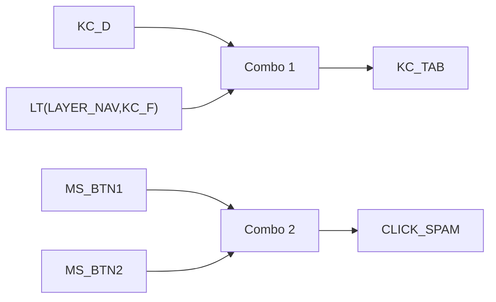

<!-- Generated by tools/profile_introspect.py. Do not edit by hand. -->
# Profile Introspection
This report is generated from the authored profile data in `keymap.c`, `config.h`, `noah_keymap_ids.h`, the pd-mode manifest, and the live Charybdis `keyboard.json` layout metadata.
## Summary

| Field | Value |
| --- | --- |
| `layer_count` | `5` |
| `layout_key_count` | `56` |
| `key_behavior_count` | `32` |
| `key_behavior_step_count` | `45` |
| `combo_count` | `2` |
| `via_macro_count` | `16` |
| `via_macro_non_empty_count` | `10` |
| `hardcoded_macro_count` | `16` |
| `hardcoded_macro_non_empty_count` | `0` |
| `keymap_custom_keycode_count` | `3` |
| `pd_mode_count` | `6` |

### Keymap Config

| Macro | Value |
| --- | --- |
| `TAPPING_TERM` | `200` |
| `COMBO_TERM` | `50` |
| `KEY_BEHAVIOR_MAX_TAP_COUNT` | `5` |
| `CUSTOM_TAP_HOLD_TERM` | `150` |
| `CUSTOM_LONGER_HOLD_TERM` | `400` |
| `CUSTOM_MULTI_TAP_TERM` | `150` |
| `CHARYBDIS_DRAGSCROLL_DPI` | `100` |
| `PD_MODE_VOLUME_DPI` | `0` |
| `PD_MODE_BRIGHTNESS_DPI` | `0` |
| `PD_MODE_ZOOM_DPI` | `400` |
| `PD_MODE_ARROW_DPI` | `400` |
| `CHARYBDIS_MINIMUM_DEFAULT_DPI` | `800` |
| `CHARYBDIS_DEFAULT_DPI_CONFIG_STEP` | `200` |
| `CHARYBDIS_MINIMUM_SNIPING_DPI` | `200` |
| `CHARYBDIS_SNIPING_DPI_CONFIG_STEP` | `100` |
| `CHARYBDIS_AUTO_SNIPING_LAYER` | `LAYER_NAV` |
| `AUTO_MOUSE_DEFAULT_LAYER` | `LAYER_POINTER` |
| `AUTO_MOUSE_TIME` | `1200` |
| `RGB_MATRIX_DEFAULT_MODE` | `RGB_MATRIX_SOLID_COLOR` |
| `RGB_MATRIX_DEFAULT_HUE` | `0` |
| `RGB_MATRIX_DEFAULT_SAT` | `255` |
| `RGB_MATRIX_MAXIMUM_BRIGHTNESS` | `200` |
| `RGB_MATRIX_DEFAULT_VAL` | `RGB_MATRIX_MAXIMUM_BRIGHTNESS` |
| `RGB_MATRIX_LED_FLUSH_LIMIT` | `32` |
| `RGB_MATRIX_TIMEOUT` | `900000` |
| `RGB_KEY_BEHAVIOR_FEEDBACK_FLASH_HALF_PERIOD_MS` | `200` |
| `AUTOMOUSE_RGB_DEAD_TIME` | `(AUTO_MOUSE_TIME/3)` |

### Layer RGB Config

| Layer | Mode | Authored HSV | Preview Color | Source |
| --- | --- | --- | --- | --- |
| `LAYER_BASE` | `ALL_KEYS` | `HSV(0, 0, 0)` | `#c80000` | `RGB default` |
| `LAYER_NUM` | `KEYS_MAPPED_ON_THIS_LAYER_ONLY` | `HSV(85, 255, 200)` | `#00c800` | `layer override` |
| `LAYER_SYM` | `KEYS_MAPPED_ON_THIS_LAYER_ONLY` | `HSV(169, 255, 200)` | `#0005c8` | `layer override` |
| `LAYER_NAV` | `KEYS_MAPPED_ON_THIS_LAYER_ONLY` | `HSV(180, 255, 200)` | `#2f00c8` | `layer override` |
| `LAYER_POINTER` | `KEYS_MAPPED_ON_THIS_LAYER_ONLY` | `HSV(0, 0, 150)` | `#969696` | `layer override` |

### Shared Keycode Surfaces

- Layers: `LAYER_BASE`, `LAYER_NUM`, `LAYER_SYM`, `LAYER_NAV`, `LAYER_POINTER`
- Keymap-local custom keycodes: `RIGHT_THUMB`, `LEFT_THUMB`, `CLICK_SPAM`
- PD modes: `DRAGSCROLL`, `VOLUME_MODE`, `BRIGHTNESS_MODE`, `ZOOM_MODE`, `ARROW_MODE`, `PINCH_MODE`

## Layer Images

These previews are generated as SVG image assets under `./profile-introspection-assets/`. The renderer uses the authored `layer_colors[]` config from `rgb_config.c` and derives the physical `LAYOUT()` order from the live Charybdis `keyboard.json`:

- `ALL_KEYS`: tint every physical key with the layer color
- `KEYS_MAPPED_ON_THIS_LAYER_ONLY`: tint only non-`TRNS`, non-`NO` positions and dim the rest
- `LAYER_BASE` falls back to the default RGB color from `config.h` when its authored layer color is `HSV(0, 0, 0)`

### `LAYER_BASE`

- Render mode: `ALL_KEYS`
- Authored layer color: `HSV(0, 0, 0)`
- Preview color source: `RGB default from config.h` -> `#c80000`

### `LAYER_NUM`

- Render mode: `KEYS_MAPPED_ON_THIS_LAYER_ONLY`
- Authored layer color: `HSV(85, 255, 200)`
- Preview color source: `layer override` -> `#00c800`

### `LAYER_SYM`

- Render mode: `KEYS_MAPPED_ON_THIS_LAYER_ONLY`
- Authored layer color: `HSV(169, 255, 200)`
- Preview color source: `layer override` -> `#0005c8`

### `LAYER_NAV`

- Render mode: `KEYS_MAPPED_ON_THIS_LAYER_ONLY`
- Authored layer color: `HSV(180, 255, 200)`
- Preview color source: `layer override` -> `#2f00c8`

### `LAYER_POINTER`

- Render mode: `KEYS_MAPPED_ON_THIS_LAYER_ONLY`
- Authored layer color: `HSV(0, 0, 150)`
- Preview color source: `layer override` -> `#969696`

## Key Behavior Inventory

| Keycode | Tap Count | Tap | Hold | Long Hold | Timing |
| --- | --- | --- | --- | --- | --- |
| `KC_1` | `single` | `-` | `PRESS_AND_HOLD_UNTIL_RELEASE(KC_EXLM)` | `-` | `defaults` |
| `KC_2` | `single` | `-` | `PRESS_AND_HOLD_UNTIL_RELEASE(KC_AT)` | `-` | `defaults` |
| `KC_3` | `single` | `-` | `PRESS_AND_HOLD_UNTIL_RELEASE(KC_HASH)` | `-` | `defaults` |
| `KC_4` | `single` | `-` | `PRESS_AND_HOLD_UNTIL_RELEASE(KC_DLR)` | `-` | `defaults` |
| `KC_5` | `single` | `-` | `PRESS_AND_HOLD_UNTIL_RELEASE(KC_PERC)` | `-` | `defaults` |
| `KC_6` | `single` | `-` | `PRESS_AND_HOLD_UNTIL_RELEASE(KC_CIRC)` | `-` | `defaults` |
| `KC_6` | `double` | `TAP_SENDS(KC_MPLY)` | `-` | `-` | `defaults` |
| `KC_7` | `single` | `-` | `PRESS_AND_HOLD_UNTIL_RELEASE(KC_AMPR)` | `-` | `defaults` |
| `KC_7` | `double` | `TAP_SENDS(KC_MNXT)` | `PRESS_AND_HOLD_UNTIL_RELEASE(KC_MNXT)` | `-` | `defaults` |
| `KC_8` | `single` | `-` | `PRESS_AND_HOLD_UNTIL_RELEASE(KC_ASTR)` | `-` | `defaults` |
| `KC_8` | `double` | `TAP_SENDS(KC_MPRV)` | `PRESS_AND_HOLD_UNTIL_RELEASE(KC_MPRV)` | `-` | `defaults` |
| `KC_9` | `single` | `-` | `PRESS_AND_HOLD_UNTIL_RELEASE(KC_LPRN)` | `-` | `defaults` |
| `KC_0` | `single` | `-` | `PRESS_AND_HOLD_UNTIL_RELEASE(KC_RPRN)` | `-` | `defaults` |
| `KC_MINS` | `single` | `-` | `PRESS_AND_HOLD_UNTIL_RELEASE(KC_UNDS)` | `-` | `defaults` |
| `KC_BSLS` | `single` | `-` | `PRESS_AND_HOLD_UNTIL_RELEASE(KC_PIPE)` | `-` | `defaults` |
| `KC_SCLN` | `single` | `-` | `PRESS_AND_HOLD_UNTIL_RELEASE(KC_COLN)` | `-` | `defaults` |
| `KC_QUOT` | `single` | `-` | `PRESS_AND_HOLD_UNTIL_RELEASE(KC_DQUO)` | `-` | `defaults` |
| `KC_COMM` | `single` | `-` | `PRESS_AND_HOLD_UNTIL_RELEASE(KC_LABK)` | `-` | `defaults` |
| `KC_DOT` | `single` | `-` | `PRESS_AND_HOLD_UNTIL_RELEASE(KC_RABK)` | `-` | `defaults` |
| `KC_LBRC` | `single` | `-` | `PRESS_AND_HOLD_UNTIL_RELEASE(KC_LCBR)` | `-` | `defaults` |
| `KC_RBRC` | `single` | `-` | `PRESS_AND_HOLD_UNTIL_RELEASE(KC_RCBR)` | `-` | `defaults` |
| `KC_ESC` | `single` | `-` | `-` | `TAP_AT_HOLD_THRESHOLD(LAG(KC_ESC))` | `defaults` |
| `KC_ESC` | `double` | `TAP_SENDS(S(KC_GRV))` | `-` | `-` | `defaults` |
| `KC_LEFT_SHIFT` | `single` | `TAP_SENDS(KC_CAPS)` | `-` | `-` | `defaults` |
| `KC_RIGHT_ALT` | `single` | `TAP_SENDS(LOCK_PD_MODE(ARROW_MODE))` | `-` | `-` | `defaults` |
| `KC_ENT` | `single` | `-` | `PRESS_AND_HOLD_UNTIL_RELEASE(S(KC_ENT))` | `-` | `defaults` |
| `LT(LAYER_NAV,KC_SLSH)` | `double` | `-` | `TAP_AT_HOLD_THRESHOLD(LOCK_LAYER(LAYER_NAV))` | `-` | `tap_hold=100` |
| `KC_LEFT` | `single` | `-` | `TAP_ON_RELEASE_AFTER_HOLD(A(KC_LEFT))` | `TAP_AT_HOLD_THRESHOLD(G(KC_LEFT))` | `defaults` |
| `KC_RIGHT` | `single` | `-` | `TAP_ON_RELEASE_AFTER_HOLD(A(KC_RIGHT))` | `TAP_AT_HOLD_THRESHOLD(G(KC_RIGHT))` | `defaults` |
| `BRIGHTNESS_MODE` | `single` | `TAP_SENDS(KC_TRNS)` | `-` | `-` | `defaults` |
| `PINCH_MODE` | `single` | `TAP_SENDS(KC_TRNS)` | `-` | `-` | `defaults` |
| `PINCH_MODE` | `double` | `TAP_SENDS(VIA_MACRO_6)` | `PRESS_AND_HOLD_UNTIL_RELEASE(ZOOM_MODE)` | `-` | `defaults` |
| `VOLUME_MODE` | `single` | `TAP_SENDS(KC_TRNS)` | `-` | `-` | `defaults` |
| `VOLUME_MODE` | `double` | `TAP_SENDS(KC_MUTE)` | `-` | `-` | `defaults` |
| `DRAGSCROLL` | `single` | `TAP_SENDS(KC_TRNS)` | `-` | `-` | `defaults` |
| `DRAGSCROLL` | `double` | `-` | `TAP_AT_HOLD_THRESHOLD(LOCK_PD_MODE(DRAGSCROLL))` | `-` | `defaults` |
| `LEFT_THUMB` | `single` | `TAP_SENDS(LOCK_LAYER(LAYER_SYM))` | `PRESS_AND_HOLD_UNTIL_RELEASE(MO(LAYER_SYM))` | `-` | `defaults` |
| `LEFT_THUMB` | `double` | `TAP_SENDS(KC_MPLY)` | `TAP_ON_RELEASE_AFTER_HOLD(KC_ESCAPE)` | `TAP_AT_HOLD_THRESHOLD(LOCK_LAYER(LAYER_NUM))` | `defaults` |
| `LEFT_THUMB` | `triple` | `TAP_SENDS(KC_MNXT)` | `-` | `PRESS_AND_HOLD_UNTIL_RELEASE(KC_MNXT)` | `defaults` |
| `LEFT_THUMB` | `quadruple` | `TAP_SENDS(KC_MPRV)` | `-` | `PRESS_AND_HOLD_UNTIL_RELEASE(KC_MPRV)` | `defaults` |
| `RIGHT_THUMB` | `single` | `TAP_SENDS(LOCK_LAYER(LAYER_NAV))` | `PRESS_AND_HOLD_UNTIL_RELEASE(MO(LAYER_NAV))` | `-` | `tap_hold=100` |
| `RIGHT_THUMB` | `double` | `TAP_SENDS(KC_MPLY)` | `TAP_ON_RELEASE_AFTER_HOLD(KC_ESCAPE)` | `TAP_AT_HOLD_THRESHOLD(LOCK_LAYER(LAYER_NUM))` | `tap_hold=100` |
| `RIGHT_THUMB` | `triple` | `TAP_SENDS(KC_MNXT)` | `-` | `PRESS_AND_HOLD_UNTIL_RELEASE(KC_MNXT)` | `tap_hold=100` |
| `RIGHT_THUMB` | `quadruple` | `TAP_SENDS(KC_MPRV)` | `-` | `PRESS_AND_HOLD_UNTIL_RELEASE(KC_MPRV)` | `tap_hold=100` |
| `CLICK_SPAM` | `single` | `-` | `REPEAT_WHILE_HELD(MS_BTN1, 100Hz)` | `-` | `tap_hold=1` |

## Combos

| Inputs | Output |
| --- | --- |
| `KC_D`, `LT(LAYER_NAV,KC_F)` | `KC_TAB` |
| `MS_BTN1`, `MS_BTN2` | `CLICK_SPAM` |

### Combo Graph

## Macro Inventory

### VIA Macros

| Slot | Payload | Usage |
| --- | --- | --- |
| `VIA_MACRO_0` | `{KC_LGUI,KC_SPC}` | `LAYER_NAV @ matrix[8,5]` |
| `VIA_MACRO_1` | `{KC_LALT,KC_SPC}` | `LAYER_NAV @ matrix[7,5]` |
| `VIA_MACRO_2` | `{KC_LALT,KC_LGUI,KC_SPC}` | `LAYER_NAV @ matrix[6,5]` |
| `VIA_MACRO_3` | `{KC_LCTL,KC_LALT,KC_LGUI,KC_C}` | `LAYER_SYM @ matrix[3,3]` |
| `VIA_MACRO_4` | `{KC_LCTL,KC_LALT,KC_LGUI,KC_X}` | `LAYER_SYM @ matrix[3,2]` |
| `VIA_MACRO_5` | `{KC_LCTL,KC_LGUI,KC_SPC}` | `LAYER_SYM @ matrix[3,0]` |
| `VIA_MACRO_6` | `{KC_LALT,KC_LGUI,KC_8}` | `PINCH_MODE double tap` |
| `VIA_MACRO_7` | `{KC_LCTL,KC_LALT,KC_LGUI,KC_V}` | `LAYER_NAV @ matrix[0,3]` |
| `VIA_MACRO_8` | `{KC_LSFT,KC_LGUI,KC_V}` | `LAYER_SYM @ matrix[3,4]` |
| `VIA_MACRO_9` | `{KC_LSFT,KC_LGUI,KC_P}` | `LAYER_SYM @ matrix[3,5]` |
| `VIA_MACRO_10` | `<empty>` | - |
| `VIA_MACRO_11` | `<empty>` | - |
| `VIA_MACRO_12` | `<empty>` | - |
| `VIA_MACRO_13` | `<empty>` | - |
| `VIA_MACRO_14` | `<empty>` | - |
| `VIA_MACRO_15` | `<empty>` | - |

### Hardcoded Macros

| Slot | Payload | Usage |
| --- | --- | --- |
| `MACRO_0` | `<empty>` | - |
| `MACRO_1` | `<empty>` | - |
| `MACRO_2` | `<empty>` | - |
| `MACRO_3` | `<empty>` | - |
| `MACRO_4` | `<empty>` | - |
| `MACRO_5` | `<empty>` | - |
| `MACRO_6` | `<empty>` | - |
| `MACRO_7` | `<empty>` | - |
| `MACRO_8` | `<empty>` | - |
| `MACRO_9` | `<empty>` | - |
| `MACRO_10` | `<empty>` | - |
| `MACRO_11` | `<empty>` | - |
| `MACRO_12` | `<empty>` | - |
| `MACRO_13` | `<empty>` | - |
| `MACRO_14` | `<empty>` | - |
| `MACRO_15` | `<empty>` | - |

## Diffable JSON

- Generated artifact: [`docs/generated/profile-introspection-assets/profile-summary.json`](./profile-introspection-assets/profile-summary.json)
- Generated layer images: `./profile-introspection-assets/profile-layer-*.svg`
- Regenerate the report, JSON summary, and layer images with `python3 tools/profile_introspect.py --write`
- Verify they are current with `python3 tools/profile_introspect.py --check`
