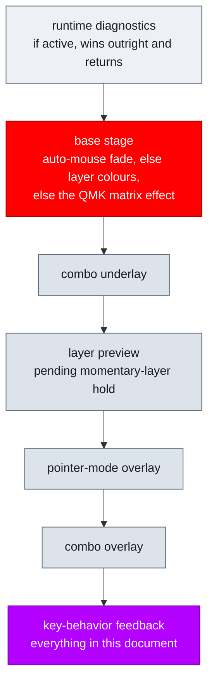
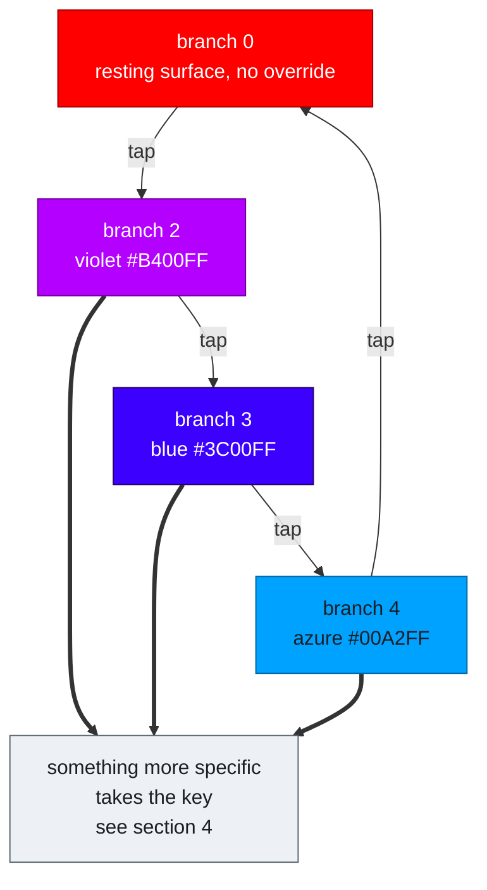
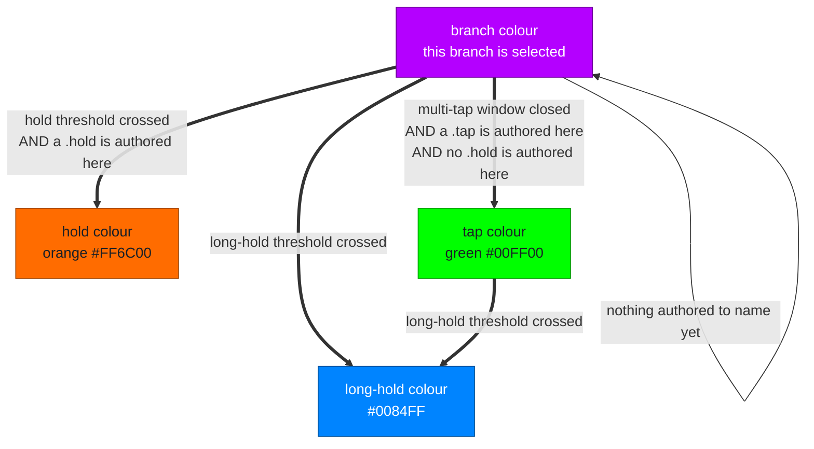
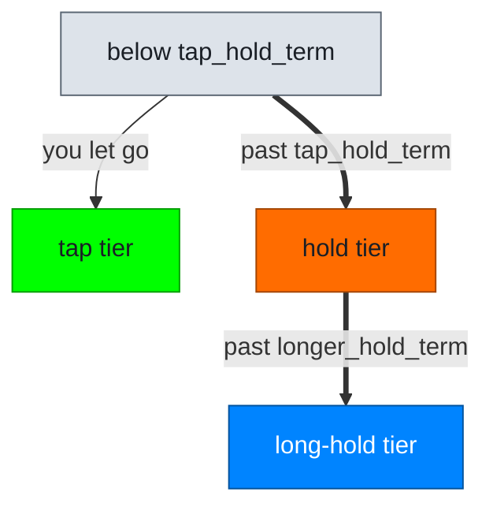
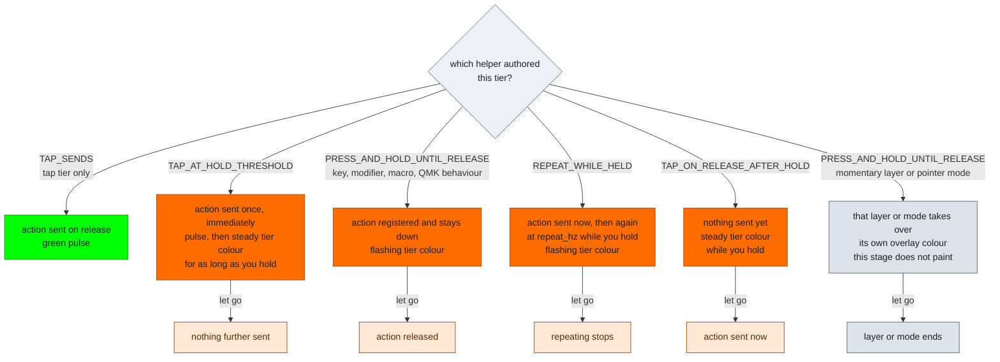

# RGB Feedback Model

The complete model: what paints the board, what the key-behavior stage adds on
top, and which colour it shows at every position in a gesture.

One sentence carries the whole thing: **the light answers "what would letting go
right now send?"** Everything below is that sentence applied to each situation,
and every silence in it is that sentence having no new answer.

Timing names are authored fields on a `key_behaviors[]` row, row-level and shared
by every `tap_counts[]` entry on that key. Defaults live in the keymap
[`config.h`](../keyboards/bastardkb/charybdis/4x6/keymaps/noah/config.h). Colours
are authored in
[`rgb_config.c`](../keyboards/bastardkb/charybdis/4x6/keymaps/noah/rgb_config.c).

---

## 1. The board is already lit

The key-behavior stage is the **last** of several painters, and it only ever
*overrides*. When it has nothing to say it paints nothing, and what you see is
whatever the stage beneath it left there. "No feedback" and "no light" are
different things, and confusing them is the easiest way to misread this model.

Later stages paint over earlier ones. So a key-behavior colour hides the layer
colour while it shows, and the layer colour returns when it stops.

### The resting surface

What a key looks like when nothing special is happening:

| where | resting colour |
|---|---|
| `LAYER_BASE` | `HSV(0,0,0)` does not paint, so the QMK effect shows: `RGB_MATRIX_SOLID_COLOR` at `HSV(0,255,max)` — **solid red** |
| `LAYER_NUM` | `HSV(85,255,max)` green, mapped keys only |
| `LAYER_SYM` | `HSV(169,255,max)` magenta, mapped keys only |
| `LAYER_NAV` | `HSV(180,255,max)` blue, mapped keys only |
| `LAYER_POINTER` | `HSV(0,0,150)` white, mapped keys only |

This matters for reading every colour below: they are seen *against* one of
these, not against black.

---

## 2. Branch 0 is the non-tapping surface

A key on its base branch is behaving normally, so it **looks** normal. The
key-behavior stage declines to paint and the resting surface shows through.

That is not a gap in the language — it is the language's answer. "Nothing unusual
is selected" and "the key looks like itself" are the same statement. It also
means a plain keystroke never flashes, which is what you want on `Esc`, `/`,
copy and paste.

---

## 3. The tap phase: taps name the branch

Every tap past the base one names the branch it reaches. The index **cycles**
through the authored branches, so a run of taps of any length resolves to exactly
one action.

Thin arrows are you tapping. The thick arrow is the board advancing on its own.

The wrap is modulo the authored depth: `index = (N-1) mod depth`. A four-branch
row answers a fifth tap with branch 1 again, a sixth with branch 2. Tapping past
the deepest branch therefore cannot fire two different actions from one gesture —
but it also means tapping cannot repeat an action inside one window. To send the
same branch twice you have to let the window close between attempts.

Deeper counts than the palette provides clamp to the last entry in
`RGB_TAP_BRANCH_COLORS(...)`. A count with no authored step shows nothing, because
a colour there would name a branch that cannot fire.

**No clock is read here.** The only things that change the branch colour are a
further tap and something more specific outranking it.

---

## 4. The handover: what replaces the branch colour

The branch colour is the **floor**. It holds from the tap that selects the branch
until the series resolves, and any action state takes the key from it the moment
there is one to name. Ordering does this, not timing.

The self-loop is the important case. A branch that authors **no `.tap`** — only a
hold tier not yet reached — has nothing more specific to say, so the branch colour
simply stays until that threshold arrives. Being on that branch is the last true
thing about the key.

Three shapes, three answers:

| the selected branch authors | held past `tap_hold_term` |
|---|---|
| `.tap`, no `.hold` | **tap colour** once the multi-tap window closes — a release sends that tap |
| `.tap` + `.hold` | **hold colour** — the hold tier claimed the key |
| no `.tap`, hold tier not yet reached | **branch colour** — nothing else to name |

The tap colour's boundary is the **multi-tap window**, not `tap_hold_term`. A
branch with no hold tier has no tap-vs-hold decision for `tap_hold_term` to
describe, and on a row whose `multi_tap_term` is the longer of the two, naming the
tap at the hold threshold would claim an outcome a further tap could still change.

---

## 5. The tiers: which clock selects which action

Separately from the count, one clock from the current press decides which tier of
the selected branch you reach.

A tier the branch does not author is not a threshold at all — crossing it changes
nothing, because nothing about the outcome changed. On a `.long_hold`-only branch
the only real threshold is `longer_hold_term`.

Releasing before a hold tier is reached falls back to the branch's `.tap`. A
branch with `.tap` and `.long_hold` released between the two thresholds sends its
tap, not its long hold.

---

## 6. What each tier actually does

Reaching a tier is not the whole story. What fires, and what the light does while
you keep holding, is decided by which helper authored that tier.

Colours below show the `.hold` tier in orange; `.long_hold` behaves identically in
the long-hold blue. The tap tier has one helper.

Three light shapes carry three meanings, and the distinction is load bearing:

- **flashing** — an action is registered right now and releases when you let go
- **steady** — a threshold has been crossed and something is still pending
- **a single pulse** — an action just fired and nothing is being held

Flash and pulse both use `RGB_KEY_BEHAVIOR_FEEDBACK_FLASH_HALF_PERIOD_MS`.

`TAP_SENDS(KC_TRNS)` keeps the lower active layer's tap output while the authored
row still owns timing and branching. The same form works on the hold helpers.

---

## 7. Precedence

Several states can be live on one key at once. The highest wins.

| priority | semantic | means |
|---|---|---|
| 60 | tap committed | this tap is what you get, before or after it fires |
| 50 | long-hold active — steady or flashing | the long-hold tier owns the key |
| 40 | hold active or hold pending | the hold tier owns the key |
| 10 | tap branch pending | this branch is selected, nothing has fired |
| 0 | none | no override; the resting surface shows |

The branch sits at the bottom on purpose. It names *which branch you are on*,
which every action state is entitled to replace with *what that branch is about
to do*.

---

## 8. Timings

Real profile: `tap_hold_term` 150, `longer_hold_term` 400, `multi_tap_term` 150,
flash half period 200. All in milliseconds.

| event | when |
|---|---|
| multi-tap window closes | **151 after the last release**, or after the press while held |
| a buffered tap fires | when that window closes |
| hold tier reached | `tap_hold_term` after the press |
| long-hold tier reached | `longer_hold_term` after the press |
| pulse or flash half-cycle | 200 |

The window is anchored on the **release**, not the press, because a release
restamps it — so a longer press does not shorten the wait. Total press-to-output
for a single tap on a multi-tap row is therefore *your press duration + 151*.

Eleven authored rows carry a multi-tap branch, so every single tap on them waits
that window: `KC_ESC`, `KC_LEFT_GUI`, `LT(LAYER_NAV,KC_SLSH)`, `G(KC_C)`,
`G(KC_V)`, `MS_BTN3`, `PINCH_MODE`, `VOLUME_MODE`, `DRAGSCROLL`, `LEFT_THUMB`,
`RIGHT_THUMB`. A row with only `tap_counts[0]` has no window and fires
immediately.

---

## 9. Where this stage declines to paint

Silence is a word in this language. These conditions choose it:

- **branch 0**, always — the non-tapping surface, section 2
- **a count with no authored step**, since a colour would name a branch that
  cannot fire
- **layer and pointer-mode actions**, whose own overlays are the persistent
  feedback and sit earlier in the stack
- **a hold tier carrying a layer preview**, which routes to the preview stage
- **base-tap commits**, because `tap_commit_mode` is limited to non-base taps
- **implicit and fallback hold tokens**, which are holds the engine synthesised
  rather than behaviour anyone authored
- **a stale mirrored semantic on the slave** where combo feedback has already
  synced that key, so an out-of-date colour cannot stomp a live combo footprint

---

## 10. Where the colour lands

`key_behavior_feedback_colors.locality` decides the area, currently
`RGB_KEY_HALF`: the whole half containing the key. So one key's tap state repaints
29 LEDs and hides the layer colours under them while it shows.

| locality | area |
|---|---|
| `RGB_BOTH_HALVES` | all 58 |
| `RGB_LEFT_HALF` / `RGB_RIGHT_HALF` | that half |
| `RGB_KEY_HALF` | the half containing the key — **current setting** |
| `RGB_KEYS_ONLY` | the key footprint only; for combos, every key in the combo |

LED groups can add accents after the main locality render. See
[RGB_CONFIG.md](./RGB_CONFIG.md).

---

## 11. Both halves

Per-key truth is computed on the USB half. The other half renders the same scene
from mirrored packed maps, captured once per RGB frame as a coherent snapshot, so
a frame cannot mix two generations of state. A mirrored read that lands
mid-publish keeps the previous frame's values rather than tearing.

Consequence: the non-USB half can be at most one RGB frame behind, and never
inconsistent within a frame.

---

## 12. Known weak points

Recorded because they are choices, not defects in the logic.

**Contrast against the resting surface.** `hold_active_color` `HSV(18)` `#FF6C00`
sits 25° from the base layer's red `HSV(0)` `#FF0000`, at equal saturation and
brightness. The base layer is where hold feedback is most used — all ten
number-row shifted symbols, `KC_ESC`, `KC_ENT`, `KC_LEFT_SHIFT` — so the most
common hold feedback on the board is painted against the surface it most resembles.

**Palette collisions.** Three are reachable on `RIGHT_THUMB` alone: branch 3
`#3C00FF` is exactly `LAYER_NAV`, whose lock is that key's single tap; the tap
colour `#00FF00` is exactly `LAYER_NUM`, whose lock is that key's double-tap long
hold; branch 4 `#00A2FF` sits 7° from `long_hold_active_color` `#0084FF`, and they
are consecutive states in the same gesture.

**Scale.** `RGB_KEY_HALF` repaints half a lit board for one key's state, and this
stage renders last, so the layer context under it is lost while it shows.

**Latency.** The 151 ms window is the price of a multi-tap branch and is paid on
*every* tap of that key, including the single tap that is usually the common one.
It is an authoring trade per row, not a property of the model.

---

For the authoring surface — colour tables, localities, LED groups, render order —
see [RGB_CONFIG.md](./RGB_CONFIG.md). For the machinery and its self-audit, see
[RGB_IMPLEMENTATION.md](./RGB_IMPLEMENTATION.md). For the engine contract behind
these transitions, see [INTERACTION_MODEL.md](./INTERACTION_MODEL.md).
