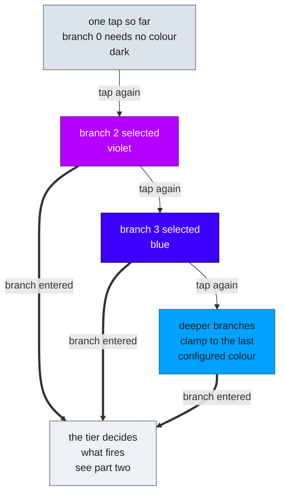
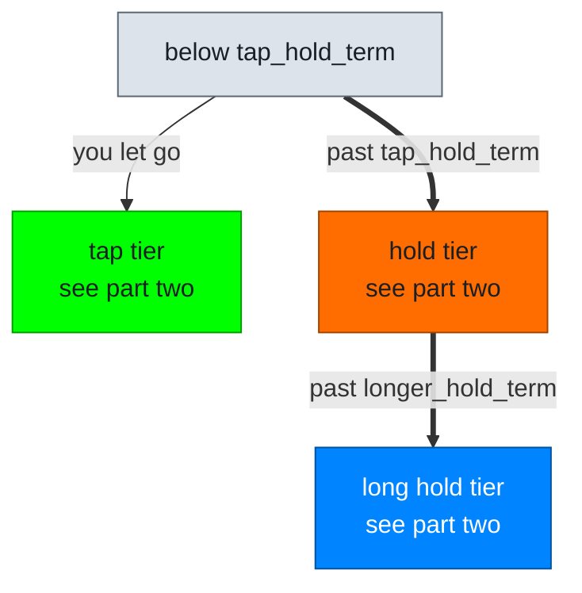
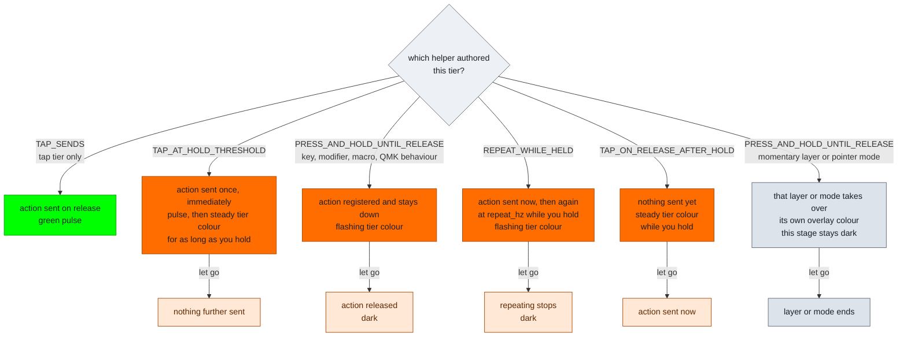

# RGB Feedback Flow

How the key-behavior feedback stage walks a tap gesture, and which color it
shows at each position. The color always answers one question: what would
letting go right now send?

Timing names are the authored fields on a `key_behaviors[]` row. All four are
row-level, shared by every `tap_counts[]` entry on that key. Defaults live in
the keymap [`config.h`](../keyboards/bastardkb/charybdis/4x6/keymaps/noah/config.h).

## Part one: taps name the branch

The tap phase has one state and it is driven by your taps, not by a timer. Each
tap past the base one names the branch it reaches, and the key holds that colour
until the branch is entered. Tap again and it simply renames.

Nothing about the tap phase is derived from a clock, so there is no moment where
the colour can get ahead of the runtime or fall behind it. The only two things
that change it are a further tap and the branch being entered.

Thick arrows are the board advancing on its own. Thin arrows are you tapping.

A branch is entered the instant the action path takes the key over: its tap fires
at the flush, or a hold tier claims it at a threshold. Until then the branch colour
owns the key, and it deliberately outranks the pending tier colours — while
nothing has fired, the branch is the honest answer to what letting go would send.

Every authored depth waits the same `multi_tap_term` before its tap fires, the
deepest one included, so the colour is on screen for the same length of time
wherever you are in the gesture. Holding is the one thing that cuts it short, and
it should: crossing `tap_hold_term` enters the branch, so the hold tier takes over
there and then.

The base tap stays dark on purpose. One tap does not show that you meant to enter
a tap branch at all, and a colour on every keystroke would be noise. The tap index
cycles, so a fifth tap on a four-branch row lands back on the base branch and the
key goes dark again mid-gesture — that is the same statement as the first tap: the
branch now selected has no colour of its own.

## Part one and a half: which tier you enter

Separately from the count, one clock from the current press decides which tier of
the selected branch you reach.

This clock says *which* action is selected within the branch. It does not change
the tap phase: crossing `tap_hold_term` on a second tap does not end the branch
colour, because the branch has not been entered yet. Once it is, these tier
colours take over.

The tier clock only reaches a hold tier if you keep holding. Tap twice and let go
and it ends at the tap tier. A deeper authored branch being available never forces
a deeper answer.

## Part two: what the tier actually does

Reaching a tier is not the whole story. What fires, and what the light does
while you keep holding, is decided by which helper authored that tier on that
tap count. This subtree plugs into every tier node above.

The colors below show the `.hold` tier in orange. The `.long_hold` tier behaves
identically in the long-hold blue. The tap tier has only one helper.

Three light shapes carry three different meanings, and the distinction is load
bearing:

- **flashing** means an action is registered right now and will be released
  when you let go
- **steady** means a threshold has been crossed and something is still pending
- **a single pulse** means an action just fired and nothing is being held

Flash and pulse both use `RGB_KEY_BEHAVIOR_FEEDBACK_FLASH_HALF_PERIOD_MS`.

`TAP_SENDS(KC_TRNS)` keeps the lower active layer's tap output at that key while
the authored row still owns the timing and branching. The same `KC_TRNS` form
works on the hold-tier helpers and defers to the lower layer's own behavior for
that tier.

## What stays dark, on purpose

Dark is a word in this language, not an absence. These conditions choose it:

- the base tap for the whole of its multi-tap window, because one tap does not
  show intent to enter a tap branch
- any tier a row does not author, so a `.long_hold`-only key shows nothing at
  the hold threshold
- layer actions and pointer-mode actions, whose own overlays are the persistent
  feedback
- any hold tier carrying a layer preview, which routes to the preview overlay
  instead of this stage
- keys inside a currently pressed combo, where the combo footprint speaks
  instead
- the base tap of a multi-tap key on commit, since tap-commit feedback is
  limited to non-base taps

## When two states coincide

Higher wins: selected tap branch, then tap sent, then long-hold, then hold. The
branch outranks the pending tier states by design, because a branch that has not
been entered is a more truthful answer than a tier that has not fired.

For the color table, locality, LED groups and render order, see
[RGB_CONFIG.md](./RGB_CONFIG.md). For the engine contract behind these
transitions, see [INTERACTION_MODEL.md](./INTERACTION_MODEL.md).
