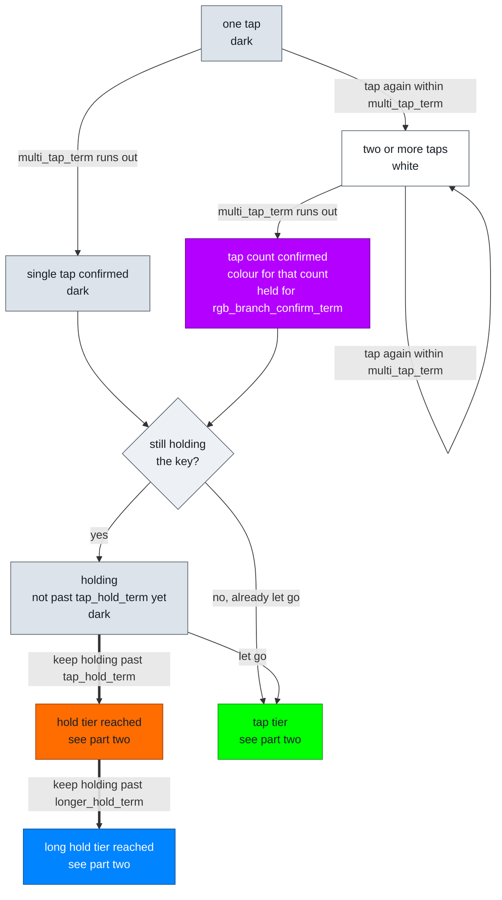
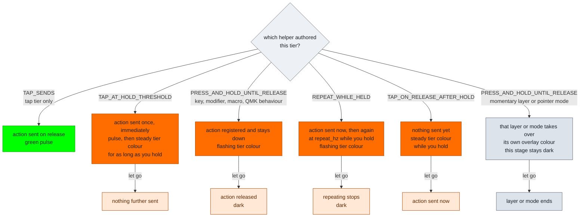

# RGB Feedback Flow

How the key-behavior feedback stage walks a tap gesture, and which color it
shows at each position. The color always answers one question: what would
letting go right now send?

Timing names are the authored fields on a `key_behaviors[]` row. All four are
row-level, shared by every `tap_counts[]` entry on that key. Defaults live in
the keymap [`config.h`](../keyboards/bastardkb/charybdis/4x6/keymaps/noah/config.h).

## Part one: reaching a tier

Which tap count wins, and then which tier of that count the key is sitting in.

Thick arrows are the board advancing on its own when a term runs out. Thin
arrows are you releasing the key.

The confirmed-count node is filled violet, which is the two-tap color. Three
taps is blue, four is azure, and deeper counts clamp to the last color in
`RGB_TAP_BRANCH_COLORS(...)`. A single tap confirms without any color, because
`branch_confirm_mode` and `tap_commit_mode` are both restricted to non-base
taps.

The hold spine only exists when the key is still down as the count confirms.
Tap twice and let go and the gesture ends in the tap tier; there is no hold
tier to reach. A deeper authored branch being available does not change that.
It keeps the question open while the window is open, and never forces a deeper
answer.

## Part two: what the tier actually does

Reaching a tier is not the whole story. What fires, and what the light does
while you keep holding, is decided by which helper authored that tier on that
tap count. This subtree plugs into every tier node above.

The colors below show the `.hold` tier in orange. The `.long_hold` tier behaves
identically in the long-hold blue. The tap tier has only one helper.

Three light shapes carry three different meanings, and the distinction is load
bearing:

- **flashing** means an action is registered right now and will be released
  when you let go
- **steady** means a threshold has been crossed and something is still pending
- **a single pulse** means an action just fired and nothing is being held

Flash and pulse both use `RGB_KEY_BEHAVIOR_FEEDBACK_FLASH_HALF_PERIOD_MS`.

`TAP_SENDS(KC_TRNS)` keeps the lower active layer's tap output at that key while
the authored row still owns the timing and branching. The same `KC_TRNS` form
works on the hold-tier helpers and defers to the lower layer's own behavior for
that tier.

## What stays dark, on purpose

Dark is a word in this language, not an absence. These conditions choose it:

- a single tap for the whole of its multi-tap window, because one tap does not
  show intent to enter a tap branch
- any tier a row does not author, so a `.long_hold`-only key shows nothing at
  the hold threshold
- layer actions and pointer-mode actions, whose own overlays are the persistent
  feedback
- any hold tier carrying a layer preview, which routes to the preview overlay
  instead of this stage
- keys inside a currently pressed combo, where the combo footprint speaks
  instead
- the base tap of a multi-tap key on commit, since both branch-confirm and
  tap-commit feedback are limited to non-base taps

## When two states coincide

Higher wins: tap-count confirmed, then tap sent, then long-hold, then hold,
then the uncommitted white. White ranks lowest by design, so the moment
anything is actually known the answer outranks the question.

For the color table, locality, LED groups and render order, see
[RGB_CONFIG.md](./RGB_CONFIG.md). For the engine contract behind these
transitions, see [INTERACTION_MODEL.md](./INTERACTION_MODEL.md).
